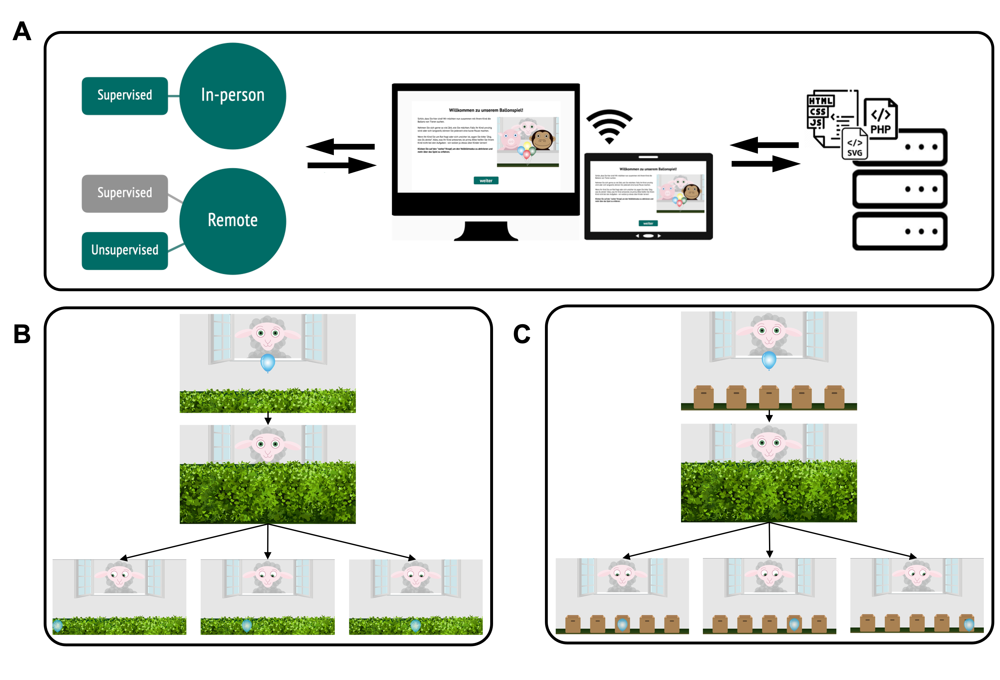

# TANGO: A reliable, open-source, browser-based task to assess individual differences in gaze understanding in 3 to 5-year-old children and adults

---

> Project repository with source code, data files and analysis scripts associated with the studies.

---

## Paper

Prein, J. C., Kalinke, S., Haun, D. B. M., & Bohn, M. (2023). TANGO: A reliable, open-source, browser-based task to assess individual differences in gaze understanding in 3 to 5-year-old children and adults. _Behavior Research Methods_. https://doi.org/10.3758/s13428-023-02159-5

## Structure

```
.
├── data                                    <-- data files
├── figures                                 <-- plots presented in the paper / supplements
├── paper
|   └── manuscript.Rmd                      <-- manuscript file
├── saves                                   <-- saved output from stats analyses
├── stats
|   ├── analysis.Rmd                        <-- code to run analyses reported in the paper
|   ├── supplements_triallevel.Rmd          <-- trial-level analysis reported in the supplements
│   ├── supplements_validity.Rmd            <-- validity analysis (family demograhics, orev data) reported in the paper & supplements
│   └── supplements_webcamcoding.Rmd        <-- webcam coding (potential parental interference) reported in the supplements
└── supplements
    └── supplements.Rmd                     <-- supplements file
```



Fig. 1 Study setup. **A** Infrastructure for online testing. (i) Subjects aged 3 to 99+ can participate. Data collection can take place anywhere: online, in kindergartens, or in research labs. (ii) The task is presented as a website that works across devices. (iii) The scripts for the website and the recorded data are stored on secure in-house servers. **B** Hedge version (continuous) of the TANGO. (i) The agent stands in a window with the target in front of them. (ii) A hedge grows and covers the target. (iii) The target falls to a random location on the ground. The agent’s eyes track the movement of the target. Three exemplary target locations are shown to depict how indicative the agent’s gaze cues are in determining the target’s location. The transparent target is only shown for an illustrative purpose (not visible during the test). **C** Box version (discrete) of the TANGO. Number of boxes (min. 1; max. 8) as potential hiding locations can be set according to the researcher’s need.
