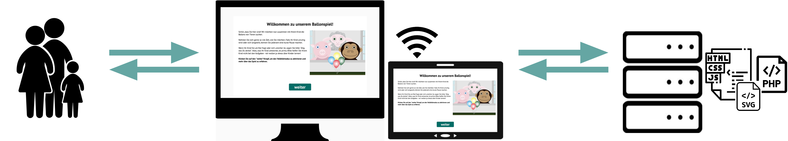

```{r setup, include = FALSE}
library("papaja")
r_refs("r-references.bib")
```

```{r analysis-preferences}
# Seed for random number generation
set.seed(42)
knitr::opts_chunk$set(cache.extra = knitr::rand_seed)
```

\newpage

# -- POSSIBLE ROUGH STRUCTURE -- 
# intro
## individual differences in dev psy
- reliable tasks: need variation, more trials

## exisiting tasks for social cognition
- wellman

## current goal
- standardized, easy to use, continuous

# methods (let's see whether we want this generic heading...)
## design of our task
- training trials (touch & fam together, click on visible balloon / visible target flight, voice over trials)
- test trials
- flexible: two versions, can also use discrete
- face value

- stimulus timing 

## implementation / development
- JS, HTML, CSS
- parcel?!
- SVG: scalable
- webapp: portable across devices, flexible, no hard system requirements
- response collection: file format, variables saved (click responses)

## data processing
- workflow for collecting data
- pipeline? downloading server data into r, coverting coordinate systems

# does our task induce variation?
## participants: kiga & prolific vali
## procedure 
## results
- for hedge & box
- sanity check: developmental trajectory
- remote testing: online child sample as side note

# do we capture variation reliably?
## participants: relikiga & prolific reli
## results: 
- internal consistency?
- test-retest

# exploratory: external validity
## participants: subsample kiga & relikiga with questionnaire data
## results: 
- peer exposure (box & hedge combined?)

# discussion
## limitations
## future development / extending the task
# conclusion


\newpage
# Introduction 
Idea for an opener :) 

Developmental psychology is facing a dilemma: many research questions are questions about individual differences, yet, there is a lack of tasks to reliably measure these individual differences. For example ... . 

- individual differences in developmental psychology
- reliable tasks, variation needed, more trials
- existing tasks for social cognition: wellman
- goal of the current project


# Design of our balloon finding task

## Stimuli
Our newly implemented balloon finding task displays cartoon-like stimuli that are engaging for children and adults alike. An animal character (i.e., agent; sheep, monkey, or pig) is placed centrally in a window. A balloon (i.e., target; blue, green, yellow, or red) is located in front of them. The target then falls to the ground. At all times, the agent’s gaze tracks the movement of the target. That is, the pupils and iris of the agent move in a way that their center aligns with the center of the target. While the distance of the target's flight depends on the final location, the target moves at a constant speed. Participants are then asked to locate the target’s position on the screen. 

To keep participants engaged and interested, the presentation of events is accompanied by cartoon-like effects. Each trial starts with an attention-getter: an eye-blinking sound plays while the pupils and iris of the agent enlarge (increase to 130%) and change in opacity (decrease to 75%) for 0.3 sec. The landing of the target is accompanied by a tapping sound. Once the target landed, the instructor's voice asks "Where is the balloon?". After the response is registered, a short plop sound plays and a small orange circle confirms the participants' location choice. If no response got registered within 5 secs after the target landed, an audio prompt reminds the participant to respond. 

## Trials
Before participants advance to the test trials, we present four training trials. In the first training trial, participants have full visual access to the target flight and the target's end location and are simply asked to click on the visible balloon. In the second and third training trials, participants have partial visual access: they witness the target flight but cannot see the target's end location. They are then asked to click on the invisible balloon, i.e., the location where they saw the target land. In test trials, participants have no visual access to the target flight nor the end location. Participants are expected to use the agent’s gaze as a cue to locate the target. The first trial of each type comprises a voice-over description of the presented events. The audio descriptions explicitly state that the agent is always looking at the target (see Appendix for audio script). After these four training and audio guided trials, participants receive 15 test trials. The complete sequence of four training trials and 15 test trials can be administered within 5-10 minutes of testing time.

## Study versions
We designed two study versions which can be chosen according to the researchers' need: there is a continuous *hedge* version and a discrete *box* version. Both versions use the same first training trial and then differ in the consecutive training and test trials. 
In the *hedge* version, participants have to indicate their estimated target location directly on a hedge (i.e., hedge version). 
Here, the dependent variable is imprecision, which is defined as the absolute difference between the target's true x coordinate and the x coordinate of the participant’s click.
In the *box* version, participants are asked to click on a box that hides the target. Researchers have the choice of how many boxes are shown: one up to eight boxes can be displayed as potential hiding locations. Here, we use a categorical outcome (i.e., which box was clicked) to calculate the proportion of correct responses. 
Note that in the test trials of both study versions, the target flight is covered by a hedge. In the *hedge* version, the hedge then shrinks to a minimum height required to cover the target's end location. In the *box* version, the hedge shrinks completely. The boxes then hide the target's final destination. 
(ref:figlab1) **Study versions of the balloon finding task**. (a) Screenshots from the continuous *hedge* version of the task. (b) Screenshots from the discrete *box* version of the task. (i) The agent stands in a window with the target in front of them. (ii) A hedge grows and covers the target. (iii) The target falls to a random location on the ground / into a box. The agent's eyes track the movement of the target. 

```{r fig1, fig.show = "hold", out.width = "100%", fig.align = "default", fig.cap = "(ref:figlab1)",}
# {r, echo=FALSE, out.width="49%", out.height="20%", fig.cap="figlab1", fig.show='hold', fig.align='center'}
knitr::include_graphics(c("../figures/gafo_hedge.png", "../figures/gafo_boxes.png"))
``` 

## Randomization
All agents and target colors appear equally often and are not repeated in more than two consecutive trials. The randomization of the target end location depends on the study version. In the *hedge* version, the full width of the screen is divided into ten bins. Exact coordinates within each bin are then randomly generated. In the *box* version, the target randomly lands in one of the boxes. As with agent and color choice, each bin/box occurs equally often and can only occur twice in a row.

## Implementation
Our balloon finding task is presented as an interactive web-app. The task is portable across devices and web browsers and does not require any installation. A great advantage of online testing is that our testing procedure is standardized across participants. By using pre-recorded study instructions,no interaction with the experimenter is necessary during the study. The code is open-source (https://github.com/ccp-eva/gafo-demo) and a live demo version can be found under: https://ccp-odc.eva.mpg.de/gafo-demo/.

The web-app was programmed in JavaScript (ECMAScript 2015, i.e., ES6), HTML5, CSS and PHP. 
For the web-app development, we chose the zero configuration bundler Parcel. It enables a live server for debugging, makes imports easy, and minifies scripts in order to save data storage.
For the design of the landing pages, the CSS library Material Components Web (TODO: insert citation) was used. 
For stimulus presentation, a scalable vector graphic (SVG) composition was parsed. This way, the composition scales according to the user's view port without loss of quality, while keeping the aspect ratio and relative object positions constant. 
Furthermore, SVGs allow us to define all composite parts of the scene (e.g., pupil of the agent) individually. This is needed for precisely calculating exact pupil and target locations and sizes. Additionally, it makes it easy to adjust the stimuli and, for example, add another agent to the scene.
The GreenSock Animation Platform (GSAP; TODO: insert citation) library was used to animate the movement of single SVG elements. 

The web-app generates two file types: (1) a text file (.json) containing meta-data, trial specifications and participants' click responses, and (2) a video file (.webm) of the participant's webcam recording.
For our samples described in this paper, we deployed the web-app on servers located in Leipzig, Germany. Data got automatically collected and safely stored on these in-house servers. If no internet connection or server is available, researchers could download a local version of the experiment which stores the generated data automatically on the used device.

(ref:figlab2) **Infrastructure for online testing**. With our new infrastructure, subjects aged 3 – 99+ can participate. Data collection is efficient and automatized and can take place anywhere: at home, in kindergartens or research institutes. Our task is presented as a website that works across devices. The scripts for the website and recorded data are stored on secure local servers.
```{r fig2, out.width="100%", fig.align = "center", fig.cap = "(ref:figlab2)"}

```

## Data processing
- workflow server to R, converting coordinate systems
We used `r cite_r("r-references.bib")` for all our analyses.


# Does the balloon finding task induce variation?
## Participants: kiga & prolific vali
## Procedure
## Results
- for hedge & box
- sanity check: developmental trajectory
- remote testing: online child sample as side note

# Can we capture variation reliably?
## Participants: religa kiga & prolific reli
## Procedure: 14 ± 3 days
- what is different compared to variation? nr of trials, fixed order
## Results
- internal consistency
- test-retest

# Exploring the external validity of our task
## Participants: subset kiga & relikiga that filled out questionnaires
## Results
- peer exposure (hedge & box combined?)

# Discussion
## Limitations
## Future development / extending the task

# Conclusion

# Declarations
## Open practices statement
The web application (https://ccp-odc.eva.mpg.de/gafo-demo/) described here is open source (https://github.com/ccp-eva/gafo-demo).
The datasets generated during and/or analysed during the current study are available in the [gazecues-methods] repository, (https://github.com/jprein/gazecues-methods). All experiments were preregistered (https://osf.io/zjhsc/).

## Funding 
This study was funded by the Max Planck Society for the Advancement of Science, a noncommercial, publicly financed scientific organization (no grant number). We thank all the children and parents who participated in the study.

## Conflicts of interest 
The authors declare that they have no conflict of interest.

## Ethics approval 

## Consent to participate
Informed consent was obtained from all individual participants included in the study or their legal guardians.

## Consent for publication 

## Open access

## Authors' contributions 
optional: please review the submission guidelines from the journal whether statements are mandatory

\newpage

# References

\begingroup
\setlength{\parindent}{-0.5in}
\setlength{\leftskip}{0.5in}

<div id="refs" custom-style="Bibliography"></div>
\endgroup

\newpage

# Supplements

## Adult sample

### Recruitment
We recruited participants using the online participant recruitment service *Prolific* from the University of Oxford. *Prolific*'s subject pool consists of a mostly European and US-american sample although subjects from all over the world are included. The recruitment platform realises ethical payment of participants, which requires researchers to pay participants a fixed minimum wage of £5.00 (around US$6.50 or €6.00) per hour. We decided to pay all participants the same fixed fee which was in relation to the estimated average time taken to complete the task.
*Prolific* distributed our study link to potential participants, while the hosting of the online study was done by local servers in the Max Planck Institute for Evolutionary Anthropology, Leipzig. Therefore, study data was saved only on our internal servers, while *Prolific* provided demographic information of the participants.
Participants' *Prolific* ID was forwarded to our study website using URL parameters. This way, we could match participant demographic data to our study data. The same technique was used to confirm study completion: we redirected participants from our study website back to the *Prolific* website using URL parameters. 
We used *Prolific*'s inbuilt prescreening filter to include only participants who were fluent in English and could therefore properly understand our written and oral study instructions. 

### Study 1 - Validation hedge version
The aim of Study 1 was to validate the hedge version of our balloon finding task. The pre-registration can be found here: https://osf.io/r3bhn. We recruited participants online by advertising the study on *Prolific*. 

50 adults participated in the study. One additional subject returned their submission, i.e., decided to leave the study early or withdrew their submission after study completion. Data collection took place in May 2021. 

Participants were compensated with £1.25 for completing the study. We estimated an average completion time of 6 minutes, resulting in an estimated hourly rate of £10.00. In average, participants took 05:56min to complete the study. 

Participants were required to complete the study on a tablet or desktop.Participation on mobile devices was disabled since the display would be too small and would harm click precision. It was indicated that the study required audio sound. 

We stored *Prolific*'s internal demographic information, 
while not asking for additional personal information. 

After clicking the study title, participants were directed to our online study website.
...

### Study 2 - Validation box version
As in study 1, we recruited participants on *Prolific*, and employed the same methodology. However, this time we focussed on validating the box version of the task in an adult sample. Participants were presented with eight boxes in which the target could land.

50 adults participated in the study. One additional subject returned their submission, i.e., decided to leave the study early or withdrew their submission after study completion. Data collection took place in June 2021. 

Participants were compensated with £1.00 for completing the study. We estimated an average completion time of 6 minutes, resulting in an estimated hourly rate of £10.00. In average, participants took 04:43min to complete the study. 

### Study 3 - Reliability hedge version
In study 3 and 4, we assessed the test-retest reliability of our balloon-finding task in an adult sample. The pre-registration can be found here: https://osf.io/nu62m. We tested the same participants twice with a delay of two weeks. The testing conditions were as specified in Study 1 and 2. However, the target locations as well as the succession of animals and target colors was randomized once. Each participant then received the same fixed randomized order of target location, animal, and target color. Participants received 30 test trials without voice-over description, so that each of the ten bins occurred exactly three times. 

In addition to the beforementioned prescreening settings, we used a whitelist. *Prolific* has a so-called *custom allowlist prescreening filter* where one can enter the *Prolific* IDs of participants who completed a previous study. Only these subjects are then invited to participate in a study. This way, repeated measurements can be implemented, collecting data from the same subjects at different points in time.  

In a first round, 60 participants took part on the first testday. Additional two subjects returned their submission, i.e., decided to leave the study early or withdrew their submission after study completion. One additional participant timed out, i.e., did not finish the survey within the allowed maximum time. The maximum time is calculated by *Prolific*, based on the estimated average completion time. For this study, the maximum time amounted to 41 minutes. For the first testday, participants were compensated with £1.25. We estimated an average completion time of 9 minutes, resulting in an estimated hourly rate of £8.33. In average, participants took 07:11min to complete the first part. 

Of the 60 participants that completed testday 1, 41 subjects finished testday 2. One additional participant timed out, i.e., did not finish the survey within the allowed maximum time. Participants were compensated with £1.50 for completing the second part of the study. We estimated an average completion time of 9 minutes, resulting in an estimated hourly rate of £10. In average, participants took 06:36min to complete the second part of the study.

Since we aimed for a minimum sample size of 60 subjects participating on both testdays, we reran the first testday with additional 50 participants. Additional seven subjects returned their submission, i.e., decided to leave the study early or withdrew their submission after study completion. Two additional participants timed out, i.e., did not finish the survey within the allowed maximum time. Again, participants were compensated with £1.25 for completing the first part of the study (estimated average completion time 9 minutes, estimated hourly rate of £8.33). In average, participants took 06:51min to complete the first part. 

Of the additional 50 participants that completed testday 1, 29 subjects finished testday 2. Again, participants were compensated with £1.50 for completing the second part of the study (estimated average completion time 9 minutes, estimated hourly rate of £10). In average, participants took 06:26min to complete the second part of the study.

### Study 4 - Reliability box version
As in study 3, we recruited participants on *Prolific*, and employed the same methodology. However, this time participants were presented with the box version of the task. Participants received 32 test trials without voice-over description, so that each of the eight boxes occurred exactly four times. As in study 2, we employed eight boxes in which the target could land.

In a first round, 60 participants took part on the first testday. Additional five subjects returned their submission, i.e., decided to leave the study early or withdrew their submission after study completion. For the first testday, participants were compensated with £1.25. We estimated an average completion time of 9 minutes, resulting in an estimated hourly rate of £8.33. In average, participants took 07:33min to complete the first part. 

Of the 60 participants that completed testday 1, 41 subjects finished testday 2. Participants were compensated with £1.50 for completing the second part of the study. We estimated an average completion time of 9 minutes, resulting in an estimated hourly rate of £10. In average, participants took 07:50min to complete the second part of the study.

Since we aimed for a minimum sample size of 60 subjects participating on both testdays, we reran the first testday with additional 50 participants. Additional eight subjects returned their submission, i.e., decided to leave the study early or withdrew their submission after study completion. One additional participant timed out, i.e., did not finish the survey within the allowed maximum time. Again, participants were compensated with £1.25 for completing the first part of the study (estimated average completion time 9 minutes, estimated hourly rate of £8.33). In average, participants took 07:37min to complete the first part. 

Of the additional 50 participants that completed testday 1, 28 subjects finished testday 2. Additional three subjects returned their submission, i.e., decided to leave the study early or withdrew their submission after study completion. One additional participant timed out, i.e., did not finish the survey within the allowed maximum time. Again, participants were compensated with £1.50 for completing the second part of the study (estimated average completion time 9 minutes, estimated hourly rate of £10). In average, participants took 06:30min to complete the second part of the study.

## Child sample
```{r}
library(tidyverse)
testtrials <- readRDS(file = "../data/gafo-testtrials.rds") %>% 
  # determine order of factors
  mutate(
    targetPosition = factor(targetPosition, levels = c("1", "2", "3", "4", "5", "6", "7", "8", "9", "10", "box1", "box2", "box3", "box4", "box5")), 
    studyversion = factor(studyversion, levels = c("hedge", "box")), 
    datacollection = factor(datacollection, levels = c("in-person - supervised", "remote - unsupervised")),
    sample = factor(sample, levels = c("kids", "adults")), 
    studytype = factor(studytype, levels = c("vali", "vali2", "reli"))
  )

kids_vali <- testtrials %>% 
  filter(ageInYears < 6 & studytype == "vali")

kids_vali_inperson_sample <- kids_vali %>%
  filter(datacollection == "in-person - supervised") %>% 
  group_by(ageInYears) %>%
  summarise(
    nTotal = n_distinct(subjID), 
    meanAgeInMonths = mean(ageInMonths, na.rm = T) %>% round(2),
    sdAgeInMonths = sd(ageInMonths, na.rm = T) %>% round(2),
    minAgeInMonths = min(ageInMonths, na.rm = T),
    maxAgeInMonths = max(ageInMonths, na.rm = T),
  )
  
# kids_vali %>% 
#   filter(datacollection == "in-person - supervised") %>% 
#   group_by(ageInYears, gender) %>% 
#   summarise(
#     n = length(unique(subjID))
#   )
```

### Study 1 - Validation Remote and in-person
The validation of our task in a in-person and remote child sample can be found here: https://osf.io/snju6. 
We chose to have at least 20 data points per cell (i.e. unique combination of data collection mode, study version, and age-group). Across the two data collection modes, a total of `r kids_vali %>% select(subjID) %>% n_distinct()` children participated. Participants received a small gift as thank you for their participation in the study. 

For our in-person supervised testing sample, we went to kindergartens in Leipzig and surroundings that cooperate with the Max Planck Institute for Evolutionary Anthropology. For our remote unsupervised testing sample, families were recruited on a voluntary basis via email from the database of the Max Planck Institute for Evolutionary Anthropology. Children in both sub samples live in Leipzig, Germany or surrounding areas and grow up in an industrialized, urban Central-European context. Information on socioeconomic status was not formally recorded, although the majority of families come from mixed, mainly mid to high socioeconomic backgrounds with high levels of parental education.
Written informed consent was obtained from at least one caregiver prior to testing. 
TODO: how to phrase for kiga testing?

## Procedure Remote Testing
In the beginning of the online study, families were invited to enter "our virtual institute" and were welcomed by an introductory video of the study leader, shortly describing the research background and further procedure. Then, caregivers were informed about data security and were asked for their informed consent. They were asked to enable the sound and seat their child centrally in front of their device. Subsequently, a brief demographic questionnaire was displayed, asking for (1) the total number of household members, (2) the number of children, (3) age of the other children, (4) whether the child was in day care, and if yes, (5) since when and (6) for how long on an average day. Before the study started, families were instructed how to setup their webcam and enable the recording permissions. Study participation was video recorded whenever possible in order to ensure that the answers were generated by the children themselves. 
Then, families were guided through the online study with pre-recorded audio instructions. After completion, families received a little crafting / coloring sheet as a small thank-you gift.

Depending on the participant's device, the website automatically presents the hedge or box version of the study. For families that use a tablet with touchscreen, the hedge version is shown. Here, children can directly click on the screen themselves to indicate where the target is. For families that use a computer without touchscreen, the website presents the box version of the task. We assumed that younger children in our sample would not be acquainted with the usage of a computer mouse. Therefore, we asked children to point to the screen. Caregivers were then asked to act as the "digital finger" of their children and click on the indicated box. In order to facilitate the translation of children's pointing and caregivers' clicking, we decided to implement this categorical version of the task.

Our in-person supervised testing sample involved `r kids_vali %>% filter(datacollection == "in-person - supervised") %>% select(subjID) %>% n_distinct()` children, including `r kids_vali_inperson_sample %>% filter(ageInYears == "3") %>%  select(nTotal)` 3-year-olds (mean = `r kids_vali_inperson_sample %>% filter(ageInYears == "3") %>%  select(meanAgeInMonths)` months, SD = `r kids_vali_inperson_sample %>% filter(ageInYears == "3") %>%  select(sdAgeInMonths)`, range = `r kids_vali_inperson_sample %>% filter(ageInYears == "3") %>%  select(minAgeInMonths)` - `r kids_vali_inperson_sample %>% filter(ageInYears == "3") %>%  select(maxAgeInMonths)`, 22 girls), `r kids_vali_inperson_sample %>% filter(ageInYears == "4") %>%  select(nTotal)` 4-year-olds (mean = `r kids_vali_inperson_sample %>% filter(ageInYears == "4") %>%  select(meanAgeInMonths)` months, SD = `r kids_vali_inperson_sample %>% filter(ageInYears == "4") %>%  select(sdAgeInMonths)`, range = `r kids_vali_inperson_sample %>% filter(ageInYears == "4") %>%  select(minAgeInMonths)` - `r kids_vali_inperson_sample %>% filter(ageInYears == "4") %>%  select(maxAgeInMonths)`, 19 girls), and `r kids_vali_inperson_sample %>% filter(ageInYears == "5") %>%  select(nTotal)` 5-year-olds (mean = `r kids_vali_inperson_sample %>% filter(ageInYears == "5") %>%  select(meanAgeInMonths)` months, SD = `r kids_vali_inperson_sample %>% filter(ageInYears == "5") %>%  select(sdAgeInMonths)`, range = `r kids_vali_inperson_sample %>% filter(ageInYears == "5") %>%  select(minAgeInMonths)` - `r kids_vali_inperson_sample %>% filter(ageInYears == "5") %>%  select(maxAgeInMonths)`, 22 girls).

```{r}
# test papajas apa tables
apa_table(kids_vali_inperson_sample, 
          caption = "Child sample", 
          note = "in-person supervised testing", 
          # align = c("l", "r", "c"), 
          escape = FALSE, 
          row.names = TRUE, 
          placement = "h")
```

### Study 2 - Reliability in-person 
https://osf.io/xqm73

# Instructions and voice over descriptions
This is the content of our voice recordings. Children listen to this during the game.

|     |     |     |     |     |
| --- | --- | --- | --- | --- |
| **Nr** | **Timeline** | **German** | **English** | **Filename** |
| **1** | **welcome** | Hallo! Schön, dass du da bist. Wir spielen jetzt das Ballon-Spiel! Siehst du die Tiere auf dem Bild da? Wir möchten gleich zusammen mit den Tieren mit einem Ballon spielen. Was genau passiert, erklären wir dir jetzt ganz in Ruhe. | Hello! Great that you’re here. We’ll now play a balloon game. Can you see the animals in the picture over there? We want to play together with the animals using the balloon. We’ll now talk you through exactly what will happen. | welcome.mp3 |
| **2** | **touch** | Schau mal, da steht ein Tier im Fenster. Und siehst du den Ballon da? Der Ballon fällt immer runter und landet auf dem Boden. Und du musst ihn dann finden. Das Tier hilft Dir und schaut immer den Ballon an. | Look, an animal is standing in the window. And can you see the balloon over there? The balloon always falls down and lands on the ground. And you have to find it! The animal helps you and always looks at the balloon. | touch-1.mp3 |
| **3** |     | Wo ist der Ballon? Drück auf den Ballon! | Where is the balloon? Click on the balloon! | prompt-touch-long.mp3 |
| **4** | **fam - HEDGE** | Klasse, das war super! Jetzt spielen wir weiter. Siehst du wieder das Tier und den Ballon da? Der Ballon fällt wieder runter. Diesmal fällt er hinter eine Hecke. Du musst ihn wieder finden. Das Tier hilft dir und schaut immer den Ballon an. | Perfect, that was great! Now, we’ll continue playing. Can you see the animal and the balloon again? The balloon will fall down again. This time, it will fall behind a hedge. And you have to find it! The animal helps you and looks at the balloon. | fam-hedge-1.mp3 |
| **5** |     | Wo ist der Ballon? Drücke auf die Hecke - wo der Ballon ist. | Where is the balloon? On the hedge, click where the balloon is. | prompt-hedge-long.mp3 |
| **6** | **fam - BOX** | Klasse, das war super! Jetzt spielen wir weiter. Siehst du wieder das Tier und den Ballon da? Der Ballon fällt wieder runter. Diesmal fällt er in eine Kiste.  <br>Du musst ihn wieder finden. Das Tier hilft dir und schaut immer den Ballon an. | Perfect, that was great! Now, we’ll continue playing. Can you see the animal and the balloon again? The balloon falls down again. This time, it falls into a box. And you have to find it! The animal helps you and looks at the balloon. | fam-box-1.mp3 |
| **7** |     | Wo ist der Ballon? Drücke auf die Kiste mit dem Ballon. | Where is the balloon? Click on the box with the balloon. | prompt-box-long.mp3 |
| **8** | **test - HEDGE** | Klasse , das hast du toll gemacht! Nun spielen wir weiter. Da sind wieder der Ballon, das Tier und die Hecke. Die Hecke wächst jetzt hoch. | Nice, good job! Now, we’ll continue playing. There is the balloon, the animal and the hedge. The hedge is growing a bit now. | test-hedge-1.mp3 |
| **9** |     | Der Ballon ist nun hinter der Hecke. Du kannst das nicht sehen - das Tier aber! Jetzt fällt der Ballon auf den Boden und du musst ihn wieder finden. Denk dran - das Tier schaut immer den Ballon an. | The balloon is behind the hedge now. You can’t see it - but the animal can! The balloon falls to the ground and you have to find it. Remember - the animal always looks at the balloon! | test-hedge-2.mp3 |
| **10** |     | Dann schrumpft die Hecke. Drücke auf die Hecke - wo der Ballon ist. | Now, the hedge is shrinking. On the hedge, click where the balloon is. | test-hedge-3.mp3 |
| **11** | **test - BOX** | Klasse , das hast du toll gemacht! Nun spielen wir weiter. Da sind wieder der Ballon, das Tier und die Kisten. Jetzt wächst eine Hecke hoch. | Nice, good job! Now, we’ll continue playing. There is the balloon and the animal. Now, a hedge is growing. | test-box-1.mp3 |
| **12** |     | Der Ballon ist nun hinter der Hecke. Du kannst das nicht sehen - das Tier aber! Jetzt fällt der Ballon in eine Kiste und du musst ihn wieder finden. Denk dran - das Tier schaut immer den Ballon an. | The balloon is behind the hedge now. You can’t see it - but the animal can! The balloon falls into a box and you have to find it. Remember - the animal always looks at the balloon! | test-box-2.mp3 |
| **13** |     | Dann schrumpft die Hecke. Drücke auf die Kiste mit dem Ballon. | Now, the hedge is shrinking. Click on the box with the balloon. | test-box-3.mp3 |
| **14** | **goodbye** | Geschafft! Die Tiere sind schon ganz glücklich vom Spielen! Vielen Dank für deine Hilfe! Bis zum nächsten Mal und liebe Grüße vom Schwein, Affen und Schaf | The animals are super happy after playing. Thanks a lot for your help! See you soon and goodbye from the pig, monkey and sheep | goodbye.mp3 |
| **15** | **general prompt** | Wo ist der Ballon? | Where is the balloon? | prompt-general.mp3 |
| **16** | **touch - no response** | Drück auf den Ballon! | Click on the balloon! | prompt-touch.mp3 |
| **17** | **hedge - no response** | Drücke auf die Hecke - wo der Ballon ist! | On the hedge, click where the balloon is! | prompt-hedge.mp3 |
| **18** | **box - no response** | Drücke auf die Kiste mit dem Ballon! | Click on the box with the balloon! | prompt-box.mp3 |
| **19** | **landing sound of balloon** | \-  | \-  | balloon-lands.mp3 |
| **20** | **sound of blinking eyes** | \-  | \-  | blink.mp3 |
| **21** | **sound for target click** | \-  | \-  | positive-feedback.mp3 |