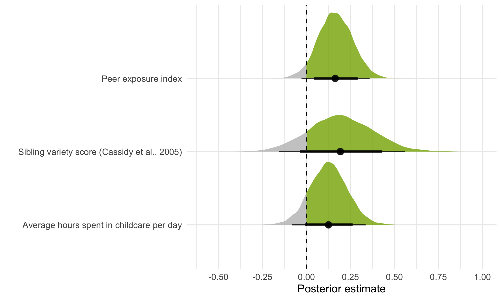
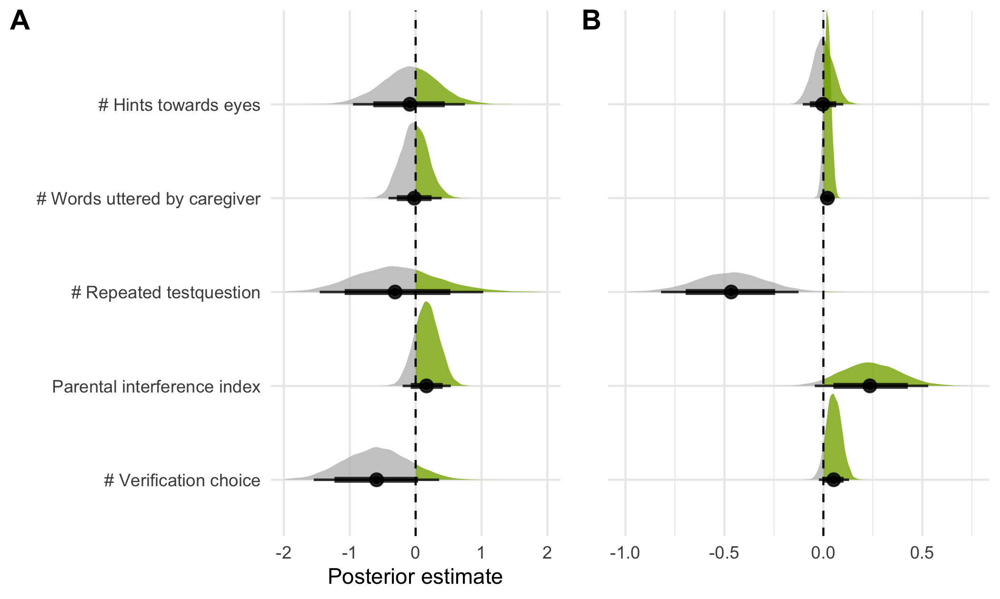

```{r setup, include = FALSE}
library("papaja")
# r_refs("r-references.bib")
```

```{r analysis-preferences}
# Seed for random number generation
set.seed(42)
knitr::opts_chunk$set(cache.extra = knitr::rand_seed)
```

```{r load_data}
library(tidyverse)
library(brms)
testtrials <- readRDS(file = "../data/gafo-testtrials.rds") %>% 
  # determine order of factors
  mutate(
    targetPosition = factor(targetPosition, levels = c("1", "2", "3", "4", "5", "6", "7", "8", "9", "10", "box1", "box2", "box3", "box4", "box5")), 
    studyversion = factor(studyversion, levels = c("hedge", "box")), 
    datacollection = factor(datacollection, levels = c("in-person - supervised", "remote - unsupervised")),
    sample = factor(sample, levels = c("kids", "adults")), 
    studytype = factor(studytype, levels = c("vali", "vali2", "reli"))
  )
```

# Introduction 
Social cognition -- representing and reasoning about an agent’s perspectives, knowledge states, intentions, beliefs, and preferences to explain and predict their behavior -- is among the most-studied phenomena in developmental research. 
In recent decades, much progress has been made in determining the average age at which a specific social-cognitive ability emerges in development [@gopnik1991young; @wellman2001metaanalysis; @wellman2004scaling; @peterson2012mind; @rakoczy2022foundations].
Yet, there are always individual differences. 
Identifying variability in social-cognitive abilities and factors influencing their development is vital in theory building (e.g., to test causal predictions) and for designing interventions 
[@happe2017structure; @mundy2007individual; @kidd2018individual; @underwood1975individual; @lecce2014promoting].

Numerous studies have already examined individual differences in social cognition [for an overview, see @hughes2015individual; @slaughter2015theorya]. 
These individual differences studies often focus on the relationship between social-cognitive abilities and: (1) family influences, (2) other cognitive constructs, and (3) social behavioral outcome [for an overview, see @repacholi2003introduction]. 
Studies on social-cognitive abilities and family influences include the effect of parenting practices [for a review, see @pavarini2013parental], attachment quality [e.g., @astor2020social], mental state talk [@hughes2011individual; @gola2012mental; @lecce2014promoting], and family background as parental education, occupation, sibling interaction and childcare [@dunn1991young; @cutting1999theory; @bulgarelli2016social]. 
Another group of individual differences studies focuses on the interplay of social and physical cognition [@herrmann2010structure], executive functions [@carlson2004individual; @carlson2001individual; @buttelmann2021relations; @hughes2007executive; @benson2012individual], and language abilities [@okumura2017individual; @milligan2007language; @mcewen2007origins]. 
Studies on social behavioral outcomes measured the interplay of social cognition and prosociality [for a review, see @imuta2016theory; @walker2005gender], stereotypes and resource allocations [@rizzo2018theory], and moral intentions [@sodian2016understanding]. 

However, frequently, developmental psychologists are surprised to find minor or no association between measures of social cognition that are thought to be theoretically related -- cross-sectionally and/or longitudinally [e.g., @sodian2016understanding]. 
This might be because traditional measures of social cognition are not designed to capture variation between children: 
they often rely on low trial numbers, small sample sizes, and dichotomous measures. A recent review showed that many atudies on social cognition measures failed to report relevant psychometric properties at all [@beaudoin2020systematic] or -- when they did -- showed mixed results on test-retest reliability [@mayes1996testretest; @hughes2000good].  

To give an example: perhaps the most commonly applied prototypical measure for social cognition is the change-of-location false belief task [@baron-cohen1985does; @wimmer1983beliefs]. 
Here, children watch a short sequence of events (often acted out or narrated by the experimenters). 
A doll called Sally puts her marble into a basket. 
After Sally leaves the scene, a second doll named Anne takes the marble and moves it into a box. 
Participants then get asked where Sally will look for her marble once she returns. 
The outcome measures false belief understanding in a dichotomous way: 
children pass the task if they take the protagonist’s epistemic state into account and answer that she will look into the basket. 
Many years of research utilizing these verbal change-of-location tasks suggest that children develop belief-representing abilities at four to five years of age [for a review, see @wellman2001metaanalysis]. 
Several cross-cultural studies supported this evidence [@barrett2013early; @callaghan2005synchrony; cf. @mayer2015weird].

However, from this age onwards, the change-of-location task shows ceiling effects and has very limited diagnostic value [@repacholi2003introduction]. 
Thus, this sort of task seems to be well suited to track group-level developmental trends, yet it fails to capture individual differences [cf. "reliability paradox", @hedge2018reliability]. 
As @wellman2012theory put it, “it’s really only passing/failing one sort of understanding averaged across age” (p. 317). 
This has profound implications for what studies on individual differences using this task (or others) can show. 
Poor measurement of social cognition on an individual level is likely to conceal relations between different aspects of cognition and may obscure developmental change.

Thus, developmental psychology faces a dilemma: many research questions are questions about individual differences, yet, there is a lack of tasks to measure these individual differences reliably. 
To capture the emergence of social-cognitive abilities and related social factors in greater precision and detail, we must consequently address the methodological limitations of existing study designs [@hughes2004links; @hughes2011individual]. 

@schaafsma2015deconstructing compiled a "wish-list" for new social-cognitive paradigms. 
They advocated for parametric -- instead of dichotomous -- measures covering proficiency as a range, avoiding floor and ceiling effects, and showing satisfactory test-retest reliability estimates [see also @beaudoin2020systematic; @hughes2015individual]. 
New tasks should induce variation across age groups, including older children and adults [@repacholi2003introduction]. 
Another goal in creating new tasks should be to focus on "face value": 
measures should probe the underlying social-cognitive ability as straight-forward and directly as possible. 
The task should serve as a proxy for behavior as it appears in the real world and should be validated in relation to real-world experiences [@repacholi2003introduction]. 

# A new measure of gaze understanding

Our goal was to design a new measure of social cognition that captures individual differences across age groups in a systematic and reliable way. 
We focused on one of the fundamental abilities implicated in many social-cognitive reasoning processes: 
gaze understanding -- the ability to locate and use the attentional focus of an agent. 
The first component of this ability is often termed gaze following -- turning one's eyes in the same direction as the gaze of another agent -- 
and has been studied intensively [@itakura1998use; @delbianco2019developmental; @byers-heinlein2021development; @moore2008development; @coelho2006searching; @tomasello2007reliance; @hernik2019infant; @astor2021gaze; @frischen2007gaze; @shepherd2010following; @lee1998children]. 
Following an agent's gaze provides insights into their intentions, thoughts, and feelings by acting as a "front end ability" [@brooks2005development, p. 535]. 
In our definition, gaze understanding goes one step further by including the *acting on the gaze-cued location* -- therefore, using the available social information to guide one's behavior as needed in real-life conditions. 

To address the psychometric shortcoming of earlier work, we implemented the following design features: 
First, we used a continuous measure which allowed us to capture fine grained individual differences at different ages. 
Second, we designed short trials that facilitate more than a dozen replicates per subject. 
The result are more precise individual-level estimates. 
Third, we systematically investigated the psychometric properties of the new task. 
Finally, to validate the task, we studied how it relates to aspects of children's everyday experience.

Designing this task required a new testing infrastructure. 
We designed the task as an interactive browser-based web app. 
This greatly increased the flexibility with which we could modify the stimuli on a trial-by-trial basis. 
Furthermore, because the task is largely self-contained, it is much more controlled and standardized. 
Most importantly perhaps, it makes the task portable: testing is possible in-person using tablets but also remotely via the internet (no installation needed). 
As such, it provides a solid basis to study individual differences in gaze understanding across ages at scale. 
We make the task and its source code openly accessible for other researchers to use and modify. 

# Task design

## Implementation
The code is open-source (https://github.com/ccp-eva/gafo-demo) and a live demo version can be found under: https://ccp-odc.eva.mpg.de/gafo-demo/.

The web app was programmed in `JavaScript`, `HTML5`, `CSS` and `PHP`. For stimulus presentation, a scalable vector graphic (SVG) composition was parsed. This way, the composition scales according to the user's view port without loss of quality, while keeping the aspect ratio and relative object positions constant. Furthermore, SVGs allow us to define all composite parts of the scene (e.g., pupil of the agent) individually. This is needed for precisely calculating exact pupil and target locations and sizes. Additionally, it makes it easy to adjust the stimuli and, for example, add another agent to the scene. The web app generates two file types: (1) a text file (.json) containing meta-data, trial specifications and participants' click responses, and (2) a video file (.webm) of the participant's webcam recording. These files can either be sent to a server or downloaded to the local device.

## Stimuli
Our newly implemented task features an online game where children or adults are asked to search for a balloon. The events proceed as follows (see Figure \@ref(fig:fig1)B and C). An animated agent (a sheep, monkey, or pig) looks out of a window of a house. A balloon (i.e., target; blue, green, yellow, or red) is located in front of them. The target then falls to the ground. At all times, the agent’s gaze tracks the movement of the target. That is, the pupils and iris of the agent move in a way that their center aligns with the center of the target. While the distance of the target's flight depends on the final location, the target moves at a constant speed. Participants are then asked to locate the target: they respond by touching or clicking on the screen. Visual access to the target’s true location is manipulated by a hedge. Participants either have full, partial, or no visual access to the true target location. When partial or no information about the target location is accessible, participants are expected to use the agent’s gaze as a cue. 

To keep participants engaged and interested, the presentation of events is accompanied by cartoon-like effects. Each trial starts with an attention-getter: an eye-blinking sound plays while the pupils and iris of the agent enlarge (increase to 130%) and change in opacity (decrease to 75%) for 0.3 sec. The landing of the target is accompanied by a tapping sound. Once the target landed, the instructor's voice asks "Where is the balloon?". For confirming the participant's click, a short plop sound plays and a small orange circle appears at the location of choice. If no response is registered within 5 secs after the target landed, an audio prompt reminds the participant to respond. 

## Trials
Trials differ in the amount of visual access that participants have to the final target position. Before the test trials start, participants complete four training trials during which they familiarize themselves with clicking the screen. In the first training trial, participants have full visual access to the target flight and the target's end location and are simply asked to click on the visible balloon. In the second and third training trials, participants have partial access: they witness the target flight but cannot see the target's end location. They are then asked to click on the hidden balloon, i.e., the location where they saw the target land. In test trials, participants have no visual access to the target flight or the end location. Participants are expected to use the agent’s gaze as a cue to locate the target. The first trial of each type comprises a voice-over description of the presented events. The audio descriptions explicitly state that the agent is always looking at the target (see Appendix for audio script). After the four training trials, participants receive 15 test trials. The complete sequence of four training trials and 15 test trials can be easily completed within 5-10 minutes.

## Study versions
We designed two study versions which differ in the final hiding place of the target and, consequently, on the outcome measure: a *hedge version* (continuous) and a *box version* (discrete). Both versions use the same first training trial and then differ in the consecutive training and test trials. 
In the hedge version, participants have to indicate their estimated target location directly on a hedge. Here, the dependent variable is imprecision, which is defined as the absolute difference between the target center and the x coordinate of the participant’s click.
In the box version, the target lands in a box and participants are asked to click on the  box that hides the target. Researchers have the choice how many boxes are shown: one up to eight boxes can be displayed as potential hiding locations. Here, we use a categorical outcome (i.e., which box was clicked) to calculate the proportion of correct responses. 
Note that in the test trials of both versions, the target flight is covered by a hedge. In the hedge version, the hedge then shrinks to a minimum height required to cover the target's end location. In the box version, the hedge shrinks completely. The boxes then hide the target's final destination (see Figure \@ref(fig:fig1)B and C). 

(ref:figlab1) **Study setup**. 
(A) Infrastructure for online testing. (i) Subjects aged 3 – 99+ can participate. Data collection can take place anywhere: online, in kindergartens or research labs. (ii) The task is presented as a website that works across devices. (iii) The scripts for the website and the recorded data are stored on secure local servers.
(B) Hedge version (continuous) of the gaze understanding task. (i) The agent stands in a window with the target in front of them. (ii) A hedge grows and covers the target. (iii) The target falls to a random location on the ground. The agent's eyes track the movement of the target. 
(C) Box version (discrete) of the gaze understanding task. Number of boxes (min. 1; max. 8) as potential hiding locations can be set according to the researcher's need.

```{r fig1, include = T, out.width = "100%", fig.align = "center", fig.cap = "(ref:figlab1)"}
knitr::include_graphics("../figures/gafo_procedure.jpg")
``` 

## Randomization
All agents and target colors appear equally often and are not repeated in more than two consecutive trials. The randomization of the target end location depends on the study version. In the hedge version, the full width of the screen is divided into ten bins. Exact coordinates within each bin are then randomly generated. In the box version, the target randomly lands in one of the boxes. As with agent and color choice, each bin/box occurs equally often and can only occur twice in a row.

# Individual differences
Our first aim was to assess whether our gaze understanding task induces inter-individual variation in a child and adult sample. Furthermore, we were interested in how the data collection mode influences responses.

Methods, sample size and analysis were pre-registered: https://osf.io/snju6 (child sample) and https://osf.io/r3bhn (adult sample). Participants were equally distributed across the two study versions. The study was approved by an internal ethics committee at the Max Planck Institute for Evolutionary Anthropology. Data was collected between May and October 2021.

```{r vali_sample}
vali <- testtrials %>% 
  filter(studytype == "vali" & (ageInYears < 6 | ageInYears == 18))

vali_kids <- vali %>%
  filter(ageInYears < 6) %>% 
  group_by(datacollection, ageInYears) %>%
  mutate(female = ifelse(gender == "f", 1, 0)) %>% 
  summarise(
    nTotal = n_distinct(subjID), 
    meanAgeInMonths = mean(ageInMonths, na.rm = T) %>% round(2),
    sdAgeInMonths = sd(ageInMonths, na.rm = T) %>% round(2),
    minAgeInMonths = min(ageInMonths, na.rm = T),
    maxAgeInMonths = max(ageInMonths, na.rm = T),
    nFemales = ceiling(sum(female/15)),
  )
  
vali_adults <- vali %>%
  filter(ageInYears == 18) %>% 
  mutate(
    gender = ifelse(is.na(gender), 0, paste(gender)), 
    female = ifelse(gender == "f", 1, 0),
  ) %>% 
  summarise(
    nTotal = n_distinct(subjID), 
    meanAge = mean(age, na.rm = T) %>% round(2),
    sdAge = sd(age, na.rm = T) %>% round(2),
    minAge = min(age, na.rm = T),
    maxAge = max(age, na.rm = T),
    nFemales = ceiling(sum(female/15)),
  )
```
## Participants
We collected data from an in-person child sample, a remote child sample, and a remote adult sample.
In-person testing with children took place in kindergartens in Leipzig, Germany. The in-person child sample consisted of 
`r sum(vali_kids$nTotal[vali_kids$datacollection == "in-person - supervised"])` children, including 
`r sum(vali_kids$nTotal[vali_kids$datacollection == "in-person - supervised" & vali_kids$ageInYears == "3"])` 3-year-olds 
(mean = `r sum(vali_kids$meanAgeInMonths[vali_kids$datacollection == "in-person - supervised" & vali_kids$ageInYears == "3"])` months, 
SD = `r sum(vali_kids$sdAgeInMonths[vali_kids$datacollection == "in-person - supervised" & vali_kids$ageInYears == "3"])`, 
range = `r sum(vali_kids$minAgeInMonths[vali_kids$datacollection == "in-person - supervised" & vali_kids$ageInYears == "3"])`
- `r sum(vali_kids$maxAgeInMonths[vali_kids$datacollection == "in-person - supervised" & vali_kids$ageInYears == "3"])`, 
`r sum(vali_kids$nFemales[vali_kids$datacollection == "in-person - supervised" & vali_kids$ageInYears == "3"])` girls),
`r sum(vali_kids$nTotal[vali_kids$datacollection == "in-person - supervised" & vali_kids$ageInYears == "4"])` 4-year-olds 
(mean = `r sum(vali_kids$meanAgeInMonths[vali_kids$datacollection == "in-person - supervised" & vali_kids$ageInYears == "4"])` months, 
SD = `r sum(vali_kids$sdAgeInMonths[vali_kids$datacollection == "in-person - supervised" & vali_kids$ageInYears == "4"])`, 
range = `r sum(vali_kids$minAgeInMonths[vali_kids$datacollection == "in-person - supervised" & vali_kids$ageInYears == "4"])`
- `r sum(vali_kids$maxAgeInMonths[vali_kids$datacollection == "in-person - supervised" & vali_kids$ageInYears == "4"])`, 
`r sum(vali_kids$nFemales[vali_kids$datacollection == "in-person - supervised" & vali_kids$ageInYears == "4"])` girls),
and `r sum(vali_kids$nTotal[vali_kids$datacollection == "in-person - supervised" & vali_kids$ageInYears == "5"])` 5-year-olds 
(mean = `r sum(vali_kids$meanAgeInMonths[vali_kids$datacollection == "in-person - supervised" & vali_kids$ageInYears == "5"])` months, 
SD = `r sum(vali_kids$sdAgeInMonths[vali_kids$datacollection == "in-person - supervised" & vali_kids$ageInYears == "5"])`, 
range = `r sum(vali_kids$minAgeInMonths[vali_kids$datacollection == "in-person - supervised" & vali_kids$ageInYears == "5"])`
- `r sum(vali_kids$maxAgeInMonths[vali_kids$datacollection == "in-person - supervised" & vali_kids$ageInYears == "5"])`, 
`r sum(vali_kids$nFemales[vali_kids$datacollection == "in-person - supervised" & vali_kids$ageInYears == "5"])` girls). 

For our remote child sample, we recruited families via an internal database. The remote child sample included `r sum(vali_kids$nTotal[vali_kids$datacollection == "remote - unsupervised"])` children, including 
`r sum(vali_kids$nTotal[vali_kids$datacollection == "remote - unsupervised" & vali_kids$ageInYears == "3"])` 3-year-olds 
(mean = `r sum(vali_kids$meanAgeInMonths[vali_kids$datacollection == "remote - unsupervised" & vali_kids$ageInYears == "3"])` months, 
SD = `r sum(vali_kids$sdAgeInMonths[vali_kids$datacollection == "remote - unsupervised" & vali_kids$ageInYears == "3"])`, 
range = `r sum(vali_kids$minAgeInMonths[vali_kids$datacollection == "remote - unsupervised" & vali_kids$ageInYears == "3"])`
- `r sum(vali_kids$maxAgeInMonths[vali_kids$datacollection == "remote - unsupervised" & vali_kids$ageInYears == "3"])`, 
`r sum(vali_kids$nFemales[vali_kids$datacollection == "remote - unsupervised" & vali_kids$ageInYears == "3"])` girls),
`r sum(vali_kids$nTotal[vali_kids$datacollection == "remote - unsupervised" & vali_kids$ageInYears == "4"])` 4-year-olds 
(mean = `r sum(vali_kids$meanAgeInMonths[vali_kids$datacollection == "remote - unsupervised" & vali_kids$ageInYears == "4"])` months, 
SD = `r sum(vali_kids$sdAgeInMonths[vali_kids$datacollection == "remote - unsupervised" & vali_kids$ageInYears == "4"])`, 
range = `r sum(vali_kids$minAgeInMonths[vali_kids$datacollection == "remote - unsupervised" & vali_kids$ageInYears == "4"])`
- `r sum(vali_kids$maxAgeInMonths[vali_kids$datacollection == "remote - unsupervised" & vali_kids$ageInYears == "4"])`, 
`r sum(vali_kids$nFemales[vali_kids$datacollection == "remote - unsupervised" & vali_kids$ageInYears == "4"])` girls),
and `r sum(vali_kids$nTotal[vali_kids$datacollection == "remote - unsupervised" & vali_kids$ageInYears == "5"])` 5-year-olds 
(mean = `r sum(vali_kids$meanAgeInMonths[vali_kids$datacollection == "remote - unsupervised" & vali_kids$ageInYears == "5"])` months, 
SD = `r sum(vali_kids$sdAgeInMonths[vali_kids$datacollection == "remote - unsupervised" & vali_kids$ageInYears == "5"])`, 
range = `r sum(vali_kids$minAgeInMonths[vali_kids$datacollection == "remote - unsupervised" & vali_kids$ageInYears == "5"])`
- `r sum(vali_kids$maxAgeInMonths[vali_kids$datacollection == "remote - unsupervised" & vali_kids$ageInYears == "5"])`, 
`r sum(vali_kids$nFemales[vali_kids$datacollection == "remote - unsupervised" & vali_kids$ageInYears == "5"])` girls). Children in our sample grow up in an industrialized, urban Central-European context. Information on socioeconomic status was not formally recorded, although the majority of families come from mixed, mainly mid to high socioeconomic backgrounds with high levels of parental education. 

Adults were recruited via *Prolific* [@palan2018prolific]. *Prolific* is an online participant recruitment service from the University of Oxford with a predominantly European and US-american subject pool. Participants consisted of `r vali_adults$nTotal` English-speakers with an average age of `r vali_adults$meanAge` years (SD = `r vali_adults$sdAge`, range = `r vali_adults$minAge` - `r vali_adults$maxAge`, `r vali_adults$nFemales` females). 
For completing the study, subjects were payed above the fixed minimum wage (in average £10.00 per hour).

## Procedure
Children in our in-person sample were tested on a tablet in a quiet room in their kindergarten. An experimenter guided the child through the study. Children in the remote sample received a personalized link to the study website and families could participate at any time or location they wanted. In the beginning of the online study, families were invited to enter our "virtual institute" and were welcomed by an introductory video of the study leader, shortly describing the research background and further procedure. Then, caregivers were informed about data security and were asked for their informed consent. They were asked to enable the sound and seat their child centrally in front of their device. Before the study started, families were instructed how to setup their webcam and enable the recording permissions. We stressed that caregivers should not help their children. Study participation was video recorded whenever possible in order to ensure that the answers were generated by the children themselves.
Depending on the participant's device, the website automatically presented the hedge or box version of the study. For families that used a tablet with touchscreen, the hedge version was shown. Here, children could directly click on the touchscreen themselves to indicate where the target is. For families that used a computer without touchscreen, the website presented the box version of the task. We assumed that younger children in our sample would not be acquainted with the usage of a computer mouse. Therefore, we asked children to point to the screen, while caregivers were asked to act as the "digital finger" of their children and click on the indicated box. 

All participants received 15 test trials. In the box version, we decided to adjust the task difficulty according to the sample: children were presented with five boxes while adults were presented with eight boxes as possible target locations. 

## Analysis
All test trials without voice over description were included in our analyses. We ran all analyses in `r R.version$version.string` [@rcoreteam2022language]. Regression models were fit as Bayesian generalized linear mixed models (GLMMs) with default priors for all analyses, using the function `brm` from the package `brms` [@burkner2017brms; @burkner2018advanced].

To estimate the developmental trajectory of gaze understanding and the effect of data collection mode, we fit a GLMM predicting the task performance by age (in months, z-transformed) and data collection mode (reference category: in-person supervised). The model included random intercepts for each participant and each target position, and a random slope for symmetric target position within participants (model notation in `R: performance ~ age + datacollection + (symmetricPosition | subjID) + (1 | targetPosition)`). Here, `targetPosition` refers to the exact bin/box of the target, while `symmetricPosition` refers to the absolute distance from the stimulus center (i.e., smaller value meaning more central target position). We expected that trials could differ in their difficulty depending on the target centrality and that these these item effects could vary between participants.

For the hedge version, performance was defined as the absolute click distance between the target center and the click X coordinate, scaled according to target widths, and modeled by a `lognormal` distribution. For the box version, the model predicted correct responses (0/1) using a `Bernoulli` distribution with a logit link function. We inspected the posterior distribution (mean and 95% Confidence Interval (CI)) for the age and data collection estimates.

## Results
(ref:figlab2) **Measuring inter-individual variation**. 
(A) Developmental trajectory in continuous hedge version. Performance is measured as average imprecision, i.e., the absolute distance between the target's center and the participant's click. The unit of imprecision is counted in the width of the target, i.e., a participant with an imprecision of 1 clicked in average one target width to the left or right of the true target center. 
(B) Internal consistency (odd-even split) in hedge child sample. (C) Internal consistency in hedge adult sample. (D) Test-retest reliability in hedge child sample. (E) Test-retest reliability in hedge adult sample.
(F) Developmental trajectory in discrete box version. Performance is measured as the proportion of correct responses, i.e., how many times the participant clicked on the box that actually contained the target. Dotted black line shows level of performance expected by chance (for child sample 20%, i.e., 1 out of 5 boxes; for adult sample 12.5%, i.e., 1 out of 8 boxes).
(G) Internal consistency (odd-even split) in box child sample. (H) Internal consistency in box adult sample. (I) Test-retest reliability in box child sample. (J) Test-retest reliability in box adult sample.
Regression lines with 95% CI show smooth conditional mean based on a linear model (generalized linear model for box version), with *Pearson*'s correlation coefficient *r*.
Large points with 95% CI (based on non-parametric bootstrap) represent performance means by age group (binned by year). 
Small points show the mean performance for each subject. Shape of data points represents data collection mode: opaque circles for in-person supervised data collection, translucent diamonds  for remote unsupervised data collection. Color of data points denotes age group.

```{r fig2, include = T, out.width = "100%", fig.align = "center", fig.cap = "(ref:figlab2)"}
knitr::include_graphics(c("../figures/gafo_results.png"))
``` 

```{r agemodels}
mAgeHedge <- readRDS(file = "../saves/mAgeHedge.rds") 
mAgeBox <- readRDS(file = "../saves/mAgeBox.rds") 
```

We found a strong developmental effect: with increasing age, participants got more and more accurate in locating the target. In the hedge version, children's click imprecision decreased with age, while, in the box version the proportion of correct responses increased (see Figure \@ref(fig:fig2)A and F). Most participants in the box version performed above chance level. By the end of their sixth year of life, children came close to the adult's proficiency level. Most importantly, however, we found substantial inter-individual variation across study versions and age groups. For example, some three-year-olds were more precise in their responses than some five-year-olds. Even though variation is smaller, we even find inter-individual differences in the adult sample.

As Figure \@ref(fig:fig2)A and F show, our remotely collected child data resembled the data from the kindergarten sample. 
We found evidence that responses of children participating remotely were slightly more precise. This difference was mainly driven by the younger participants and especially prominent in the box version of the task. It is conceivable that caregivers were especially prone to influence the behavior of younger children. In the box version, caregivers might have had more opportunities to interfere since they carried out the clicking for their children.[^fn1]

[^fn1]: In an exploratory analysis, we coded parental behavior and environmental factors during remote unsupervised testing. We focused on the subsample with the greatest performance difference between data collection modes: the three-year-olds in the box version of the task (n = `r n_distinct(vali$subjID[vali$datacollection == "remote - unsupervised" & vali$ageInYears == 3 & vali$studyversion == "box" & vali$webcam == TRUE])`). We reasoned that if parental interference cannot explain the greatest performance difference in our sample, the effects would be negligible in the remaining sample. Based on our model comparison, we conclude that there is no clear evidence of a stable effect of parental interference. See Supplements for further detail.

Our GLMM analysis corroborated the visual inspection of the data: in the hedge version, the estimates for age ($\beta$ = `r fixef(mAgeHedge)["age", "Estimate"]`; 95% CI [`r fixef(mAgeHedge)["age", "Q2.5"]`; `r fixef(mAgeHedge)["age", "Q97.5"]`]) and data collection mode `r fixef(mAgeHedge)["datacollectionremoteMunsupervised", "Estimate"]` (95% CI [`r fixef(mAgeHedge)["datacollectionremoteMunsupervised", "Q2.5"]`; `r fixef(mAgeHedge)["datacollectionremoteMunsupervised", "Q97.5"]`]) were negative and reliably different from zero.
In the box version, the estimate of age ($\beta$ =`r fixef(mAgeBox)["age", "Estimate"]` (95% CI [`r fixef(mAgeBox)["age", "Q2.5"]`; `r fixef(mAgeBox)["age", "Q97.5"]`]) and the estimate of data collection mode  ($\beta$ = `r fixef(mAgeBox)["datacollectionremoteMunsupervised", "Estimate"]` (95% CI [`r fixef(mAgeBox)["datacollectionremoteMunsupervised", "Q2.5"]`; `r fixef(mAgeBox)["datacollectionremoteMunsupervised", "Q97.5"]`]) were positive and reliably different from zero. Note that even though confidence intervals from the data collection estimates were wide, the effect was positive and reliably different from zero in a way that our remote sample performed more accurately than our in-person sample. 

## Discussion
Our task induced inter-individual variation in both adults and children. We see substantial developmental gains: with increasing age, participants got more and more precise in locating the target. The five-year-olds reached a proficiency level close to the adults' level. For neither study version nor age group did we find any floor or ceiling effects. The presentation as a tablet game kept children interest and motivated throughout the 15 test trials. Furthermore, we found a comparable developmental trajectory for an unsupervised remote child sample. This illustrates the flexibility of the task. 

# Internal consistency and retest reliability

As a next step, we aimed at investigating whether the variation that we captured with our gaze understanding task is reliable. We assessed internal consistency (split-half reliability) and test-retest reliability. Data collection and analysis were pre-registered (can be found here: https://osf.io/xqm73 for child sample, and https://osf.io/nu62m adult sample). Participants were equally distributed across the two study versions. The study was approved by an internal ethics committee at the Max Planck Institute for Evolutionary Anthropology. Data was collected between July 2021 and April 2022.

```{r reli_sample}
reli <- testtrials %>% 
  filter(studytype == "reli" & (ageInYears < 6 | ageInYears == 18) & completedReli)

reli_kids <- reli %>%
  filter(ageInYears < 6) %>% 
  group_by(datacollection, ageInYears) %>%
  mutate(female = ifelse(gender == "f", 1, 0)) %>% 
  summarise(
    nTotal = n_distinct(subjID), 
    meanAgeInMonths = mean(ageInMonths, na.rm = T) %>% round(2),
    sdAgeInMonths = sd(ageInMonths, na.rm = T) %>% round(2),
    minAgeInMonths = min(ageInMonths, na.rm = T),
    maxAgeInMonths = max(ageInMonths, na.rm = T),
    nFemales = ceiling(sum(female/30)), # 15 test trials * 2
  )

reli_adults <- reli %>%
  filter(ageInYears == 18) %>% 
  mutate(
    gender = ifelse(is.na(gender), 0, paste(gender)), 
    female = ifelse(gender == "f", 1, 0),
  ) %>% 
  summarise(
    nTotal = n_distinct(subjID), 
    meanAge = mean(age, na.rm = T) %>% round(2),
    sdAge = sd(age, na.rm = T) %>% round(2),
    minAge = min(age, na.rm = T),
    maxAge = max(age, na.rm = T),
    nFemales = sum(female),
  ) %>% 
  mutate(
    nFemales = ifelse(studyversion == "hedge", nFemales/60, nFemales/64), # test trials * 2
    nFemales = ceiling(nFemales)
  )
```
## Participants
Participants were recruited in the same way as in the previous study. The child sample consisted of 
`r sum(reli_kids$nTotal[reli_kids$datacollection == "in-person - supervised"])` children, including 
`r sum(reli_kids$nTotal[reli_kids$datacollection == "in-person - supervised" & reli_kids$ageInYears == "3"])` 3-year-olds 
(mean = `r sum(reli_kids$meanAgeInMonths[reli_kids$datacollection == "in-person - supervised" & reli_kids$ageInYears == "3"])` months, 
SD = `r sum(reli_kids$sdAgeInMonths[reli_kids$datacollection == "in-person - supervised" & reli_kids$ageInYears == "3"])`, 
range = `r sum(reli_kids$minAgeInMonths[reli_kids$datacollection == "in-person - supervised" & reli_kids$ageInYears == "3"])`
- `r sum(reli_kids$maxAgeInMonths[reli_kids$datacollection == "in-person - supervised" & reli_kids$ageInYears == "3"])`, 
`r sum(reli_kids$nFemales[reli_kids$datacollection == "in-person - supervised" & reli_kids$ageInYears == "3"])` girls),
`r sum(reli_kids$nTotal[reli_kids$datacollection == "in-person - supervised" & reli_kids$ageInYears == "4"])` 4-year-olds 
(mean = `r sum(reli_kids$meanAgeInMonths[reli_kids$datacollection == "in-person - supervised" & reli_kids$ageInYears == "4"])` months, 
SD = `r sum(reli_kids$sdAgeInMonths[reli_kids$datacollection == "in-person - supervised" & reli_kids$ageInYears == "4"])`, 
range = `r sum(reli_kids$minAgeInMonths[reli_kids$datacollection == "in-person - supervised" & reli_kids$ageInYears == "4"])`
- `r sum(reli_kids$maxAgeInMonths[reli_kids$datacollection == "in-person - supervised" & reli_kids$ageInYears == "4"])`, 
`r sum(reli_kids$nFemales[reli_kids$datacollection == "in-person - supervised" & reli_kids$ageInYears == "4"])` girls),
and `r sum(reli_kids$nTotal[reli_kids$datacollection == "in-person - supervised" & reli_kids$ageInYears == "5"])` 5-year-olds 
(mean = `r sum(reli_kids$meanAgeInMonths[reli_kids$datacollection == "in-person - supervised" & reli_kids$ageInYears == "5"])` months, 
SD = `r sum(reli_kids$sdAgeInMonths[reli_kids$datacollection == "in-person - supervised" & reli_kids$ageInYears == "5"])`, 
range = `r sum(reli_kids$minAgeInMonths[reli_kids$datacollection == "in-person - supervised" & reli_kids$ageInYears == "5"])`
- `r sum(reli_kids$maxAgeInMonths[reli_kids$datacollection == "in-person - supervised" & reli_kids$ageInYears == "5"])`, 
`r sum(reli_kids$nFemales[reli_kids$datacollection == "in-person - supervised" & reli_kids$ageInYears == "5"])` girls). 

The adult sample consisted of `r reli_adults$nTotal` English-speakers with an average age of `r reli_adults$meanAge` years (SD = `r reli_adults$sdAge`, range = `r reli_adults$minAge` - `r reli_adults$maxAge`, `r reli_adults$nFemales` females). 

## Procedure
We applied the same procedure as in the first study, with the following differences. Participants completed the study twice, with a delay of 14 ± 3 days. The target locations as well as the succession of agents and target colors was randomized once and then held constant across participants.
The child sample received 15 test trials. In the hedge version, each bin occurred once, making up ten of the test trials. For the remaining five test trials, we repeated one out of two adjacent bins (i.e., randomly chose between bin 1 & 2, bin 3 & 4, etc). In the box version, we ensured that each of the five boxes occurred exactly three times. For the remaining training trials, we repeated a fixed order of four random bins/boxes.
Adults in the hedge version received 30 test trials, each of the ten bin occurring exactly three times. Adults in the box version received 32 test trials with each of the eight boxes occurring exactly four times. 

## Analysis
We assessed reliability in two ways. First, we focused on the internal consistency by calculating splithalf reliability coefficients. For each subject, trials were split into odd and even trials, performance was aggregated and then correlated using *Pearson* coefficients. For this, we used the data of the first test day. Performance was defined according to study version: in the hedge version, performance referred to the mean absolute difference between the target center and the click coordinate, scaled according to target widths; in the box version, we computed the mean proportion of correct choices. 
@pronk2021methods recently compared various methods for computing split-half reliability that differ in how the trials are split into parts and whether they are combined with stratification by task design. To compare our traditional approach of a simple odd-even split, we additionally calculated reliability estimates using first-second, odd-even, permutated, and Monte Carlo splits without and with stratification by target position. First-second and odd-even splits belong to single sample methods, since each participant has a single pair of performance scores, while permutated (without replacement) and Monte Carlo (with replacement) splits make use of resampling. Analyses were run using the function `by_split` from the `splithalfr` package [@pronk2021methods].

Second, we assessed the test-retest reliability. We calculated performance scores (depending on study version as described above) for each participant in each test session and correlated them using *Pearson* correlation coefficients. Furthermore, for our child sample we report an age-corrected correlation between the two test days using a GLMM based approach [@rouder2019psychometrics]. We fit trial by trial data with a fixed effect of age, a random intercept for each subject and a random slope for test day (model notation in `R: performance ~ age (0 + reliday | subjID)`). For the hedge version, performance was modeled by a lognormal distribution, while the model for the box version used a Bernoulli distribution with a logit link function. The model computes a correlation between the participant specific estimates for each test day. This can be interpreted as the test-retest reliability. By using this approach, we do not need to compromise on data aggregation and, therefore, loss of information. Since the model uses hierarchical shrinkage, we obtain regularized, more accurate person-specific estimates. Most importantly, the model includes age as a fixed effect. The correlation between the two person-specific estimates is consequently the age-independent estimate for test-retest reliability. This rules out the possibility that a high correlation between test days arises from domain general cognitive development instead of study-specific inter-individual differences. A high correlation between our participant specific model estimates would speak for a high association between test days.

## Results
```{r splithalf}
splithalf <- readRDS(file = "../saves/gafo-splithalf.rds")
```

We found that our gaze understanding task induced systematic variation: splithalf and test-retest reliability was high for most samples. For the internal consistency, we show traditional odd-even splits on our data and the corresponding *Pearson* correlation coefficients in Figure \@ref(fig:fig2)B, C, G and H. Figure \@ref(fig:fig3) compares splithalf reliability coefficients by splitting and stratification method [@pronk2021methods].
In the hedge version, the splithalf reliability coefficients ranged from `r min(splithalf$coefficient[splithalf$studyversion == "hedge"])` to `r max(splithalf$coefficient[splithalf$studyversion == "hedge"])`. In the box version, splithalf reliability coefficients ranged from `r min(splithalf$coefficient[splithalf$studyversion == "box"])` to `r max(splithalf$coefficient[splithalf$studyversion == "box"])`. 
Similarly to the results of @pronk2021methods, we found that more robust splitting methods that are less prone to task design or time confounds yielded higher reliability coefficients. In the majority of cases, stratifying by target position lead to similar or even higher estimates compared to no stratification. As might be expected, we found higher coefficients for the samples with higher variation, i.e., for our continuous hedge version of the task.

(ref:figlab3) **Internal Consistency**. 
Reliability coefficients per splitting method, stratification level, study version and age group. Error bars show the 95% confidence intervals of the coefficient estimates, calculated with the function `by_split` from the `splithalfr` package [@pronk2021methods].
```{r fig3, include = T, out.width = "100%", fig.align = "center", fig.cap = "(ref:figlab3)"}
knitr::include_graphics("../figures/gafo_splithalf.png")
``` 

```{r retestmodels}
mRetestHedge <- readRDS(file = "../saves/mRetestHedge.rds") 
mRetestBox <- readRDS(file = "../saves/mRetestBox.rds") 
```
For the test-retest reliability, we show the association between raw performance scores of the two test days and corresponding *Pearson* correlation coefficients in Figure \@ref(fig:fig2)D, E, I and J.[^fn2]

[^fn2]: In the hedge version, we excluded one 5-year-old child from the test-retest analysis. The performance of the mentioned child was 3 standard deviations above the mean on both test days. Including the child yielded a *Pearson* correlation coefficient of *r* = 0.87. 

The age-corrected, GLMM based retest reliabilities for children yielded similar results. In hedge version it was `r posterior_summary(mRetestHedge)["cor_subjID__relidayreliday1__relidayreliday2", "Estimate"]` (95% CI [`r posterior_summary(mRetestHedge)["cor_subjID__relidayreliday1__relidayreliday2", "Q2.5"]`;`r posterior_summary(mRetestHedge)["cor_subjID__relidayreliday1__relidayreliday2", "Q97.5"]`]). 
In the box version it was `r posterior_summary(mRetestBox)["cor_subjID__relidayreliday1__relidayreliday2", "Estimate"]` (95% CI [`r posterior_summary(mRetestBox)["cor_subjID__relidayreliday1__relidayreliday2", "Q2.5"]`;`r posterior_summary(mRetestBox)["cor_subjID__relidayreliday1__relidayreliday2", "Q97.5"]`]).  

## Discussion
Our results indicated that the measured variation was systematic. As could be expected, the continuous measure of the hedge version yielded higher reliability estimates than the discrete box version. For children, the model based reliability estimates showed that the task did capture individual differences even when correcting for age. This corroborates what we already see in Figure \@ref(fig:fig2): there was a clear overlap between age groups, indicating that age is predictive of performance for the mean, but is not the main source of individual differences.

# Validity
Our third aim was to assess whether the captured individual variation in gaze understanding relates to factors in children's real live social environment. Previous studies found associations between social cognition measures and various environmental factors [@devine2018family; @hughes2004links], including family background and education [@cutting1999theory; bulgarelli2016social], number and age of siblings and family constellation [@zhang2021worse, @cassidy2005theory; @perner1994theory; @peterson2000kindred], interaction with siblings [@dunn1991young], and centre-based childcare [@bulgarelli2016social]. It is assumed that opportunities to play, communicate and argue with siblings and similarly-aged peers help children to understand the human mind. Therefore, if we find a link between gaze understanding and family factors, we regard this as an indicator for the predictive validity of our measure. 

```{r extvali_sample}
extvali <- testtrials %>% 
  filter(ageInYears < 6) %>%
  mutate(
        symmetricPosition = case_when(
                                  targetPosition == "5" | targetPosition == "6" | targetPosition == "box3" ~ 1, 
                                  targetPosition == "4" | targetPosition == "7" | targetPosition == "box2" | targetPosition == "box4" ~ 2,
                                  targetPosition == "3" | targetPosition == "8" | targetPosition == "box1" | targetPosition == "box5" ~ 3, 
                                  targetPosition == "2" | targetPosition == "9" ~ 4,
                                  targetPosition == "1" | targetPosition == "10" ~ 5, 
                       ), 
  ) %>% 
  select(datacollection, studyversion, subjID, gender, trialNr, ageInMonths, ageInYears, correctBox, childcareAge, childcareHours, householdTotal, siblingsNr, siblingsChildAged, siblingsVarietyScoreP, siblingsVarietyScoreW, targetPosition, symmetricPosition) %>% 
  group_by(subjID) %>% 
  # so that all models run with same nr of subjects
  drop_na()

extvali_sample <- extvali %>%
  group_by(ageInYears) %>%
  mutate(female = ifelse(gender == "f", 1, 0)) %>% 
  summarise(
    nTotal = n_distinct(subjID), 
    meanAgeInMonths = mean(ageInMonths, na.rm = T) %>% round(2),
    sdAgeInMonths = sd(ageInMonths, na.rm = T) %>% round(2),
    minAgeInMonths = min(ageInMonths, na.rm = T),
    maxAgeInMonths = max(ageInMonths, na.rm = T),
    nFemales = ceiling(sum(female/15)),
  )
```

## Participants
For this exploratory analysis, we included all children of the aforementioned samples where families filled out a short demographic questionnaire. This subsample consisted of 
`r sum(extvali_sample$nTotal)` children, including 
`r sum(extvali_sample$nTotal[extvali_sample$ageInYears == "3"])` 3-year-olds 
(mean = `r sum(extvali_sample$meanAgeInMonths[extvali_sample$ageInYears == "3"])` months, 
SD = `r sum(extvali_sample$sdAgeInMonths[extvali_sample$ageInYears == "3"])`, 
range = `r sum(extvali_sample$minAgeInMonths[extvali_sample$ageInYears == "3"])`
- `r sum(extvali_sample$maxAgeInMonths[extvali_sample$ageInYears == "3"])`, 
`r sum(extvali_sample$nFemales[extvali_sample$ageInYears == "3"])` girls),
`r sum(extvali_sample$nTotal[extvali_sample$ageInYears == "4"])` 4-year-olds 
(mean = `r sum(extvali_sample$meanAgeInMonths[extvali_sample$ageInYears == "4"])` months, 
SD = `r sum(extvali_sample$sdAgeInMonths[extvali_sample$ageInYears == "4"])`, 
range = `r sum(extvali_sample$minAgeInMonths[extvali_sample$ageInYears == "4"])`
- `r sum(extvali_sample$maxAgeInMonths[extvali_sample$ageInYears == "4"])`, 
`r sum(extvali_sample$nFemales[extvali_sample$ageInYears == "4"])` girls),
and `r sum(extvali_sample$nTotal[extvali_sample$ageInYears == "5"])` 5-year-olds 
(mean = `r sum(extvali_sample$meanAgeInMonths[extvali_sample$ageInYears == "5"])` months, 
SD = `r sum(extvali_sample$sdAgeInMonths[extvali_sample$ageInYears == "5"])`, 
range = `r sum(extvali_sample$minAgeInMonths[extvali_sample$ageInYears == "5"])`
- `r sum(extvali_sample$maxAgeInMonths[extvali_sample$ageInYears == "5"])`, 
`r sum(extvali_sample$nFemales[extvali_sample$ageInYears == "5"])` girls). 

## Procedure
Families of our kindergarten and online child sample were asked to fill out a brief demographic questionnaire. We asked for (1) the total number of household members, (2) the number of children, (3) age of the other children, (4) whether the child was in day care, and if yes, (5) since when and (6) for how long on an average day. 

## Analysis
To estimate the effects of social surrounding on gaze understanding, we fit GLMMs predicting the task performance by each of our questionnaire variables, controlling for age (in months, z-transformed), data collection mode (reference category: in-person supervised) and study version (reference category: hedge version). The models included random intercepts for each participant and each target position, and a random slope for symmetric target position within participants. Therefore, our null model closely resembled the structure from our first analysis (see Analysis section of *Does the gaze understanding task induce variation?*; here: `performance ~ age + datacollection + studyversion + (symmetricPosition | subjID) + (1 | targetPosition)`). 
In order to combine data of our two study versions, we transformed continuous click responses from the hedge version into a discrete outcome. For the target position, we categorized two adjacent bins as one imaginary box. To measure participants' performance, we created imaginary box boundaries around the target's landing position and examined whether the participant's click response fell into this imaginary box. Across the two study versions, we could consequently model the participant's correct response (0/1) using a `Bernoulli` distribution with a logit link function.
For model comparisons, we ran separate models, each with one of the following predictors as a fixed effects added to the null model: number of household members, number of children aged 0-18 in household, number of children aged 1-12 in household, hours spent in childcare each day, and age when subject entered childcare. 
In addition, we calculated three index scores. First, we calculated a sibling variety score according to @peterson2000kindred. Second, we implemented the modified version of @cassidy2005theory (for more details, see Supplements). Third, based on our own data exploration, we calculated the amount of peer exposure determined as the number of siblings and the average hours spent in childcare (both z-transformed). 
We compared the models using WAIC (widely applicable information criterion) scores and weights [@mcelreath2020statistical]. As an indicator of out-of-sample predictive accuracy, lower WAIC scores stand for a better model fit. WAIC weights represent the probability that the model in question provides the best out-of-sample prediction compared to the other models. 

## Results
```{r extvali_winningmodel}
mExtvaliPE <- readRDS(file = "../saves/extvali-mExtvaliPE.rds") 
```

The model including our peer exposure index, as defined as the number of other children in the household and average hours spent in childcare, showed the best out-of-sample predictive accuracy. Note that we did not find a great difference in WAIC scores between the compared models (see Supplements for WAIC scores and weights). The model estimates were all considerably smaller than estimates of age, study version and data collection, and all 95% CIs included zero. For example, for our winning model, we found a peer exposure estimate of $\beta$ =
`r fixef(mExtvaliPE)["pe", "Estimate"]` (95% CI [`r fixef(mExtvaliPE)["pe", "Q2.5"]`; `r fixef(mExtvaliPE)["pe", "Q97.5"]`]),
with the estimates of age being $\beta$ =`r fixef(mExtvaliPE)["age", "Estimate"]` (95% CI [`r fixef(mExtvaliPE)["age", "Q2.5"]`; `r fixef(mExtvaliPE)["age", "Q97.5"]`]), data collection mode being $\beta$ =`r fixef(mExtvaliPE)["datacollectionremoteMunsupervised", "Estimate"]` (95% CI [`r fixef(mExtvaliPE)["datacollectionremoteMunsupervised", "Q2.5"]`; `r fixef(mExtvaliPE)["datacollectionremoteMunsupervised", "Q97.5"]`]), and study version $\beta$ =`r fixef(mExtvaliPE)["studyversionbox", "Estimate"]` (95% CI [`r fixef(mExtvaliPE)["studyversionbox", "Q2.5"]`; `r fixef(mExtvaliPE)["studyversionbox", "Q97.5"]`]). Nevertheless, a general pattern emerges: exposure to a more variable social environment positively influenced children's gaze understanding. The number of people and, more specifically, children, as well as the more diverse their age, the more likely children were to understand the agent's gaze cue. The only predictor resulting in a negative estimate was the age at which a participant entered childcare, i.e., the later a child entered, the better performance in the task.

(ref:figlab4) **External validity of the gaze understanding task**. 
Factors of children's social surroundings and their influence on the probability of responding correctly. Models are ordered according to their WAIC scores, with the uppermost winning the model comparison. The graph shows the estimated density curves of a model's predictor coefficient. Only models performing better than our null model are included in the graph.

```{r fig4, include = T, out.width = "100%", fig.align = "center", fig.cap = "(ref:figlab4)"}

```

## Discussion
We found that factors of children's social surrounding influenced their gaze understanding. Even though the effects are small and confidence intervals wide, it is remarkable that we were able to detect relationships between this fundamental social-cognitive ability and very distant, real life variables. Previous studies often focused on more complex, later developing social-cognitive abilities (e.g., false belief understanding). Apparently, systematic links between family factors and social-cognitive abilities can be found even when looking at more fundamental social-cognitive abilities like gaze understanding.

# Discussion
We presented a new experimental paradigm to study individual differences in a fundamental social-cognitive ability -- gaze understanding. 
Participants are asked to locate a balloon by using the gaze cues of another agent. 
The outcome measure depends on the presented study version: 
in the hedge version, we implemented a continuous measure, while the box version employs a categorical measure. 
The cartoon-like presentation makes the task engaging for children and adults alike.

First, our new web-based testing infrastructure proved useful for standardized, portable data collection at scale, both remotely as well as in-person. 
Second, we could show that we captured fine grained individual differences in gaze understanding at different ages -- especially in the continuous hedge version.
Third, our task showed satisfactory psychometric properties with respect to internal consistency and retest reliability estimates. 
Finally, we found that gaze understanding relates to aspects of children's everyday experience.
The web app (https://ccp-odc.eva.mpg.de/gafo-demo/) and its source code (https://github.com/ccp-eva/gafo-demo) are openly accessible.
We want to highlight that researchers are welcome to use and modify our task according to their needs. 
  
  
- summary (so als ob die leute nix gelesen hätten)
  - continuous
  - across age, adults nochmal aufgreifen
  - good reliability
  
## Comparing our study versions
Our continuous hedge version yields higher internal consistency estimates compared to the categorical box version. 
Both study versions exhibit high retest reliability. 
Therefore, when a sufficient amount of trials is presented, the box version of the task can yield reliable individual estimates [cf. @hughes2000good improved reliability through aggregation]. 
With respect to psychometric properties, we would recommend the use of the continuous version. 
However, the categorical box version demonstrates design features that might be preferable in some research contexts: the discrete outcome might facilitate clicking for children. In addition, researchers could induce different levels of salience for each box. Our task could consequently be used to study bias, preferences and diverse desires (e.g. matching the box appearance to some feature of the agent). 
  
## Online implementation
For our task, we designed a new testing infrastructure. 
The gaze understanding task is presented as an interactive web app. 
This enables presentation across devices without any prior installation. 
Short trials facilitate a substantial number of trials -- here, we employed 15 test trials within 5-10 minutes testing time.
Consequently, individual-level estimates are more precise. 
Stimuli presentation is achieved through the use of SVGs. This has several advantages: 
the aspect ratio and stimulus quality are kept constant no matter which size the web browser displays. 
Most importantly, we can dynamically modify the stimulus details (e.g., positions) on a trial-by-trial basis.
Presented agents and objects can be easily adapted for future task modifications or specific cultural settings. 

## Comparing data collection modes
Participants can be tested in-person with supervision or remotely at home. 
Test instructions are standardized and, with prior informed consent, the webcam records study participation.
This allows us to scale up data collection: testing is flexible, fast and requires no further experimenter training. 
We compared children participating in-person, supervised in kindergartens with children participated remotely at home. 
Our results suggest a comparable developmental trajectory of gaze understanding in both samples. 
Children in the remote sample are slightly more precise. 
This effect is most pronounced in the three-year-olds in the box version (for an analysis of the webcam recordings, see Appendix XXX). 
Therefore, we recommend using a tablet for remote data collection. 
Children can then click for themselves and caregivers have less chance to interfere.  

## Validity
Validity is often assessed by looking at concurrent relations between measures. Here we looked at a relation that is often postulated for social cognition tasks, namely that social-cognitive ability is predicted by family level variables.
We found that children's gaze understanding relates to factors of their social environment: 
children were more accurate, the more social exposure and the more diverse their surrounding was.
However, compared to our fine-grained, parametric measure of gaze understanding, family variables were only captured on the surface level by employing single questionnaire items. 
We hope that future technological advances will enable continuous measures of children's real life social surroundings [@barr2020screen; @long2020detecting, @rogoff2018importance]. 

## Future research
Even though aggregate scores seem to improve reliability estimates [cf. @hughes2000good], they may smooth out noise that could be attributed to individual differences. 
As we could see in the splithalf reliability calculations, the more accurately the statistical method represents the task structure, the higher our reliability estimates are. 
Therefore, we argue that future research should aim at implementing statistical analyses that mirror the experimental design in its complexity. 
A potentially promising approach are computational cognitive models. 
We could take advantage of all available information and model variation between and within individuals in an even more fine-grained and interpretable manner. 
Computational frameworks could also be used to model performance and their underlying cognitive processes across tasks. With nested hierarchical models, we could assess the systematic relation between various social-cognitive abilities and recover potentially shared structures between cognitive processes [@bohn2022individual]. 

Adding complexity to our gaze understanding task might increase individual differences in an adult sample. 
Researchers could consider to adjust the task difficulty, for example, by adjusting the target speed or implementing a saccade version (i.e., where the agent only briefly looks at the target position and then back to the center). By inducing more between-person variance, reliability estimates could further increase. 

Our future goal is to utilize the presented testing infrastructure for further studies on social-cognitive abilities. 
We aim at creating a task battery to study individual differences in various aspects of social cognition. 
As @schaafsma2015deconstructing pointed out, social cognition is encompasses a whole range of abilities which could be best assessed by task batteries. We want to move from the most fundamental social-cognitive abilities to more complex processes like knowledge-ignorance or false belief understanding.
  
- conclusion:
  - big picture
  - ind diff important for ..., good measures needed
  - dedicated measures of ind diff instead of simply using well-established. reliability    paradox paper zitieren
  - task & infrastructure
  - foundations for more precise measures for cognitive development


---
We presented a new experimental paradigm to study individual differences in a fundamental social-cognitive ability -- gaze understanding. 
The task is presented as an interactive web app that does not require any prior installation and works across devices. 
Data collection is enabled at scale, with supervised and remote testing and standardized test instructions.
Stimuli presentation is achieved through the use of SVGs which has several advantages: 
the aspect ratio and stimulus quality are kept constant no matter which size the web browser displays. 
Most importantly, we can dynamically modify the stimulus details (e.g., positions) on a trial-by-trial basis.

In our task, participants are asked to locate a balloon by using the gaze cues of another agent. 
Therefore, participants need to follow the agent's gaze and act according to this social cue. 
The outcome measure depends on the presented study version: 
in the hedge version, we implemented a continuous measure, while the box version employs a categorical measure. 
Short trials facilitate a substantial number of trials -- here, we employed 15 test trials within 5-10 minutes testing time.
The cartoon-like presentation makes the task engaging for children and adults alike.

First, our new web-based testing infrastructure proved useful for standardized, portable data collection at scale, both remotely as well as in-person. 
Second, we could show that we captured fine grained individual differences in gaze understanding at different ages -- especially in the continuous hedge version.
Third, our task showed satisfactory psychometric properties with respect to internal consistency and retest reliability estimates. 
Finally, we found that gaze understanding relates to aspects of children's everyday experience.
The web app (https://ccp-odc.eva.mpg.de/gafo-demo/) and its source code (https://github.com/ccp-eva/gafo-demo) are openly accessible.
We want to highlight that researchers are welcome to use and modify our task according to their needs. 


- From previous intro potentially: 
  - @hedge2018reliability section on reliability paradox
  - Few studies that do realize continuous measures often administer (theory of mind) scales and conventionally compute aggregate scores (across tasks or trials), therefore neglecting the issue of measurement error [@hughes2011individual]. 
This way, a particular social-cognitive ability in question is still assessed categorically on a trial basis [e.g., @bulgarelli2016social; @rizzo2018theory; @buttelmann2021relations]. 
  - Additionally, it has been argued that social-cognitive abilities should not be treated as an all-or-nothing matter (e.g., dichotomously in pass/fail situations) but as abilities on a continuum [@hughes2015individual; @beaudoin2020systematic]. 
Task batteries might be better suited to cover a range of social-cognitive abilities [@hughes2011individual]. 

# Declarations
## Open practices statement
The web application (https://ccp-odc.eva.mpg.de/gafo-demo/) described here is open source (https://github.com/ccp-eva/gafo-demo).
The datasets generated during and/or analysed during the current study are available in the [gazecues-methods] repository, (https://github.com/jprein/gazecues-methods). All experiments were preregistered (https://osf.io/zjhsc/).

## Funding 
This study was funded by the Max Planck Society for the Advancement of Science, a noncommercial, publicly financed scientific organization (no grant number). We thank all the children and parents who participated in the study.

## Conflicts of interest 
The authors declare that they have no conflict of interest.

## Ethics approval 

## Consent to participate
Informed consent was obtained from all individual participants included in the study or their legal guardians.

## Consent for publication 

## Open access

## Authors' contributions 
optional: please review the submission guidelines from the journal whether statements are mandatory

\newpage

# References

\begingroup
\setlength{\parindent}{-0.5in}
\setlength{\leftskip}{0.5in}

<div id="refs" custom-style="Bibliography"></div>
\endgroup

\newpage

# Supplements
## Child sample
### Webcam coding
(ref:figlab5) **Model comparison for exploratory webcam coding of parental interference**. 
Factors of parental interference and their influence on the probability of responding correctly. The graph shows the estimated density curves of a model's predictor coefficient. Models are ordered according to their WAIC scores in the trial-by-trial analysis, with the uppermost winning the model comparison. (A) Analysis on a trial-by-trial level. (B) Analysis on a subject level.

```{r fig5, include = T, out.width = "100%", fig.align = "center", fig.cap = "(ref:figlab5)"}

```

Comparing the performances of children across our two data collection modes, we found that children participating remotely were slightly more precise. This difference was especially prominent in younger participants in the box version of the task. It is conceivable that caregivers were especially prone to influence the behavior of younger children. In the box version, caregivers might have had more opportunities to interfere since they carried out the clicking for their children.
In an exploratory analysis, we coded parental behavior and environmental factors during remote unsupervised testing. Due to the time consuming nature of hand coding videos frame by frame, we focused on the subsample with the greatest performance difference between data collection modes: the three-year-olds in the box version of the task (n = `r n_distinct(vali$subjID[vali$datacollection == "remote - unsupervised" & vali$ageInYears == 3 & vali$studyversion == "box" & vali$webcam == TRUE])`). We reasoned that if parental interference cannot explain the greatest performance difference in our sample, the effects would be negligible in the remaining sample.
A trial was defined as the time between two eye blinking sounds. We transcribed all utterances by parents and children and counted the words uttered by each. We then classified the utterances into several categories: question asked by child, repeated test questions by caregiver, hints towards agents (how many times the caregivers guided the child's attention to the agent), hints towards eyes (how many times the caregivers guided the child's attention to the agent's eyes), verification of choice (how many times the caregiver questioned or double checked the child's response), mentioning of screen (how many times the caregiver verbally guided the child's attention to the screen), pointing to screen (how many times the caregiver pointed towards the screen), positive & negative feedback, motivational statements, and incomprehensible utterances.
In addition, we coded how many adults and children were present, whether a response click was obviously conducted by the caregiver themselves, and whether children took a break during the trial. 
We conducted a model comparison to estimate the effects of parental interference. Our null model explained the response behavior by age, while including random effects for subject and target position (model notation in `R: correct ~ age + (1 | subjID) + (1 | targetPosition)`.[^fn3]

[^fn3]: Attentive readers might notice that we simplified the structure of random effects. Compared to our models in the *Individual differences* and *External Validity* sections, this model does not include the random slope for symmetric target position within participants. We decided to do so since we had limited amount of data from few participants. 

We compared this null model to models including the number of words uttered by the caregiver, number of repeated testquestions, verification of choice, or hints towards eyes as fixed effects. Furthermore, we calculated an parental interference index by summing up number of repeated testquestions, verification of choice, and hints towards eyes, with the sign matching the variable's direction of effect. Remaining variables that we coded for were not included since there was not enough variation and/or occurrences in our sample. 
We compared models using WAIC (widely applicable information criterion) scores and weights. As an indicator of out-of-sample predictive accuracy, lower WAIC scores stand for a better model fit. WAIC weights represent the probability that the model in question provides the best out-of-sample prediction compared to the other models. 
On the trial level, the model including the verification of choice as a main effect performed best: here, the less the caregivers asked for children's responses again, the more likely children clicked on the correct box. Interestingly, the effect reversed on a subject level - possibly due to greater learning effects for the children that were most likely to click incorrectly in the beginning and then receiving most parental comments. On the subject level, the model including number of repeated test questions performed best: the more caregivers asked again where the target landed, the more likely children were to respond to the incorrect box. In all cases, however, ELPD difference scores were smaller than their standard errors. Similarly, 95% CI of the model estimates included zero and were rather wide (Table \ref{tab:webcam_table}). Therefore, we conclude that the effect of parental interference was negligable and could, most likely, be explained as described above.

```{r webcam_table, results = "asis"}
# webcam_models <- readRDS(file = "../saves/supplements-webcamcoding-results.rds") %>%
#   mutate(across(c(WAIC, SE_WAIC, Weight, ELPD_DIFF, SE_ELPD_DIFF), as.numeric)) %>% 
#   mutate_if(is.numeric, round, 2)
#     
# papaja::apa_table(
#   webcam_models, 
#   caption = "Model comparison for exploratory webcam coding of parental interference", 
#   note = "All models included random intercepts for participant and target position.", 
#   escape = T
# )
```

### Appendix to external validity section
#### Scoring of sibling variety scores
For assessing the external validity of our gaze understanding task, we calculated two sibling variety scores based on the existing Theory of Mind literature. 
First, we followed the approach by @peterson2000kindred. Here, only-children as well as firstborns with siblings under one year scored 0 points; lastborns with siblings above 12 years scored 0.5 points; children with twins, firstborns with siblings over one year, and lastborns with at least one sibling under 13 years scored 1 point, middleborns with at least one older and younger sibling aged one to 12 years scored 2 points. 

Second, we implemented the sibling variety score by @cassidy2005theory. The authors adjusted the original score of @peterson2000kindred in the following way: only-children scored 0 points; children with a sibling under one year or above 12 years, and twins with no other sibling scored 0.5 points; children with a sibling above one year or under 13 years scored 1 point; middleborns with at least one older and younger sibling aged one to 12 years scored 2 points. Twins with additional siblings scored depending on the age and number of their siblings. 

The reasoning was that children between one and 13 years of age would engage in sibling play, while the youngest and most mature siblings would be less likely to participate in such. However, teenage siblings might provide opportunities for interesting discussions [@peterson2000kindred]. 

#### WAIC scores and weights of the model comparison
As can be seen, ELPD difference scores are smaller than their respective standard errors. WAIC scores between models don't differ substantially (Table \ref{tab:extvali_table}). All effects except when a child entered childcare positively influence performance. 

```{r extvali_table, results = "asis"}
extvali_models <- readRDS(file = "../saves/extvali-results.rds") %>% 
  mutate(across(c(WAIC, SE_WAIC, Weight, ELPD_DIFF, SE_ELPD_DIFF), as.numeric)) %>% 
  mutate_if(is.numeric, round, 2)

papaja::apa_table(
  extvali_models, 
  caption = "Model comparison for influences of children's social surrounding", 
  note = "All models included random intercepts for each participant and each target position, and a random slope for symmetric target position within participants", 
  escape = T
)
```

## Adult sample
### Recruitment
We recruited participants using the online participant recruitment service *Prolific* from the University of Oxford. *Prolific*'s subject pool consists of a mostly European and US-american sample although subjects from all over the world are included. The recruitment platform realises ethical payment of participants, which requires researchers to pay participants a fixed minimum wage of £5.00 (around US$6.50 or €6.00) per hour. We decided to pay all participants the same fixed fee which was in relation to the estimated average time taken to complete the task.
*Prolific* distributed our study link to potential participants, while the hosting of the online study was done by local servers in the Max Planck Institute for Evolutionary Anthropology, Leipzig. Therefore, study data was saved only on our internal servers, while *Prolific* provided demographic information of the participants.
Participants' *Prolific* ID was forwarded to our study website using URL parameters. This way, we could match participant demographic data to our study data. The same technique was used to confirm study completion: we redirected participants from our study website back to the *Prolific* website using URL parameters. 
We used *Prolific*'s inbuilt prescreening filter to include only participants who were fluent in English and could therefore properly understand our written and oral study instructions. 

### Study 1 - Validation hedge version
The aim of Study 1 was to validate the hedge version of our gaze understanding task. The pre-registration can be found here: https://osf.io/r3bhn. We recruited participants online by advertising the study on *Prolific*. 

50 adults participated in the study. One additional subject returned their submission, i.e., decided to leave the study early or withdrew their submission after study completion. Data collection took place in May 2021. 
Participants were compensated with £1.25 for completing the study. We estimated an average completion time of 6 minutes, resulting in an estimated hourly rate of £10.00. In average, participants took 05:56min to complete the study. 
Participants were required to complete the study on a tablet or desktop. Participation on mobile devices was disabled since the display would be too small and would harm click precision. It was indicated that the study required audio sound. 

We stored *Prolific*'s internal demographic information, while not asking for additional personal information. 

### Study 2 - Validation box version
As in study 1, we recruited participants on *Prolific*, and employed the same methodology. However, this time we focussed on validating the box version of the task in an adult sample. Participants were presented with eight boxes in which the target could land.
50 adults participated in the study. One additional subject returned their submission, i.e., decided to leave the study early or withdrew their submission after study completion. Data collection took place in June 2021. 
Participants were compensated with £1.00 for completing the study. We estimated an average completion time of 6 minutes, resulting in an estimated hourly rate of £10.00. In average, participants took 04:43min to complete the study. 

### Study 3 - Reliability hedge version
In study 3 and 4, we assessed the test-retest reliability of our gaze understanding task in an adult sample. The pre-registration can be found here: https://osf.io/nu62m. We tested the same participants twice with a delay of two weeks. The testing conditions were as specified in Study 1 and 2. However, the target locations as well as the succession of animals and target colors was randomized once. Each participant then received the same fixed randomized order of target location, animal, and target color. Participants received 30 test trials without voice-over description, so that each of the ten bins occurred exactly three times. 

In addition to the beforementioned prescreening settings, we used a whitelist. *Prolific* has a so-called *custom allowlist prescreening filter* where one can enter the *Prolific* IDs of participants who completed a previous study. Only these subjects are then invited to participate in a study. This way, repeated measurements can be implemented, collecting data from the same subjects at different points in time.  

In a first round, 60 participants took part on the first testday. Additional two subjects returned their submission, i.e., decided to leave the study early or withdrew their submission after study completion. One additional participant timed out, i.e., did not finish the survey within the allowed maximum time. The maximum time is calculated by *Prolific*, based on the estimated average completion time. For this study, the maximum time amounted to 41 minutes. For the first testday, participants were compensated with £1.25. We estimated an average completion time of 9 minutes, resulting in an estimated hourly rate of £8.33. In average, participants took 07:11min to complete the first part. 

Of the 60 participants that completed testday 1, 41 subjects finished testday 2. One additional participant timed out, i.e., did not finish the survey within the allowed maximum time. Participants were compensated with £1.50 for completing the second part of the study. We estimated an average completion time of 9 minutes, resulting in an estimated hourly rate of £10. In average, participants took 06:36min to complete the second part of the study.

Since we aimed for a minimum sample size of 60 subjects participating on both testdays, we reran the first testday with additional 50 participants. Additional seven subjects returned their submission, i.e., decided to leave the study early or withdrew their submission after study completion. Two additional participants timed out, i.e., did not finish the survey within the allowed maximum time. Again, participants were compensated with £1.25 for completing the first part of the study (estimated average completion time 9 minutes, estimated hourly rate of £8.33). In average, participants took 06:51min to complete the first part. 

Of the additional 50 participants that completed testday 1, 29 subjects finished testday 2. Again, participants were compensated with £1.50 for completing the second part of the study (estimated average completion time 9 minutes, estimated hourly rate of £10). In average, participants took 06:26min to complete the second part of the study.

### Study 4 - Reliability box version
As in study 3, we recruited participants on *Prolific*, and employed the same methodology. However, this time participants were presented with the box version of the task. Participants received 32 test trials without voice-over description, so that each of the eight boxes occurred exactly four times. As in study 2, we employed eight boxes in which the target could land.

In a first round, 60 participants took part on the first testday. Additional five subjects returned their submission, i.e., decided to leave the study early or withdrew their submission after study completion. For the first testday, participants were compensated with £1.25. We estimated an average completion time of 9 minutes, resulting in an estimated hourly rate of £8.33. In average, participants took 07:33min to complete the first part. 

Of the 60 participants that completed testday 1, 41 subjects finished testday 2. Participants were compensated with £1.50 for completing the second part of the study. We estimated an average completion time of 9 minutes, resulting in an estimated hourly rate of £10. In average, participants took 07:50min to complete the second part of the study.

Since we aimed for a minimum sample size of 60 subjects participating on both testdays, we reran the first testday with additional 50 participants. Additional eight subjects returned their submission, i.e., decided to leave the study early or withdrew their submission after study completion. One additional participant timed out, i.e., did not finish the survey within the allowed maximum time. Again, participants were compensated with £1.25 for completing the first part of the study (estimated average completion time 9 minutes, estimated hourly rate of £8.33). In average, participants took 07:37min to complete the first part. 

Of the additional 50 participants that completed testday 1, 28 subjects finished testday 2. Additional three subjects returned their submission, i.e., decided to leave the study early or withdrew their submission after study completion. One additional participant timed out, i.e., did not finish the survey within the allowed maximum time. Again, participants were compensated with £1.50 for completing the second part of the study (estimated average completion time 9 minutes, estimated hourly rate of £10). In average, participants took 06:30min to complete the second part of the study.

# Instructions and voice over descriptions
This is the content of our audio recordings that were played as instructions and during voice over trials.

|     |     |     |     |
| --- | --- | --- | --- |
| **Timeline** | **German** | **English** | **Filename** |
| **welcome** | Hallo! Schön, dass du da bist. Wir spielen jetzt das Ballon-Spiel! Siehst du die Tiere auf dem Bild da? Wir möchten gleich zusammen mit den Tieren mit einem Ballon spielen. Was genau passiert, erklären wir dir jetzt ganz in Ruhe. | Hello! Great that you’re here. We’ll now play a balloon game. Can you see the animals in the picture over there? We want to play together with the animals using the balloon. We’ll now talk you through exactly what will happen. | welcome.mp3 |
| **touch** | Schau mal, da steht ein Tier im Fenster. Und siehst du den Ballon da? Der Ballon fällt immer runter und landet auf dem Boden. Und du musst ihn dann finden. Das Tier hilft Dir und schaut immer den Ballon an. | Look, an animal is standing in the window. And can you see the balloon over there? The balloon always falls down and lands on the ground. And you have to find it! The animal helps you and always looks at the balloon. | touch-1.mp3 |
|     | Wo ist der Ballon? Drück auf den Ballon! | Where is the balloon? Click on the balloon! | prompt-touch-long.mp3 |
| **fam - HEDGE** | Klasse, das war super! Jetzt spielen wir weiter. Siehst du wieder das Tier und den Ballon da? Der Ballon fällt wieder runter. Diesmal fällt er hinter eine Hecke. Du musst ihn wieder finden. Das Tier hilft dir und schaut immer den Ballon an. | Perfect, that was great! Now, we’ll continue playing. Can you see the animal and the balloon again? The balloon will fall down again. This time, it will fall behind a hedge. And you have to find it! The animal helps you and looks at the balloon. | fam-hedge-1.mp3 |
|     | Wo ist der Ballon? Drücke auf die Hecke - wo der Ballon ist. | Where is the balloon? On the hedge, click where the balloon is. | prompt-hedge-long.mp3 |
| **fam - BOX** | Klasse, das war super! Jetzt spielen wir weiter. Siehst du wieder das Tier und den Ballon da? Der Ballon fällt wieder runter. Diesmal fällt er in eine Kiste.  <br>Du musst ihn wieder finden. Das Tier hilft dir und schaut immer den Ballon an. | Perfect, that was great! Now, we’ll continue playing. Can you see the animal and the balloon again? The balloon falls down again. This time, it falls into a box. And you have to find it! The animal helps you and looks at the balloon. | fam-box-1.mp3 |
|     | Wo ist der Ballon? Drücke auf die Kiste mit dem Ballon. | Where is the balloon? Click on the box with the balloon. | prompt-box-long.mp3 |
| **test - HEDGE** | Klasse , das hast du toll gemacht! Nun spielen wir weiter. Da sind wieder der Ballon, das Tier und die Hecke. Die Hecke wächst jetzt hoch. | Nice, good job! Now, we’ll continue playing. There is the balloon, the animal and the hedge. The hedge is growing a bit now. | test-hedge-1.mp3 |
|     | Der Ballon ist nun hinter der Hecke. Du kannst das nicht sehen - das Tier aber! Jetzt fällt der Ballon auf den Boden und du musst ihn wieder finden. Denk dran - das Tier schaut immer den Ballon an. | The balloon is behind the hedge now. You can’t see it - but the animal can! The balloon falls to the ground and you have to find it. Remember - the animal always looks at the balloon! | test-hedge-2.mp3 |
|     | Dann schrumpft die Hecke. Drücke auf die Hecke - wo der Ballon ist. | Now, the hedge is shrinking. On the hedge, click where the balloon is. | test-hedge-3.mp3 |
| **test - BOX** | Klasse , das hast du toll gemacht! Nun spielen wir weiter. Da sind wieder der Ballon, das Tier und die Kisten. Jetzt wächst eine Hecke hoch. | Nice, good job! Now, we’ll continue playing. There is the balloon and the animal. Now, a hedge is growing. | test-box-1.mp3 |
|     | Der Ballon ist nun hinter der Hecke. Du kannst das nicht sehen - das Tier aber! Jetzt fällt der Ballon in eine Kiste und du musst ihn wieder finden. Denk dran - das Tier schaut immer den Ballon an. | The balloon is behind the hedge now. You can’t see it - but the animal can! The balloon falls into a box and you have to find it. Remember - the animal always looks at the balloon! | test-box-2.mp3 |
|     | Dann schrumpft die Hecke. Drücke auf die Kiste mit dem Ballon. | Now, the hedge is shrinking. Click on the box with the balloon. | test-box-3.mp3 |
| **goodbye** | Geschafft! Die Tiere sind schon ganz glücklich vom Spielen! Vielen Dank für deine Hilfe! Bis zum nächsten Mal und liebe Grüße vom Schwein, Affen und Schaf | The animals are super happy after playing. Thanks a lot for your help! See you soon and goodbye from the pig, monkey and sheep | goodbye.mp3 |
| **general prompt** | Wo ist der Ballon? | Where is the balloon? | prompt-general.mp3 |
| **touch - no response** | Drück auf den Ballon! | Click on the balloon! | prompt-touch.mp3 |
| **hedge - no response** | Drücke auf die Hecke - wo der Ballon ist! | On the hedge, click where the balloon is! | prompt-hedge.mp3 |
| **box - no response** | Drücke auf die Kiste mit dem Ballon! | Click on the box with the balloon! | prompt-box.mp3 |
| **landing sound of balloon** | \-  | \-  | balloon-lands.mp3 |
| **sound of blinking eyes** | \-  | \-  | blink.mp3 |
| **sound for target click** | \-  | \-  | positive-feedback.mp3 |

