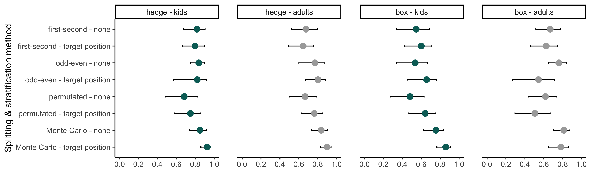

```{r setup, include = FALSE}
library("papaja")
# r_refs("r-references.bib")
```

```{r analysis-preferences}
# Seed for random number generation
set.seed(42)
knitr::opts_chunk$set(cache.extra = knitr::rand_seed)
```

```{r load_data}
library(tidyverse)
library(brms)
testtrials <- readRDS(file = "../data/gafo-testtrials.rds") %>% 
  # determine order of factors
  mutate(
    targetPosition = factor(targetPosition, levels = c("1", "2", "3", "4", "5", "6", "7", "8", "9", "10", "box1", "box2", "box3", "box4", "box5")), 
    studyversion = factor(studyversion, levels = c("hedge", "box")), 
    datacollection = factor(datacollection, levels = c("in-person - supervised", "remote - unsupervised")),
    sample = factor(sample, levels = c("kids", "adults")), 
    studytype = factor(studytype, levels = c("vali", "vali2", "reli"))
  )
```

# Introduction 
Idea for an opener :) 

Developmental psychology is facing a dilemma: many research questions are questions about individual differences, yet, there is a lack of tasks to reliably measure these individual differences. For example ...

- why is social cognition important
- what methods are currently been used?: wellman
- what are common issues? 
- what to aim at. individual differences in developmental psychology
- what characteristics should a new task fulfill? reliable tasks, variation needed, more trials
- goal of the current project: standardized, easy to use continuous methods

"Recently, it was suggested that a range of cognitive tasks may reliably measure group differences but not individual differences (Hedge et al., 2018). As cognitive tests are commonly used to make inferences about individuals, it seems a worthwhile pursuit to improve the reliability with which individual differences are assessed using these tests. To judge the success of such pursuits, accurate estimates of reliability are required." (Pronk, Molenaar, Wiers and Murre, 2021, p. 1)
"Firstly, reliability is not only a function of task and population sample but also of scoring algorithms." (Pronk, Molenaar, Wiers and Murre, 2021, p. 9)
"Hence, we conclude that for the datasets included in our reanalysis, cognitive tasks may well have been able to measure individual differences, but that these differences may be relatively unstable over time (Kopp et al., 2021). In practice, this may make cognitive tasks suitable for cross-sectional research of individual differences, but not for longitudinal research." (Pronk, Molenaar, Wiers and Murre, 2021, p. 10)

Rakoczy, H. (2022). Foundations of theory of mind and its development in early childhood. Nature Reviews Psychology, 1–13. https://doi.org/10.1038/s44159-022-00037-z:
"The way humans view agents, be it others or themselves, differs radically from the way humans view the rest of the world. This difference is because agents feel, perceive and think. Agents see the world from their own subjective perspective and they rationally plan, form intentions and act accordingly. This way of seeing others as rational subjects with individual perspectives on the world is termed theory of mind (ToM)." (p. 1)
"ToM also has specific real-life consequences. First, the development of ToM competence goes along with general measures of children’s peer social skills in early and middle childhood. (...) Second, ToM specifically predicts communicative competence. (...) Third, ToM competence is related to the quality of peer relationships: children with more advanced ToM are rated as more likeable and popular among their peers. Fourth, children who are more proficient at ToM tasks tend to act more prosocially, including comforting, sharing or helping other individuals. Finally, preschool ToM competence predicts achievement in primary school, a relationship that is possibly mediated by social competence, in that preschool ToM abilities enable subsequent social competence development, which in turn contributes to school achievement." (p. 2)
"Evidence for an emerging understanding of perception at 9 months of age comes from various sources. For example, children begin to follow the gaze of other agents in systematic and differential ways: they follow an agent’s head turn only when the agent can actually see (has their eyes open rather than closed, or wears a transparent rather than an opaque blindfold)." (p. 2)
Developmental determinants: executive function, language ("that" complementations), social (SES, siblings, mind-minded parents)
Implicit tasks: "A third class of implicit ToM tasks is interaction tasks, in which participants are involved in a communicative or cooperative interaction with another agent. This agent forms a mental state (such as a true or false belief regarding the contents of a box) and experimenters measure whether participants spontaneously take the agent’s belief into account in their interaction with the agent (for instance by helping or by interpreting the agent’s communicative acts accordingly)" (p. 9)
=> reliable & valid tasks to assess coherent development of social-cognitive functions

# Design of our balloon finding task
- face value of task (or maybe in intro already?)

## Stimuli
Our newly implemented balloon finding task displays cartoon-like stimuli that are engaging for children and adults alike. An animal character (i.e., agent; sheep, monkey, or pig) is placed centrally in a window. A balloon (i.e., target; blue, green, yellow, or red) is located in front of them. The target then falls to the ground. At all times, the agent’s gaze tracks the movement of the target. That is, the pupils and iris of the agent move in a way that their center aligns with the center of the target. While the distance of the target's flight depends on the final location, the target moves at a constant speed. Participants are then asked to locate the target’s destination: they respond by touching or clicking onto position on the screen. 

To keep participants engaged and interested, the presentation of events is accompanied by cartoon-like effects. Each trial starts with an attention-getter: an eye-blinking sound plays while the pupils and iris of the agent enlarge (increase to 130%) and change in opacity (decrease to 75%) for 0.3 sec. The landing of the target is accompanied by a tapping sound. Once the target landed, the instructor's voice asks "Where is the balloon?". After the response is registered, a short plop sound plays and a small orange circle confirms the participants' location choice. If no response got registered within 5 secs after the target landed, an audio prompt reminds the participant to respond. 

## Trials
Before the test trials start, we present four training trials during which participants familiarize themselves with selection positions on the screen. In the first training trial, participants have full visual access to the target flight and the target's end location and are simply asked to click on the visible balloon. In the second and third training trials, participants have partial visual access: they witness the target flight but cannot see the target's end location. They are then asked to click on the invisible balloon, i.e., the location where they saw the target land. In test trials, participants have no visual access to the target flight nor the end location. Participants are expected to use the agent’s gaze as a cue to locate the target. The first trial of each type comprises a voice-over description of the presented events. The audio descriptions explicitly state that the agent is always looking at the target (see Appendix for audio script). After these four training and audio guided trials, participants receive 15 test trials. The complete sequence of four training trials and 15 test trials can be administered within 5-10 minutes of testing time.

## Study versions
We designed two study versions which can be chosen according to the researchers' need: there is a continuous *hedge* version and a discrete *box* version. Both versions use the same first training trial and then differ in the consecutive training and test trials. 
In the *hedge* version, participants have to indicate their estimated target location directly on a hedge (i.e., hedge version). 
Here, the dependent variable is imprecision, which is defined as the absolute difference between the target's true x coordinate and the x coordinate of the participant’s click.
In the *box* version, participants are asked to click on a box that hides the target. Researchers have the choice of how many boxes are shown: one up to eight boxes can be displayed as potential hiding locations. Here, we use a categorical outcome (i.e., which box was clicked) to calculate the proportion of correct responses. 
Note that in the test trials of both study versions, the target flight is covered by a hedge. In the *hedge* version, the hedge then shrinks to a minimum height required to cover the target's end location. In the *box* version, the hedge shrinks completely. The boxes then hide the target's final destination. 

(ref:figlab1) **Study setup**. 
(a) Infrastructure for online testing. (i) Subjects aged 3 – 99+ can participate. Data collection can take place anywhere: at home, in kindergartens or research institutes. (ii) The task is presented as a website that works across devices. (iii) The scripts for the website and the recorded data are stored on secure local servers.
(b) Continuous *hedge* version of the balloon finding task. (i) The agent stands in a window with the target in front of them. (ii) A hedge grows and covers the target. (iii) The target falls to a random location on the ground. The agent's eyes track the movement of the target. 
(c) Discrete *box* version of the balloon finding task. Number of boxes (min. 1; max. 8) as potential hiding locations can be set individually.

```{r fig1, include = T, out.width = "100%", fig.align = "center", fig.cap = "(ref:figlab1)"}
knitr::include_graphics("../figures/gafo_procedure.jpg")
``` 

## Randomization
All agents and target colors appear equally often and are not repeated in more than two consecutive trials. The randomization of the target end location depends on the study version. In the *hedge* version, the full width of the screen is divided into ten bins. Exact coordinates within each bin are then randomly generated. In the *box* version, the target randomly lands in one of the boxes. As with agent and color choice, each bin/box occurs equally often and can only occur twice in a row.

## Implementation
Our balloon finding task is presented as an interactive web-app. The task is portable across devices and web browsers and does not require any installation. A great advantage of online testing is that our testing procedure is standardized across participants. By using pre-recorded study instructions, no interaction with the experimenter is necessary during the study. The code is open-source (https://github.com/ccp-eva/gafo-demo) and a live demo version can be found under: https://ccp-odc.eva.mpg.de/gafo-demo/.
The web-app was programmed in JavaScript (ECMAScript 2015, i.e., ES6), HTML5, CSS and PHP. 
We utilized the zero configuration bundler Parcel to enable a live server for debugging, easy imports and minified scripts in order to save data storage.
For stimulus presentation, a scalable vector graphic (SVG) composition was parsed. This way, the composition scales according to the user's view port without loss of quality, while keeping the aspect ratio and relative object positions constant. 
Furthermore, SVGs allow us to define all composite parts of the scene (e.g., pupil of the agent) individually. This is needed for precisely calculating exact pupil and target locations and sizes. Additionally, it makes it easy to adjust the stimuli and, for example, add another agent to the scene.
The GreenSock Animation Platform (GSAP; @greensock2022gsap) library was used to animate the movement of single SVG elements. 
We use URL parameters to capture the participant's ID, language and study version. 
The web-app generates two file types: (1) a text file (.json) containing meta-data, trial specifications and participants' click responses, and (2) a video file (.webm) of the participant's webcam recording.
For our samples described in this paper, we deployed the web-app on servers located in Leipzig, Germany. Data got automatically collected and safely stored on these in-house servers. If no internet connection or server is available, researchers could download a local version of the experiment which stores the generated data automatically on the used device. For child samples, we upload safety copies of the already collected responses after the fourth test trial. In cases where children want to stop participation earlier, no responses get lost.

# Does the balloon finding task induce variation?
Our first aim was to assess whether our balloon finding task induces interindividual variation in a child and adult sample. Furthermore, we were interested in how the data collection mode influences responses.

The pre-registrations can be found here: https://osf.io/snju6 (child sample) and here: https://osf.io/r3bhn (adult sample). Participants were equally distributed across the two study versions. The study was approved by an internal ethics committee at the Max Planck Institute for Evolutionary Anthropology. Data was collected between May and October 2021.

```{r vali_sample}
vali <- testtrials %>% 
  filter(studytype == "vali" & (ageInYears < 6 | ageInYears == 18))

vali_kids <- vali %>%
  filter(ageInYears < 6) %>% 
  group_by(datacollection, ageInYears) %>%
  summarise(
    nTotal = n_distinct(subjID), 
    meanAgeInMonths = mean(ageInMonths, na.rm = T) %>% round(2),
    sdAgeInMonths = sd(ageInMonths, na.rm = T) %>% round(2),
    minAgeInMonths = min(ageInMonths, na.rm = T),
    maxAgeInMonths = max(ageInMonths, na.rm = T),
  )

vali_kids_gender <- vali %>% 
  filter(ageInYears < 6) %>% 
  group_by(datacollection, ageInYears) %>%
  filter(gender == "f") %>% 
  summarise(
    nFemales = length(unique(subjID))
  )

vali_kids <- vali_kids %>% 
  left_join(vali_kids_gender, by = c("datacollection", "ageInYears"))
  
vali_adults <- vali %>%
  filter(ageInYears == 18) %>% 
  summarise(
    nTotal = n_distinct(subjID), 
    meanAge = mean(age, na.rm = T) %>% round(2),
    sdAge = sd(age, na.rm = T) %>% round(2),
    minAge = min(age, na.rm = T),
    maxAge = max(age, na.rm = T),
  )

vali_adults_gender <- vali %>% 
  filter(ageInYears == 18 & gender == "f") %>% 
  summarise(
    nFemales = length(unique(subjID))
  )

vali_adults <- vali_adults %>% 
  full_join(vali_adults_gender, by = character())
```
## Participants
We collected data from an in-person child sample, a remote child sample, and a remote adult sample.
In-person testing with children took place in kindergartens in Leipzig and surroundings that cooperate with the Max Planck Institute for Evolutionary Anthropology. The in-person child sample consisted of 
`r sum(vali_kids$nTotal[vali_kids$datacollection == "in-person - supervised"])` children, including 
`r sum(vali_kids$nTotal[vali_kids$datacollection == "in-person - supervised" & vali_kids$ageInYears == "3"])` 3-year-olds 
(mean = `r sum(vali_kids$meanAgeInMonths[vali_kids$datacollection == "in-person - supervised" & vali_kids$ageInYears == "3"])` months, 
SD = `r sum(vali_kids$sdAgeInMonths[vali_kids$datacollection == "in-person - supervised" & vali_kids$ageInYears == "3"])`, 
range = `r sum(vali_kids$minAgeInMonths[vali_kids$datacollection == "in-person - supervised" & vali_kids$ageInYears == "3"])`
- `r sum(vali_kids$maxAgeInMonths[vali_kids$datacollection == "in-person - supervised" & vali_kids$ageInYears == "3"])`, 
`r sum(vali_kids$nFemales[vali_kids$datacollection == "in-person - supervised" & vali_kids$ageInYears == "3"])` girls),
`r sum(vali_kids$nTotal[vali_kids$datacollection == "in-person - supervised" & vali_kids$ageInYears == "4"])` 4-year-olds 
(mean = `r sum(vali_kids$meanAgeInMonths[vali_kids$datacollection == "in-person - supervised" & vali_kids$ageInYears == "4"])` months, 
SD = `r sum(vali_kids$sdAgeInMonths[vali_kids$datacollection == "in-person - supervised" & vali_kids$ageInYears == "4"])`, 
range = `r sum(vali_kids$minAgeInMonths[vali_kids$datacollection == "in-person - supervised" & vali_kids$ageInYears == "4"])`
- `r sum(vali_kids$maxAgeInMonths[vali_kids$datacollection == "in-person - supervised" & vali_kids$ageInYears == "4"])`, 
`r sum(vali_kids$nFemales[vali_kids$datacollection == "in-person - supervised" & vali_kids$ageInYears == "4"])` girls),
and `r sum(vali_kids$nTotal[vali_kids$datacollection == "in-person - supervised" & vali_kids$ageInYears == "5"])` 5-year-olds 
(mean = `r sum(vali_kids$meanAgeInMonths[vali_kids$datacollection == "in-person - supervised" & vali_kids$ageInYears == "5"])` months, 
SD = `r sum(vali_kids$sdAgeInMonths[vali_kids$datacollection == "in-person - supervised" & vali_kids$ageInYears == "5"])`, 
range = `r sum(vali_kids$minAgeInMonths[vali_kids$datacollection == "in-person - supervised" & vali_kids$ageInYears == "5"])`
- `r sum(vali_kids$maxAgeInMonths[vali_kids$datacollection == "in-person - supervised" & vali_kids$ageInYears == "5"])`, 
`r sum(vali_kids$nFemales[vali_kids$datacollection == "in-person - supervised" & vali_kids$ageInYears == "5"])` girls). 

For our remote child sample, we recruited families on a voluntary basis via email from the institute's internal database. Our remote child sample included `r sum(vali_kids$nTotal[vali_kids$datacollection == "remote - unsupervised"])` children, including 
`r sum(vali_kids$nTotal[vali_kids$datacollection == "remote - unsupervised" & vali_kids$ageInYears == "3"])` 3-year-olds 
(mean = `r sum(vali_kids$meanAgeInMonths[vali_kids$datacollection == "remote - unsupervised" & vali_kids$ageInYears == "3"])` months, 
SD = `r sum(vali_kids$sdAgeInMonths[vali_kids$datacollection == "remote - unsupervised" & vali_kids$ageInYears == "3"])`, 
range = `r sum(vali_kids$minAgeInMonths[vali_kids$datacollection == "remote - unsupervised" & vali_kids$ageInYears == "3"])`
- `r sum(vali_kids$maxAgeInMonths[vali_kids$datacollection == "remote - unsupervised" & vali_kids$ageInYears == "3"])`, 
`r sum(vali_kids$nFemales[vali_kids$datacollection == "remote - unsupervised" & vali_kids$ageInYears == "3"])` girls),
`r sum(vali_kids$nTotal[vali_kids$datacollection == "remote - unsupervised" & vali_kids$ageInYears == "4"])` 4-year-olds 
(mean = `r sum(vali_kids$meanAgeInMonths[vali_kids$datacollection == "remote - unsupervised" & vali_kids$ageInYears == "4"])` months, 
SD = `r sum(vali_kids$sdAgeInMonths[vali_kids$datacollection == "remote - unsupervised" & vali_kids$ageInYears == "4"])`, 
range = `r sum(vali_kids$minAgeInMonths[vali_kids$datacollection == "remote - unsupervised" & vali_kids$ageInYears == "4"])`
- `r sum(vali_kids$maxAgeInMonths[vali_kids$datacollection == "remote - unsupervised" & vali_kids$ageInYears == "4"])`, 
`r sum(vali_kids$nFemales[vali_kids$datacollection == "remote - unsupervised" & vali_kids$ageInYears == "4"])` girls),
and `r sum(vali_kids$nTotal[vali_kids$datacollection == "remote - unsupervised" & vali_kids$ageInYears == "5"])` 5-year-olds 
(mean = `r sum(vali_kids$meanAgeInMonths[vali_kids$datacollection == "remote - unsupervised" & vali_kids$ageInYears == "5"])` months, 
SD = `r sum(vali_kids$sdAgeInMonths[vali_kids$datacollection == "remote - unsupervised" & vali_kids$ageInYears == "5"])`, 
range = `r sum(vali_kids$minAgeInMonths[vali_kids$datacollection == "remote - unsupervised" & vali_kids$ageInYears == "5"])`
- `r sum(vali_kids$maxAgeInMonths[vali_kids$datacollection == "remote - unsupervised" & vali_kids$ageInYears == "5"])`, 
`r sum(vali_kids$nFemales[vali_kids$datacollection == "remote - unsupervised" & vali_kids$ageInYears == "5"])` girls). Children in our sample grow up in an industrialized, urban Central-European context. Information on socioeconomic status was not formally recorded, although the majority of families come from mixed, mainly mid to high socioeconomic backgrounds with high levels of parental education. 

In addition, we recruited a remote adult sample by advertising the study on *Prolific*. *Prolific* is an online participant recruitment service from the University of Oxford with a predominantly European and US-american subject pool. Participants consisted of `r vali_adults$nTotal` English-speakers with an average age of `r vali_adults$meanAge` years (SD = `r vali_adults$sdAge`, range = `r vali_adults$minAge` - `r vali_adults$maxAge`, `r vali_adults$nFemales` females). 
For completing the study, subjects were payed above the fixed minimum wage (in average £10.00 per hour). *Prolific* distributed our study link to potential participants, while the hosting of the online study was done by local servers in the Max Planck Institute for Evolutionary Anthropology, Leipzig, Germany.

## Procedure
Children in our in-person sample were tested on a tablet in a quiet room in their daycare center. An experimenter accompanied the child and helped them navigate through the online study.
Children in the remote sample received a personalized link to the study websites and families could participate at any time or location they wanted. In the beginning of the online study, families were invited to enter our "virtual institute" and were welcomed by an introductory video of the study leader, shortly describing the research background and further procedure. Then, caregivers were informed about data security and were asked for their informed consent. They were asked to enable the sound and seat their child centrally in front of their device. Before the study started, families were instructed how to setup their webcam and enable the recording permissions. We stressed that caregivers should not help their children. Study participation was video recorded whenever possible in order to ensure that the answers were generated by the children themselves.
Depending on the participant's device, the website automatically presented the hedge or box version of the study. For families that used a tablet with touchscreen, the hedge version was shown. Here, children could directly click on the touchscreen themselves to indicate where the target is. For families that used a computer without touchscreen, the website presented the box version of the task. We assumed that younger children in our sample would not be acquainted with the usage of a computer mouse. Therefore, we asked children to point to the screen, while caregivers were  asked to act as the "digital finger" of their children and click on the indicated box.

Our adult sample participated remotely without supervision.

All participants received 15 test trials that were displayed as described above. In the box version, we decided to adjust the task difficulty according to the sample: children were presented with five boxes while adults were presented with eight boxes as possible target locations. 

## Analysis
All test trials without voice over description were included in our analyses.
We ran all analyses in `r R.version$version.string` [@rcoreteam2022language]. 
Regression models were fit as Bayesian generalized linear mixed models (GLMMs) with default priors for all analyses, using the function `brm` from the package `brms` [@burkner2017brms; @burkner2018advanced].

To estimate the developmental trajectory of gaze cue understanding and the effect of data collection mode, we fit a GLMM predicting the task performance by age (in months, z-transformed) and data collection mode (reference category: in-person supervised). The model included random intercepts for each participant and each target position, and a random slope for symmetric target position within participants (model notation in `R: performance ~ age + datacollection + (symmetricPosition | subjID) + (1 | targetPosition)`). Here, `targetPosition` refers to the absolute bin/box of the target, while `symmetricPosition` refers to the distance from the stimulus center (i.e., smaller value meaning more central target position). We expected that trials could differ in their difficulty depending on the target centrality and that these these item effects could vary between participants.

For the hedge version, performance was defined as the absolute click distance between the target center and the click X coordinate, scaled according to target widths, and modeled by a lognormal distribution. 
For the box version, the model predicted correct responses (0/1) using a Bernoulli distribution with a logit link function.
We inspected the posterior distribution (mean and 95% Confidence Interval (CI)) for the age and data collection estimates.

## Results
(ref:figlab2) **Measuring interindividual variation**. 
(a) Developmental trajectory in continuous *hedge* version. Performance is measured as average imprecision, i.e., the absolute distance between the target's center and the participant's click. The unit of imprecision is counted in the width of the target, i.e., a participant with an imprecision of 1 clicked in average one target width to the left or right of the true target center. 
(b) Internal consistency (odd-even split) in hedge child sample. (c) Internal consistency in hedge adult sample. (d) Test-retest reliability in hedge child sample. (e) Test-retest reliability in hedge adult sample.
(f) Developmental trajectory in discrete *box* version. Performance is measured as the proportion of correct responses, i.e., how many times the participant clicked on the box that actually contained the target. Dotted black line shows level of performance expected by chance (for child sample 20%, i.e., 1 out of 5 boxes; for adult sample 12.5%, i.e., 1 out of 8 boxes).
(g) Internal consistency (odd-even split) in box child sample. (h) Internal consistency in box adult sample. (i) Test-retest reliability in box child sample. (j) Test-retest reliability in box adult sample.
Regression lines with 95% CI show product-moment-correlations with *Pearson*'s correlation coefficient *r.* 
Large data points with 95% CI (based on non-parametric bootstrap) represent performance means by age group (binned by year). 
Small data points show the mean performance for each subject. Shape of data points represents data collection mode: opaque round circles stand for in-person supervised data collection, translucent diamonds stand for remote unsupervised data collection. Color of data points represent each age group (binned by year).

```{r fig2, include = T, out.width = "100%", fig.align = "center", fig.cap = "(ref:figlab2)"}
knitr::include_graphics(c("../figures/gafo_results.png"))
``` 
```{r agemodels}
mAgeHedge <- readRDS(file = "../saves/mAgeHedge.rds") 
mAgeBox <- readRDS(file = "../saves/mAgeBox.rds") 
```

We captured a developmental trajectory of gaze cue understanding: with increasing age, participants got more and more accurate in locating the target. In the hedge version, children's click imprecision droped with age, while, congruently, the proportion of correct responses increased in the box version (see Figure 2 A and F). Most participants in the box version performed above chance level. By the end of their sixth year of life, children came close to the adult's proficiency level. We found interindividual variation across study versions and age groups. For instance, this can be seen in that some three-year-olds were more precise in their responses than some five-year-olds. 

As Figure 2 A and F show, our remotely collected child data resembled the data from the kindergarten sample. 
We found evidence that responses of children participating remotely were slightly more precise. This difference was mainly driven by the younger participants and especially prominent in the box version of the task. It is conceivable that caregivers were especially prone to influence the behavior of younger children. In the box version, caregivers might have had more opportunities to interfere since they carried out the clicking for their children.[^fn1]

[^fn1]: In an exploratory analysis, we coded parental behavior and environmental factors during remote unsupervised testing. We focused on the subsample with the greatest performance difference between data collection modes: the three-year-olds in the box version of the task (n = `r n_distinct(vali$subjID[vali$datacollection == "remote - unsupervised" & vali$ageInYears == 3 & vali$studyversion == "box" & vali$webcam == TRUE])`). We reasoned that if parental interference cannot explain the greatest performance difference in our sample, the effects would be negligible in the remaining sample. Based on our model comparison, we conclude that there is no clear evidence of a stable effect of parental interference. See Supplements for further detail.

Our GLMM analysis corroborated the effects of age and data collection mode that we already identified by visual inspection: in the hedge version, we found an estimate of age of `r fixef(mAgeHedge)["age", "Estimate"]` (95% CI [`r fixef(mAgeHedge)["age", "Q2.5"]`; `r fixef(mAgeHedge)["age", "Q97.5"]`]) and an estimate of data collection mode of `r fixef(mAgeHedge)["datacollectionremoteMunsupervised", "Estimate"]` (95% CI [`r fixef(mAgeHedge)["datacollectionremoteMunsupervised", "Q2.5"]`; `r fixef(mAgeHedge)["datacollectionremoteMunsupervised", "Q97.5"]`]). 
In the box version, the estimate of age was `r fixef(mAgeBox)["age", "Estimate"]` (95% CI [`r fixef(mAgeBox)["age", "Q2.5"]`; `r fixef(mAgeBox)["age", "Q97.5"]`]) and the estimate of data collection mode was `r fixef(mAgeBox)["datacollectionremoteMunsupervised", "Estimate"]` (95% CI [`r fixef(mAgeBox)["datacollectionremoteMunsupervised", "Q2.5"]`; `r fixef(mAgeBox)["datacollectionremoteMunsupervised", "Q97.5"]`]). Note that the effect of data collection appears to be present, but confidence intervals are wide. 

## Discussion
Study 1 showed that our newly implemented balloon finding task can be used to study gaze cue understanding in both children and adults. With increasing age, participants got more and more precise in locating the target. We found interindividual variation across all age groups. Furthermore, we found a comparable developmental trajectory for an unsupervised remote child sample. This underlines how flexibly our new task can be used. 

# Can we capture variation reliably?
As a next step, we aimed at investigating whether the variation that we captured with our balloon finding task is reliable (i.e.,
systematically order individuals in the same way). For this aim, we assessed the internal consistency, as calculated by splithalf reliability, and the test-retest reliability. The pre-registrations can be found here: https://osf.io/xqm73 (child sample) and here: https://osf.io/nu62m (adult sample). Participants were equally distributed across the two study versions. The study was approved by an internal ethics committee at the Max Planck Institute for Evolutionary Anthropology. Data was collected between July 2021 and April 2022.

```{r reli_sample}
reli <- testtrials %>% 
  filter(studytype == "reli" & (ageInYears < 6 | ageInYears == 18) & completedReli)

reli_kids <- reli %>%
  filter(ageInYears < 6) %>% 
  group_by(datacollection, ageInYears) %>%
  summarise(
    nTotal = n_distinct(subjID), 
    meanAgeInMonths = mean(ageInMonths, na.rm = T) %>% round(2),
    sdAgeInMonths = sd(ageInMonths, na.rm = T) %>% round(2),
    minAgeInMonths = min(ageInMonths, na.rm = T),
    maxAgeInMonths = max(ageInMonths, na.rm = T),
  )

reli_kids_gender <- reli %>% 
  filter(ageInYears < 6) %>% 
  group_by(datacollection, ageInYears) %>%
  filter(gender == "f") %>% 
  summarise(
    nFemales = length(unique(subjID))
  )

reli_kids <- reli_kids %>% 
  left_join(reli_kids_gender, by = c("datacollection", "ageInYears"))
  
reli_adults <- reli %>%
  filter(ageInYears == 18) %>% 
  summarise(
    nTotal = n_distinct(subjID), 
    meanAge = mean(age, na.rm = T) %>% round(2),
    sdAge = sd(age, na.rm = T) %>% round(2),
    minAge = min(age, na.rm = T),
    maxAge = max(age, na.rm = T),
  )

reli_adults_gender <- reli %>% 
  filter(ageInYears == 18 & gender == "f") %>% 
  summarise(
    nFemales = length(unique(subjID))
  )

reli_adults <- reli_adults %>% 
  full_join(reli_adults_gender, by = character())
```
## Participants
For our child sample, we went to kindergartens in Leipzig and surroundings.
The child sample consisted of 
`r sum(reli_kids$nTotal[reli_kids$datacollection == "in-person - supervised"])` children, including 
`r sum(reli_kids$nTotal[reli_kids$datacollection == "in-person - supervised" & reli_kids$ageInYears == "3"])` 3-year-olds 
(mean = `r sum(reli_kids$meanAgeInMonths[reli_kids$datacollection == "in-person - supervised" & reli_kids$ageInYears == "3"])` months, 
SD = `r sum(reli_kids$sdAgeInMonths[reli_kids$datacollection == "in-person - supervised" & reli_kids$ageInYears == "3"])`, 
range = `r sum(reli_kids$minAgeInMonths[reli_kids$datacollection == "in-person - supervised" & reli_kids$ageInYears == "3"])`
- `r sum(reli_kids$maxAgeInMonths[reli_kids$datacollection == "in-person - supervised" & reli_kids$ageInYears == "3"])`, 
`r sum(reli_kids$nFemales[reli_kids$datacollection == "in-person - supervised" & reli_kids$ageInYears == "3"])` girls),
`r sum(reli_kids$nTotal[reli_kids$datacollection == "in-person - supervised" & reli_kids$ageInYears == "4"])` 4-year-olds 
(mean = `r sum(reli_kids$meanAgeInMonths[reli_kids$datacollection == "in-person - supervised" & reli_kids$ageInYears == "4"])` months, 
SD = `r sum(reli_kids$sdAgeInMonths[reli_kids$datacollection == "in-person - supervised" & reli_kids$ageInYears == "4"])`, 
range = `r sum(reli_kids$minAgeInMonths[reli_kids$datacollection == "in-person - supervised" & reli_kids$ageInYears == "4"])`
- `r sum(reli_kids$maxAgeInMonths[reli_kids$datacollection == "in-person - supervised" & reli_kids$ageInYears == "4"])`, 
`r sum(reli_kids$nFemales[reli_kids$datacollection == "in-person - supervised" & reli_kids$ageInYears == "4"])` girls),
and `r sum(reli_kids$nTotal[reli_kids$datacollection == "in-person - supervised" & reli_kids$ageInYears == "5"])` 5-year-olds 
(mean = `r sum(reli_kids$meanAgeInMonths[reli_kids$datacollection == "in-person - supervised" & reli_kids$ageInYears == "5"])` months, 
SD = `r sum(reli_kids$sdAgeInMonths[reli_kids$datacollection == "in-person - supervised" & reli_kids$ageInYears == "5"])`, 
range = `r sum(reli_kids$minAgeInMonths[reli_kids$datacollection == "in-person - supervised" & reli_kids$ageInYears == "5"])`
- `r sum(reli_kids$maxAgeInMonths[reli_kids$datacollection == "in-person - supervised" & reli_kids$ageInYears == "5"])`, 
`r sum(reli_kids$nFemales[reli_kids$datacollection == "in-person - supervised" & reli_kids$ageInYears == "5"])` girls). 

The adult sample was recruited over *Prolific* and consisted of `r reli_adults$nTotal` English-speakers with an average age of `r reli_adults$meanAge` years (SD = `r reli_adults$sdAge`, range = `r reli_adults$minAge` - `r reli_adults$maxAge`, `r reli_adults$nFemales` females). 

## Procedure
We applied the same procedure as in the first study, with the following differences. Participants completed the study twice, with a delay of 14 ± 3 days. 
The target locations as well as the succession of agents and target colors was randomized once and then held constant across participants.
The child sample received 15 test trials. In the hedge version, each bin occurred once, making up ten of the test trials. For the remaining five test trials, we repeated one out of two adjacent bins (i.e., randomly chose between bin 1 & 2, bin 3 & 4, etc). In the box version, we ensured that each of the five boxes occurred exactly three times. For the remaining training trials, we repeated a fixed order of four random bins/boxes.
Adults in the hedge version received 30 test trials, each of the ten bin occurring exactly three times. Adults in the box version received 32 test trials with each of the eight boxes occurring exactly four times. 

## Analysis
We assessed reliability in two ways. 
First, we focused on the internal consistency by calculating splithalf reliability coefficients. For each subject, trials were split into odd and even and performance scores per part were correlated against each other using *Pearson* correlation coefficients. We took the data of the first test day and defined performance according to study version: in the hedge version, performance referred to the absolute difference between the target center and the click coordinate, scaled according to target widths; in the box version, we computed the proportion of correct choices. 
As a recent paper by @pronk2021methods suggested, there are various less well-known split-half methods that differ in how the trials are split into parts and whether they are combined with stratification by task design. To compare our traditional approach of a simple odd-even split, we additionally calculated reliability estimates using first-second, odd-even, permutated, and Monte Carlo splits without and with stratification by target position. First-second and odd-even splits belong to single sample methods, since each participant has a single pair of performance scores, while permutated (without replacement) and Monte Carlo (with replacement) splits make use of resampling. Analyses were run using the function `by_split`from the `splithalfr` package [@pronk2021methods].
Second, we assessed the test-retest reliability. We calculated performance scores (depending on study version as described above) for each individual in each test session and correlated those using *Pearson* correlation coefficients. Furthermore, for our child sample we report an age-corrected correlation between the two test days using a GLMM based approach. We fit trial by trial data with a fixed effect of age, a random intercept for each subject and a random slope for test day (model notation in `R: performance ~ age (0 + reliday | subjID)`). For the hedge version, performance was modeled by a lognormal distribution, while the model for the box version used a Bernoulli distribution with a logit link function.
The model computes a correlation between the participant specific estimates for each test day. This can be interpreted as the test-retest reliability. By using this approach, we do not need to compromise on data aggregation and, therefore, loss of information. Most importantly, the model allows us to get an age-independent estimate for reliability. This rules out the possibility that a high correlation between test days arises from domain general cognitive maturation processes instead of study-specific inter-individual differences. 

## Results
```{r splithalf}
splithalf <- readRDS(file = "../saves/gafo-splithalf.rds")
```

We found that our balloon finding task induced systematic variation: splithalf and test-retest reliability was high for most samples. 

For the internal consistency, we show traditional odd-even splits on our data and the corresponding *Pearson* correlation coefficients in Figure 2 B, C, G and H.

Figure 3 compares splithalf reliability coefficients by splitting and stratification method, following @pronk2021methods.
In the hedge version, the splithalf reliability coefficients ranged from `r min(splithalf$coefficient[splithalf$studyversion == "hedge"])` to `r max(splithalf$coefficient[splithalf$studyversion == "hedge"])`. In the box version, splithalf reliability coefficients ranged from `r min(splithalf$coefficient[splithalf$studyversion == "box"])` to `r max(splithalf$coefficient[splithalf$studyversion == "box"])`. 
Similarly to the results of @pronk2021methods, we found that more robust splitting methods that are less prone to task design or time confounds yielded higher reliability coefficients. In the majority of cases, stratifying by target position lead to similar or even higher estimates compared to no stratification. As might be expected, we found higher coefficients for the samples with higher variation, i.e., for our continuous hedge version of the task.

(ref:figlab3) **Internal Consistency**. 
Reliability coefficients per splitting method, stratification level, study version and age group. Error bars show the 95% confidence intervals of the coefficient estimates, calculated with the function `by_split` from the `splithalfr` package [@pronk2021methods].
```{r fig3, include = T, out.width = "100%", fig.align = "center", fig.cap = "(ref:figlab3)"}

``` 
```{r retestmodels}
mRetestHedge <- readRDS(file = "../saves/mRetestHedge.rds") 
mRetestBox <- readRDS(file = "../saves/mRetestBox.rds") 
```
For the test-retest reliability, we show the association between raw performance scores of the two test days and corresponding *Pearson* correlation coefficients in Figure 2 D, E, I and J.[^fn2]

[^fn2]: In the hedge version, we excluded one 5-year-old child from the test-retest analysis. The performance of the mentioned child lay 3 standard deviations above the mean on both test days. Including the child yielded a *Pearson* correlation coefficient of *r* = 0.87. 

Taking age into account in our GLMM based approach yielded similar results. The age-independent retest reliability estimate in the hedge version amounted to `r posterior_summary(mRetestHedge)["cor_subjID__relidayreliday1__relidayreliday2", "Estimate"]` (95% CI [`r posterior_summary(mRetestHedge)["cor_subjID__relidayreliday1__relidayreliday2", "Q2.5"]`;`r posterior_summary(mRetestHedge)["cor_subjID__relidayreliday1__relidayreliday2", "Q97.5"]`]). 
In the box version of the task, the age-independent correlation between participant specific test day estimates was `r posterior_summary(mRetestBox)["cor_subjID__relidayreliday1__relidayreliday2", "Estimate"]` (95% CI [`r posterior_summary(mRetestBox)["cor_subjID__relidayreliday1__relidayreliday2", "Q2.5"]`;`r posterior_summary(mRetestBox)["cor_subjID__relidayreliday1__relidayreliday2", "Q97.5"]`]). The results suggest that our novel balloon finding task did capture individual differences beyond general cognitive maturation processes. This corroborates what we already see in Figure 2: there was a clear overlap between age groups, indicating that age is predictive of performance for the mean, but is not the driving force acccounting for individual differences. 

## Discussion
Our results indicated that the measured variation was systematic. As could be expected, the continuous measure of the hedge version yielded higher reliability estimates than the discrete box version. 

# Exploring the external validity of our task
Our third aim was to assess whether the captured individual variation in gaze cue understanding relates to factors in children's real live social surroundings. 
```{r peerexposure_sample}
pe <- testtrials %>% 
  filter(ageInYears < 6) %>% 
  select(datacollection, studyversion, subjID, gender, trialNr, ageInMonths, ageInYears, correctBox, childcareAge, childcareHours, householdTotal, siblingsNr, siblingsChildAged, siblingsVarietyScoreP, siblingsVarietyScoreW, targetPosition, targetCentralityX) %>% 
  # so that all models run with same nr of subjects
  drop_na()

pe_sample <- pe %>%
  group_by(ageInYears) %>%
  summarise(
    nTotal = n_distinct(subjID), 
    meanAgeInMonths = mean(ageInMonths, na.rm = T) %>% round(2),
    sdAgeInMonths = sd(ageInMonths, na.rm = T) %>% round(2),
    minAgeInMonths = min(ageInMonths, na.rm = T),
    maxAgeInMonths = max(ageInMonths, na.rm = T),
  )

pe_gender <- pe %>% 
  group_by(ageInYears) %>%
  filter(gender == "f") %>% 
  summarise(
    nFemales = length(unique(subjID))
  )

pe_sample <- pe_sample %>% 
  left_join(pe_gender, by = c("ageInYears"))
```

## Participants
For this exploratory analysis, we included all children of the aforementioned samples where families filled out a short demographic questionnaire. This subsample consisted of 
`r sum(pe_sample$nTotal)` children, including 
`r sum(pe_sample$nTotal[pe_sample$ageInYears == "3"])` 3-year-olds 
(mean = `r sum(pe_sample$meanAgeInMonths[pe_sample$ageInYears == "3"])` months, 
SD = `r sum(pe_sample$sdAgeInMonths[pe_sample$ageInYears == "3"])`, 
range = `r sum(pe_sample$minAgeInMonths[pe_sample$ageInYears == "3"])`
- `r sum(pe_sample$maxAgeInMonths[pe_sample$ageInYears == "3"])`, 
`r sum(pe_sample$nFemales[pe_sample$ageInYears == "3"])` girls),
`r sum(pe_sample$nTotal[pe_sample$ageInYears == "4"])` 4-year-olds 
(mean = `r sum(pe_sample$meanAgeInMonths[pe_sample$ageInYears == "4"])` months, 
SD = `r sum(pe_sample$sdAgeInMonths[pe_sample$ageInYears == "4"])`, 
range = `r sum(pe_sample$minAgeInMonths[pe_sample$ageInYears == "4"])`
- `r sum(pe_sample$maxAgeInMonths[pe_sample$ageInYears == "4"])`, 
`r sum(pe_sample$nFemales[pe_sample$ageInYears == "4"])` girls),
and `r sum(pe_sample$nTotal[pe_sample$ageInYears == "5"])` 5-year-olds 
(mean = `r sum(pe_sample$meanAgeInMonths[pe_sample$ageInYears == "5"])` months, 
SD = `r sum(pe_sample$sdAgeInMonths[pe_sample$ageInYears == "5"])`, 
range = `r sum(pe_sample$minAgeInMonths[pe_sample$ageInYears == "5"])`
- `r sum(pe_sample$maxAgeInMonths[pe_sample$ageInYears == "5"])`, 
`r sum(pe_sample$nFemales[pe_sample$ageInYears == "5"])` girls). 

## Procedure
Families of our kindergarten and online child sample were asked to fill out a brief demographic questionnaire (print out / online questionnaire). We asked for (1) the total number of household members, (2) the number of children, (3) age of the other children, (4) whether the child was in day care, and if yes, (5) since when and (6) for how long on an average day. 


## Analysis
We compared models using WAIC (widely applicable information criterion) scores and weights. As an indicator of out-of-sample predictive accuracy, lower WAIC scores stand for a better model fit. WAIC weights represent the probability that the model in question provides the best out-of-sample prediction compared to the other models. 

## Results
- peer exposure (hedge & box combined?)

# Discussion
## Limitations
## Future development / extending the task

# Conclusion

# Declarations
## Open practices statement
The web application (https://ccp-odc.eva.mpg.de/gafo-demo/) described here is open source (https://github.com/ccp-eva/gafo-demo).
The datasets generated during and/or analysed during the current study are available in the [gazecues-methods] repository, (https://github.com/jprein/gazecues-methods). All experiments were preregistered (https://osf.io/zjhsc/).

## Funding 
This study was funded by the Max Planck Society for the Advancement of Science, a noncommercial, publicly financed scientific organization (no grant number). We thank all the children and parents who participated in the study.

## Conflicts of interest 
The authors declare that they have no conflict of interest.

## Ethics approval 

## Consent to participate
Informed consent was obtained from all individual participants included in the study or their legal guardians.

## Consent for publication 

## Open access

## Authors' contributions 
optional: please review the submission guidelines from the journal whether statements are mandatory

\newpage

# References

\begingroup
\setlength{\parindent}{-0.5in}
\setlength{\leftskip}{0.5in}

<div id="refs" custom-style="Bibliography"></div>
\endgroup

\newpage

# Supplements
## Child sample
### Webcam coding
Comparing the performances of children across our two data collection modes, we found that children participating remotely were slightly more precise. This difference was especially prominent in younger participants in the box version of the task. It is conceivable that caregivers were especially prone to influence the behavior of younger children. In the box version, caregivers might have had more opportunities to interfere since they carried out the clicking for their children.
In an exploratory analysis, we coded parental behavior and environmental factors during remote unsupervised testing. Due to the incredible time consuming nature of hand coding videos frame by frame, we focused on the subsample with the greatest performance difference between data collection modes: the three-year-olds in the box version of the task (n = `r n_distinct(vali$subjID[vali$datacollection == "remote - unsupervised" & vali$ageInYears == 3 & vali$studyversion == "box" & vali$webcam == TRUE])`). We reasoned that if parental interference cannot explain the greatest performance difference in our sample, the effects would be negligible in the remaining sample.
A trial was defined as the time between two eye blinking sounds. We transcribed all utterances by parents and children and counted the words uttered by each. We then classified the utterances into several categories: question asked by child, repeated testquestion by caregiver, hints towards agents (how many times the caregivers guided the child's attention to the agent), hints towards eyes (how many times the caregivers guided the child's attention to the agent's eyes), verification of choice (how many times the caregiver questioned or double checked the child's response), mentioning of screen (how many times the caregiver verbally guided the child's attention to the screen), pointing to screen (how many times the caregiver pointed towards the screen), positive & negative feedback, motivational statements, and incomprehensible utterances.
In addition, we coded how many adults and children were present, whether a response click was obviously conducted by the caregiver themselves, and whether children took a break during the trial. 
We conducted a model comparison to estimate the effects of parental interference. Our null model explained the response behavior by age, while including random effects for subject and target position (model notation in `R: correct ~ age + (1 | subjID) + (1 | targetPosition)`. We compared this null model to models including the number of words uttered by the caregiver, number of repeated testquestions, verification of choice, or hints towards eyes as fixed effects. Furthermore, we calculated an parental interference index by summing up number of repeated testquestions, verification of choice, and hints towards eyes, with the sign matching the variable's direction of effect. Remaining variables that we coded for were not included since there was not enough variation and/or occurrences in our sample. 
We compared models using WAIC (widely applicable information criterion) scores and weights. As an indicator of out-of-sample predictive accuracy, lower WAIC scores stand for a better model fit. WAIC weights represent the probability that the model in question provides the best out-of-sample prediction compared to the other models. 
On the trial level, the model including the verification of choice as a main effect won: here, the less the caregivers asked for children's responses again, the more likely children clicked on the correct box. Interestingly, the effect reversed on a subject level - possibly due to greatest learning effects for the children that were most likely to click incorrectly in the beginning and then receiving most parental comments. On the subject level, the model including number of repeated testquestions won: the more caregivers asked again where the target landed, the more likely children were to respond to the incorrect box. In all cases, however, ELPD difference scores were smaller than their standard errors. Similarly, 95% CI of the model estimates included zero and were rather wide. Therefore, we conclude that no stable effect of parental interference could be confirmed in this exploratory analysis. 

```{r webcam_coding}
webcam_models <- readRDS(file = "../saves/supplements-webcamcoding-results.rds")

knitr::kable(webcam_models)
```

## Adult sample
### Recruitment
We recruited participants using the online participant recruitment service *Prolific* from the University of Oxford. *Prolific*'s subject pool consists of a mostly European and US-american sample although subjects from all over the world are included. The recruitment platform realises ethical payment of participants, which requires researchers to pay participants a fixed minimum wage of £5.00 (around US$6.50 or €6.00) per hour. We decided to pay all participants the same fixed fee which was in relation to the estimated average time taken to complete the task.
*Prolific* distributed our study link to potential participants, while the hosting of the online study was done by local servers in the Max Planck Institute for Evolutionary Anthropology, Leipzig. Therefore, study data was saved only on our internal servers, while *Prolific* provided demographic information of the participants.
Participants' *Prolific* ID was forwarded to our study website using URL parameters. This way, we could match participant demographic data to our study data. The same technique was used to confirm study completion: we redirected participants from our study website back to the *Prolific* website using URL parameters. 
We used *Prolific*'s inbuilt prescreening filter to include only participants who were fluent in English and could therefore properly understand our written and oral study instructions. 

### Study 1 - Validation hedge version
The aim of Study 1 was to validate the hedge version of our balloon finding task. The pre-registration can be found here: https://osf.io/r3bhn. We recruited participants online by advertising the study on *Prolific*. 

50 adults participated in the study. One additional subject returned their submission, i.e., decided to leave the study early or withdrew their submission after study completion. Data collection took place in May 2021. 
Participants were compensated with £1.25 for completing the study. We estimated an average completion time of 6 minutes, resulting in an estimated hourly rate of £10.00. In average, participants took 05:56min to complete the study. 
Participants were required to complete the study on a tablet or desktop. Participation on mobile devices was disabled since the display would be too small and would harm click precision. It was indicated that the study required audio sound. 

We stored *Prolific*'s internal demographic information, while not asking for additional personal information. 

### Study 2 - Validation box version
As in study 1, we recruited participants on *Prolific*, and employed the same methodology. However, this time we focussed on validating the box version of the task in an adult sample. Participants were presented with eight boxes in which the target could land.
50 adults participated in the study. One additional subject returned their submission, i.e., decided to leave the study early or withdrew their submission after study completion. Data collection took place in June 2021. 
Participants were compensated with £1.00 for completing the study. We estimated an average completion time of 6 minutes, resulting in an estimated hourly rate of £10.00. In average, participants took 04:43min to complete the study. 

### Study 3 - Reliability hedge version
In study 3 and 4, we assessed the test-retest reliability of our balloon-finding task in an adult sample. The pre-registration can be found here: https://osf.io/nu62m. We tested the same participants twice with a delay of two weeks. The testing conditions were as specified in Study 1 and 2. However, the target locations as well as the succession of animals and target colors was randomized once. Each participant then received the same fixed randomized order of target location, animal, and target color. Participants received 30 test trials without voice-over description, so that each of the ten bins occurred exactly three times. 

In addition to the beforementioned prescreening settings, we used a whitelist. *Prolific* has a so-called *custom allowlist prescreening filter* where one can enter the *Prolific* IDs of participants who completed a previous study. Only these subjects are then invited to participate in a study. This way, repeated measurements can be implemented, collecting data from the same subjects at different points in time.  

In a first round, 60 participants took part on the first testday. Additional two subjects returned their submission, i.e., decided to leave the study early or withdrew their submission after study completion. One additional participant timed out, i.e., did not finish the survey within the allowed maximum time. The maximum time is calculated by *Prolific*, based on the estimated average completion time. For this study, the maximum time amounted to 41 minutes. For the first testday, participants were compensated with £1.25. We estimated an average completion time of 9 minutes, resulting in an estimated hourly rate of £8.33. In average, participants took 07:11min to complete the first part. 

Of the 60 participants that completed testday 1, 41 subjects finished testday 2. One additional participant timed out, i.e., did not finish the survey within the allowed maximum time. Participants were compensated with £1.50 for completing the second part of the study. We estimated an average completion time of 9 minutes, resulting in an estimated hourly rate of £10. In average, participants took 06:36min to complete the second part of the study.

Since we aimed for a minimum sample size of 60 subjects participating on both testdays, we reran the first testday with additional 50 participants. Additional seven subjects returned their submission, i.e., decided to leave the study early or withdrew their submission after study completion. Two additional participants timed out, i.e., did not finish the survey within the allowed maximum time. Again, participants were compensated with £1.25 for completing the first part of the study (estimated average completion time 9 minutes, estimated hourly rate of £8.33). In average, participants took 06:51min to complete the first part. 

Of the additional 50 participants that completed testday 1, 29 subjects finished testday 2. Again, participants were compensated with £1.50 for completing the second part of the study (estimated average completion time 9 minutes, estimated hourly rate of £10). In average, participants took 06:26min to complete the second part of the study.

### Study 4 - Reliability box version
As in study 3, we recruited participants on *Prolific*, and employed the same methodology. However, this time participants were presented with the box version of the task. Participants received 32 test trials without voice-over description, so that each of the eight boxes occurred exactly four times. As in study 2, we employed eight boxes in which the target could land.

In a first round, 60 participants took part on the first testday. Additional five subjects returned their submission, i.e., decided to leave the study early or withdrew their submission after study completion. For the first testday, participants were compensated with £1.25. We estimated an average completion time of 9 minutes, resulting in an estimated hourly rate of £8.33. In average, participants took 07:33min to complete the first part. 

Of the 60 participants that completed testday 1, 41 subjects finished testday 2. Participants were compensated with £1.50 for completing the second part of the study. We estimated an average completion time of 9 minutes, resulting in an estimated hourly rate of £10. In average, participants took 07:50min to complete the second part of the study.

Since we aimed for a minimum sample size of 60 subjects participating on both testdays, we reran the first testday with additional 50 participants. Additional eight subjects returned their submission, i.e., decided to leave the study early or withdrew their submission after study completion. One additional participant timed out, i.e., did not finish the survey within the allowed maximum time. Again, participants were compensated with £1.25 for completing the first part of the study (estimated average completion time 9 minutes, estimated hourly rate of £8.33). In average, participants took 07:37min to complete the first part. 

Of the additional 50 participants that completed testday 1, 28 subjects finished testday 2. Additional three subjects returned their submission, i.e., decided to leave the study early or withdrew their submission after study completion. One additional participant timed out, i.e., did not finish the survey within the allowed maximum time. Again, participants were compensated with £1.50 for completing the second part of the study (estimated average completion time 9 minutes, estimated hourly rate of £10). In average, participants took 06:30min to complete the second part of the study.

# Instructions and voice over descriptions
This is the content of our audio recordings that were played as instructions and during voice over trials.

|     |     |     |     |
| --- | --- | --- | --- |
| **Timeline** | **German** | **English** | **Filename** |
| **welcome** | Hallo! Schön, dass du da bist. Wir spielen jetzt das Ballon-Spiel! Siehst du die Tiere auf dem Bild da? Wir möchten gleich zusammen mit den Tieren mit einem Ballon spielen. Was genau passiert, erklären wir dir jetzt ganz in Ruhe. | Hello! Great that you’re here. We’ll now play a balloon game. Can you see the animals in the picture over there? We want to play together with the animals using the balloon. We’ll now talk you through exactly what will happen. | welcome.mp3 |
| **touch** | Schau mal, da steht ein Tier im Fenster. Und siehst du den Ballon da? Der Ballon fällt immer runter und landet auf dem Boden. Und du musst ihn dann finden. Das Tier hilft Dir und schaut immer den Ballon an. | Look, an animal is standing in the window. And can you see the balloon over there? The balloon always falls down and lands on the ground. And you have to find it! The animal helps you and always looks at the balloon. | touch-1.mp3 |
|     | Wo ist der Ballon? Drück auf den Ballon! | Where is the balloon? Click on the balloon! | prompt-touch-long.mp3 |
| **fam - HEDGE** | Klasse, das war super! Jetzt spielen wir weiter. Siehst du wieder das Tier und den Ballon da? Der Ballon fällt wieder runter. Diesmal fällt er hinter eine Hecke. Du musst ihn wieder finden. Das Tier hilft dir und schaut immer den Ballon an. | Perfect, that was great! Now, we’ll continue playing. Can you see the animal and the balloon again? The balloon will fall down again. This time, it will fall behind a hedge. And you have to find it! The animal helps you and looks at the balloon. | fam-hedge-1.mp3 |
|     | Wo ist der Ballon? Drücke auf die Hecke - wo der Ballon ist. | Where is the balloon? On the hedge, click where the balloon is. | prompt-hedge-long.mp3 |
| **fam - BOX** | Klasse, das war super! Jetzt spielen wir weiter. Siehst du wieder das Tier und den Ballon da? Der Ballon fällt wieder runter. Diesmal fällt er in eine Kiste.  <br>Du musst ihn wieder finden. Das Tier hilft dir und schaut immer den Ballon an. | Perfect, that was great! Now, we’ll continue playing. Can you see the animal and the balloon again? The balloon falls down again. This time, it falls into a box. And you have to find it! The animal helps you and looks at the balloon. | fam-box-1.mp3 |
|     | Wo ist der Ballon? Drücke auf die Kiste mit dem Ballon. | Where is the balloon? Click on the box with the balloon. | prompt-box-long.mp3 |
| **test - HEDGE** | Klasse , das hast du toll gemacht! Nun spielen wir weiter. Da sind wieder der Ballon, das Tier und die Hecke. Die Hecke wächst jetzt hoch. | Nice, good job! Now, we’ll continue playing. There is the balloon, the animal and the hedge. The hedge is growing a bit now. | test-hedge-1.mp3 |
|     | Der Ballon ist nun hinter der Hecke. Du kannst das nicht sehen - das Tier aber! Jetzt fällt der Ballon auf den Boden und du musst ihn wieder finden. Denk dran - das Tier schaut immer den Ballon an. | The balloon is behind the hedge now. You can’t see it - but the animal can! The balloon falls to the ground and you have to find it. Remember - the animal always looks at the balloon! | test-hedge-2.mp3 |
|     | Dann schrumpft die Hecke. Drücke auf die Hecke - wo der Ballon ist. | Now, the hedge is shrinking. On the hedge, click where the balloon is. | test-hedge-3.mp3 |
| **test - BOX** | Klasse , das hast du toll gemacht! Nun spielen wir weiter. Da sind wieder der Ballon, das Tier und die Kisten. Jetzt wächst eine Hecke hoch. | Nice, good job! Now, we’ll continue playing. There is the balloon and the animal. Now, a hedge is growing. | test-box-1.mp3 |
|     | Der Ballon ist nun hinter der Hecke. Du kannst das nicht sehen - das Tier aber! Jetzt fällt der Ballon in eine Kiste und du musst ihn wieder finden. Denk dran - das Tier schaut immer den Ballon an. | The balloon is behind the hedge now. You can’t see it - but the animal can! The balloon falls into a box and you have to find it. Remember - the animal always looks at the balloon! | test-box-2.mp3 |
|     | Dann schrumpft die Hecke. Drücke auf die Kiste mit dem Ballon. | Now, the hedge is shrinking. Click on the box with the balloon. | test-box-3.mp3 |
| **goodbye** | Geschafft! Die Tiere sind schon ganz glücklich vom Spielen! Vielen Dank für deine Hilfe! Bis zum nächsten Mal und liebe Grüße vom Schwein, Affen und Schaf | The animals are super happy after playing. Thanks a lot for your help! See you soon and goodbye from the pig, monkey and sheep | goodbye.mp3 |
| **general prompt** | Wo ist der Ballon? | Where is the balloon? | prompt-general.mp3 |
| **touch - no response** | Drück auf den Ballon! | Click on the balloon! | prompt-touch.mp3 |
| **hedge - no response** | Drücke auf die Hecke - wo der Ballon ist! | On the hedge, click where the balloon is! | prompt-hedge.mp3 |
| **box - no response** | Drücke auf die Kiste mit dem Ballon! | Click on the box with the balloon! | prompt-box.mp3 |
| **landing sound of balloon** | \-  | \-  | balloon-lands.mp3 |
| **sound of blinking eyes** | \-  | \-  | blink.mp3 |
| **sound for target click** | \-  | \-  | positive-feedback.mp3 |