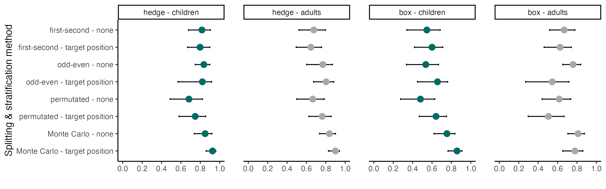

```{r setup, include = FALSE}
library("papaja")
library("ggplot2")
library("ggpubr")
library("tidyverse")
library("brms")
theme_set(theme_classic())
```

```{r analysis-preferences}
# Seed for random number generation
set.seed(42)
knitr::opts_chunk$set(cache.extra = knitr::rand_seed)
```

```{r load_data}
testtrials <- readRDS(file = "../data/tango-testtrials.rds") %>% 
  # determine order of factors
  mutate(
    targetPosition = factor(targetPosition, levels = c("1", "2", "3", "4", "5", "6", "7", "8", "9", "10", "box1", "box2", "box3", "box4", "box5")), 
    studyversion = factor(studyversion, levels = c("hedge", "box")), 
    datacollection = factor(datacollection, levels = c("in-person - supervised", "remote - unsupervised")),
    sample = factor(sample, levels = c("kids", "adults")), 
    studytype = factor(studytype, levels = c("vali", "vali2", "reli"))
  )
```

# Introduction

Social cognition -- representing and reasoning about an agent's perspectives, knowledge states, intentions, beliefs, and preferences to explain and predict their behavior -- is among the most-studied phenomena in developmental research.
In recent decades, much progress has been made in determining the average age at which a specific social-cognitive ability emerges in development [@gopnik1991young; @wellman2001metaanalysis; @wellman2004scaling; @peterson2012mind; @rakoczy2022foundations]. Yet, there are always individual differences. Identifying variability in social-cognitive abilities and factors influencing their development is vital in theory building (e.g., to test causal predictions) and designing interventions [@happe2017structure; @mundy2007individual; @kidd2018individual; @underwood1975individual; @lecce2014promoting].

Numerous studies have already examined individual differences in social cognition [for an overview, see @hughes2015individual; @slaughter2015theorya]. These individual differences studies often focus on the relationship between social-cognitive abilities and: (1) family influences, (2) other cognitive constructs, and (3) social behavioral outcome [for an overview, see @repacholi2003introduction]. Studies on social-cognitive abilities and family influences include the effect of parenting practices [for a review, see @pavarini2013parental], attachment quality [e.g., @astor2020social], mental state talk [@hughes2011individual; @gola2012mental; @lecce2014promoting], and family background as parental education, occupation, sibling interaction and childcare [@dunn1991young; @cutting1999theory; @bulgarelli2016social]. Another group of individual differences studies focuses on the interplay of social and physical cognition [@herrmann2010structure], executive functions [@carlson2004individual; @carlson2001individual; @buttelmann2021relations; @hughes2007executive; @benson2012individual], and language abilities [@okumura2017individual; @milligan2007language; @mcewen2007origins]. Studies on social behavioral outcomes measured the interplay of social cognition and prosociality [for a review, see @imuta2016theory; @walker2005gender], stereotypes, and resource allocations [@rizzo2018theory], and moral intentions [@sodian2016understanding].

However, developmental psychologists are frequently surprised to find minor or no association between measures of social cognition that are thought to be theoretically related -- cross-sectionally and/or longitudinally [e.g., @sodian2016understanding]. This might be because traditional measures of social cognition are not designed to capture variation between children: they often rely on low trial numbers, small sample sizes, and dichotomous measures. A recent review showed that many studies on social cognition measures failed to report relevant psychometric properties at all [@beaudoin2020systematic] or -- when they did -- showed mixed results on test-retest reliability [@mayes1996testretest; @hughes2000good].

To give an example: the most commonly applied prototypical measure for social cognition is the change-of-location false belief task [@baron-cohen1985does; @wimmer1983beliefs]. Here, children watch a short sequence of events (often acted out or narrated by the experimenters). A doll called Sally puts her marble into a basket. After Sally leaves the scene, a second doll named Anne takes the marble and moves it into a box. Participants then get asked where Sally will look for her marble once she returns. The outcome measures false belief understanding in a dichotomous way: children pass the task if they take the protagonist's epistemic state into account and answer that she will look into the basket. Many years of research utilizing these verbal change-of-location tasks suggest that children develop belief-representing abilities at four to five years of age [for a review, see @wellman2001metaanalysis]. Several cross-cultural studies supported this evidence [@barrett2013early; @callaghan2005synchrony; cf. @mayer2015weird].

However, from this age onwards, the change-of-location task shows ceiling effects and has very limited diagnostic value [@repacholi2003introduction]. Thus, this task seems well suited to track a particular group-level developmental transition, yet it fails to capture individual differences [cf. "reliability paradox", @hedge2018reliability].
As @wellman2012theory put it, "it's really only passing/failing one sort of understanding averaged across age" (p. 317).
This has profound implications for what studies on individual differences using this task (or others) can show.
Poor measurement of social cognition on an individual level is likely to conceal relations between different aspects of cognition and may obscure developmental change.

Thus, developmental psychology faces a dilemma: many research questions rely on measuring individuals' development, yet, there is a lack of tasks to measure these individual differences reliably.
To capture the emergence of social-cognitive abilities and their relation to social factors in greater precision and detail, we must consequently address the methodological limitations of existing study designs [@hughes2004links; @hughes2011individual].

@schaafsma2015deconstructing compiled a "wish list" for new social-cognitive paradigms.
They advocated for parametric -- instead of dichotomous -- measures covering proficiency as a range, avoiding floor and ceiling effects, and showing satisfactory test-retest reliability estimates [see also @beaudoin2020systematic; @hughes2015individual].
New tasks should capture variation across age groups, including older children and adults [@repacholi2003introduction].
Another goal in creating new tasks should be to focus on the "face value": measures should probe the underlying social-cognitive ability as straight-forward and directly as possible.
Keeping task demands minimal is also beneficial for using the paradigm in a variety of different cultural, clinical, and demographic contexts [@molleman2019unleashing].
The task should serve as a proxy for behavior as it appears in the real world and should be validated in relation to real-world experiences [@repacholi2003introduction].

# A new measure of gaze understanding

Our goal was to design a new measure of social cognition that captures individual differences across age groups in a systematic and reliable way.
We focused on a fundamental ability implicated in many social-cognitive reasoning processes: gaze understanding -- the ability to locate and use the attentional focus of an agent.
The first component of this ability is often termed gaze following -- turning one's eyes in the same direction as the gaze of another agent -- and has been studied intensively [@itakura1998use; @delbianco2019developmental; @byers-heinlein2021development; @moore2008development; @coelho2006searching; @tomasello2007reliance; @hernik2019infant; @astor2021gaze; @frischen2007gaze; @shepherd2010following; @lee1998children].
Following an agent's gaze provides insights into their intentions, thoughts, and feelings by acting as a "front end ability" [@brooks2005development, p. 535].
In our definition, gaze understanding goes one step further by including the *acting on the gaze-cued location* -- therefore, using the available social information to guide one's behavior as needed in real-life conditions.

To address the psychometric shortcoming of earlier work, we implemented the following design features: First, we used a continuous measure which allowed us to capture fine-grained individual differences at different ages.
Second, we designed short trials that facilitate more than a dozen replicates per subject.
The result is more precise individual-level estimates.
Third, we systematically investigated the psychometric properties of the new task.

Designing this task required a new testing infrastructure.
We designed the task as an interactive browser-based web app.
Previous research has successfully used online study implementations that compare well to in-person data collection [@frank2016using; @bohn2021children; @bohn2021how].
This greatly increased the flexibility with which we could modify the stimuli on a trial-by-trial basis.
Furthermore, because the task is largely self-contained, it is much more controlled and standardized.
Most importantly, it makes the task portable: testing is possible in-person using tablets but also remotely via the internet (no installation needed).
As such, it provides a solid basis to study individual differences in gaze understanding across ages at scale.
We make the task and its source code openly accessible for other researchers to use and modify.

# Task design

## Implementation

The code is open-source (<https://github.com/ccp-eva/tango-demo>), and a live demo version can be found under: <https://ccp-odc.eva.mpg.de/tango-demo/>.

The web app was programmed in `JavaScript`, `HTML5`, `CSS,` and `PHP`.
For stimulus presentation, a scalable vector graphic (SVG) composition was parsed.
This way, the composition scales according to the user's viewport without loss of quality while keeping the aspect ratio and relative object positions constant.
Furthermore, SVGs allow us to define all composite parts of the scene (e.g., pupil of the agent) individually.
This is needed for precisely calculating the exact pupil and target locations and sizes.
Additionally, it makes it easy to adjust the stimuli and, for example, add another agent to the scene.
The web app generates two file types: (1) a text file (.json) containing meta-data, trial specifications, and participants' click responses, and (2) a video file (.webm) of the participant's webcam recording.
These files can either be sent to a server or downloaded to the local device.
Personalized links can be created by passing on URL parameters.

## Stimuli

Our newly implemented task asks children and adults to search for a balloon.
The events proceed as follows (see Figure \@ref(fig:fig1)B and C).
An animated agent (a sheep, monkey, or pig) looks out of a window of a house.
A balloon (i.e., target; blue, green, yellow, or red) is located in front of them.
The target then falls to the ground.
At all times, the agent's gaze tracks the movement of the target: the pupils and iris move so that their center aligns with the center of the target.
While the distance of the target's flight depends on the final location, the target moves at a constant speed.
Participants are then asked to locate the target: they respond by touching or clicking on the screen.
Visual access to the target's true location is manipulated by a hedge.
Participants either have full, partial, or no visual access to the true target location.
When partial or no information about the target location is accessible, participants are expected to use the agent's gaze as a cue.

To keep participants engaged and interested, the presentation of events is accompanied by cartoon-like effects.
Each trial starts with an attention-getter: an eye-blinking sound plays while the pupils and iris of the agent enlarge (increase to 130%) and change in opacity (decrease to 75%) for 0.3 sec.
The landing of the target is accompanied by a tapping sound.
Once the target landed, the instructor's voice asked "Where is the balloon?".
To confirm the participant's click, a short plop sound plays, and a small orange circle appears at the location of choice.
Participants do not receive differential feedback, so that learning effects are reduced, and trials stay comparable across the sample.
If no response is registered within 5 secs after the target landed, an audio prompt reminds the participant to respond.

## Trials

Trials differ in the amount of visual access that participants have to the final target position.
Before the test trials start, participants complete four training trials during which they familiarize themselves with clicking the screen.
In the first training trial, participants have full visual access to the target flight and the target's end location and are simply asked to click on the visible balloon.
In the second and third training trials, participants have partial access: they witness the target flight but cannot see the target's end location.
They are then asked to click on the hidden balloon, i.e., the location where they saw the target land.
In test trials, participants have no visual access to the target flight or the end location.
Participants are expected to use the agent's gaze as a cue to locate the target.
The first trial of each type comprises a voice-over description of the presented events.
The audio descriptions explicitly state that the agent is always looking at the target (see Supplements for audio script).
After the four training trials, participants receive 15 test trials.
The complete sequence of four training trials and 15 test trials can be easily completed within 5-10 minutes.

## Study versions

We designed two study versions that differ in the target's final hiding place and, consequently, on the outcome measure: a *hedge version* (continuous) and a *box version* (discrete).
Both versions use the same first training trial and then differ in the consecutive training and test trials.
In the hedge version, participants have to indicate their estimated target location directly on a hedge.
Here, the dependent variable is imprecision, which is defined as the absolute difference between the target center and the x coordinate of the participant's click.
In the box version, the target lands in a box, and participants are asked to click on the box that hides the target.
Researchers can choose how many boxes are shown: one up to eight boxes can be displayed as potential hiding locations.
Here, we use a categorical outcome (i.e., which box was clicked) to calculate the proportion of correct responses.
Note that in the test trials of both versions, the target flight is covered by a hedge.
In the hedge version, the hedge then shrinks to a minimum height required to cover the target's end location.
In the box version, the hedge shrinks completely.
The boxes then hide the target's final destination (see Figure \@ref(fig:fig1)B and C).

(ref:figlab1) **Study setup**. (A) Infrastructure for online testing. (i) Subjects aged 3 -- 99+ can participate. Data collection can take place anywhere: online, in kindergartens, or in research labs. (ii) The task is presented as a website that works across devices. (iii) The scripts for the website and the recorded data are stored on secure local servers. (B) Hedge version (continuous) of the TANGO. (i) The agent stands in a window with the target in front of them. (ii) A hedge grows and covers the target. (iii) The target falls to a random location on the ground. The agent's eyes track the movement of the target. (C) Box version (discrete) of the TANGO. Number of boxes (min. 1; max. 8) as potential hiding locations can be set according to the researcher's need.

```{r fig1, include = T, out.width = "100%", fig.align = "center", fig.cap = "(ref:figlab1)"}
knitr::include_graphics("../figures/tango_procedure.png")
```

## Randomization

All agents and target colors appear equally often and are not repeated in more than two consecutive trials.
The randomization of the target end location depends on the study version.
In the hedge version, the full width of the screen is divided into ten bins.
Exact coordinates within each bin are then randomly generated.
In the box version, the target randomly lands in one of the boxes.
As with agent and color choice, each bin/box occurs equally often and can only occur twice in a row.

# Individual differences

Our first aim was to assess whether the TANGO captures inter-individual variation in a child and adult sample.
Furthermore, we were interested in how the data collection mode (in-person vs. remote) influences responses.

Task design, data collection, and sample sizes were pre-registered: <https://osf.io/snju6> (child sample) and <https://osf.io/r3bhn> (adult sample).
The analyses reported here were not pre-registered but followed the structure of the ones specified in the above pre-registrations.
The additional analyses mentioned in the pre-registrations (e.g., computational model) will be reported elsewhere.

The study design and procedure obtained ethical clearance by the MPG Ethics commission Munich, Germany, falling under a packaged ethics application (Appl. No. 2021_45), and was approved by an internal ethics committee at the Max Planck Institute for Evolutionary Anthropology.
The research adheres to the legal requirements of psychological research with children in Germany.

Participants were equally distributed across the two study versions.
Data were collected between May and October 2021.

```{r vali_sample}
vali <- testtrials %>% 
  filter(studytype == "vali" & (ageInYears < 6 | ageInYears == 18))

vali_kids <- vali %>%
  filter(ageInYears < 6) %>% 
  group_by(datacollection, ageInYears) %>%
  mutate(female = ifelse(gender == "f", 1, 0)) %>% 
  summarise(
    nTotal = n_distinct(subjID), 
    meanAgeInMonths = mean(ageInMonths, na.rm = T) %>% round(2),
    sdAgeInMonths = sd(ageInMonths, na.rm = T) %>% round(2),
    minAgeInMonths = min(ageInMonths, na.rm = T),
    maxAgeInMonths = max(ageInMonths, na.rm = T),
    nFemales = ceiling(sum(female/15)),
  )
  
vali_adults <- vali %>%
  filter(ageInYears == 18) %>% 
  ungroup() %>% 
  mutate(
    gender = ifelse(is.na(gender), 0, paste(gender)), 
    female = ifelse(gender == "f", 1, 0),
  ) %>% 
  summarise(
    nTotal = n_distinct(subjID), 
    meanAge = mean(age, na.rm = T) %>% round(2),
    sdAge = sd(age, na.rm = T) %>% round(2),
    minAge = min(age, na.rm = T),
    maxAge = max(age, na.rm = T),
    nFemales = ceiling(sum(female/15)),
  )
```

## Participants

We collected data from an in-person child sample, a remote child sample, and a remote adult sample.
In-person testing with children took place in kindergartens in Leipzig, Germany.
The in-person child sample consisted of `r sum(vali_kids$nTotal[vali_kids$datacollection == "in-person - supervised"])` children, including `r sum(vali_kids$nTotal[vali_kids$datacollection == "in-person - supervised" & vali_kids$ageInYears == "3"])` 3-year-olds (mean = `r sum(vali_kids$meanAgeInMonths[vali_kids$datacollection == "in-person - supervised" & vali_kids$ageInYears == "3"])` months, SD = `r sum(vali_kids$sdAgeInMonths[vali_kids$datacollection == "in-person - supervised" & vali_kids$ageInYears == "3"])`, range = `r sum(vali_kids$minAgeInMonths[vali_kids$datacollection == "in-person - supervised" & vali_kids$ageInYears == "3"])` - `r sum(vali_kids$maxAgeInMonths[vali_kids$datacollection == "in-person - supervised" & vali_kids$ageInYears == "3"])`, `r sum(vali_kids$nFemales[vali_kids$datacollection == "in-person - supervised" & vali_kids$ageInYears == "3"])` girls), `r sum(vali_kids$nTotal[vali_kids$datacollection == "in-person - supervised" & vali_kids$ageInYears == "4"])` 4-year-olds (mean = `r sum(vali_kids$meanAgeInMonths[vali_kids$datacollection == "in-person - supervised" & vali_kids$ageInYears == "4"])` months, SD = `r sum(vali_kids$sdAgeInMonths[vali_kids$datacollection == "in-person - supervised" & vali_kids$ageInYears == "4"])`, range = `r sum(vali_kids$minAgeInMonths[vali_kids$datacollection == "in-person - supervised" & vali_kids$ageInYears == "4"])` - `r sum(vali_kids$maxAgeInMonths[vali_kids$datacollection == "in-person - supervised" & vali_kids$ageInYears == "4"])`, `r sum(vali_kids$nFemales[vali_kids$datacollection == "in-person - supervised" & vali_kids$ageInYears == "4"])` girls), and `r sum(vali_kids$nTotal[vali_kids$datacollection == "in-person - supervised" & vali_kids$ageInYears == "5"])` 5-year-olds (mean = `r sum(vali_kids$meanAgeInMonths[vali_kids$datacollection == "in-person - supervised" & vali_kids$ageInYears == "5"])` months, SD = `r sum(vali_kids$sdAgeInMonths[vali_kids$datacollection == "in-person - supervised" & vali_kids$ageInYears == "5"])`, range = `r sum(vali_kids$minAgeInMonths[vali_kids$datacollection == "in-person - supervised" & vali_kids$ageInYears == "5"])` - `r sum(vali_kids$maxAgeInMonths[vali_kids$datacollection == "in-person - supervised" & vali_kids$ageInYears == "5"])`, `r sum(vali_kids$nFemales[vali_kids$datacollection == "in-person - supervised" & vali_kids$ageInYears == "5"])` girls).

We pre-registered the replacement for participants that finished fewer than four test trials.
This was not the case for any participant.
One child stopped participation after 16 trials (i.e., 3 test trials missing) but was included in the sample due to the pre-registered replacement rule.
Two additional participants were recruited but not included in the study because the participant did not feel comfortable interacting with the tablet alone (n = 1), or due to an originally miscalculated age of the child (n = 1).

For our remote child sample, we recruited families via an internal database of children living in Leipzig, Germany, whose parents volunteered to participate in child development studies and who indicated an interest in online studies.
Families received an email with a short study description and a personalized link.
If they had not participated in the study within two weeks, they received a reminder via email.
The response rate to invitations after the reminder was \~50%.

The remote child sample included `r sum(vali_kids$nTotal[vali_kids$datacollection == "remote - unsupervised"])` children, including `r sum(vali_kids$nTotal[vali_kids$datacollection == "remote - unsupervised" & vali_kids$ageInYears == "3"])` 3-year-olds (mean = `r sum(vali_kids$meanAgeInMonths[vali_kids$datacollection == "remote - unsupervised" & vali_kids$ageInYears == "3"])` months, SD = `r sum(vali_kids$sdAgeInMonths[vali_kids$datacollection == "remote - unsupervised" & vali_kids$ageInYears == "3"])`, range = `r sum(vali_kids$minAgeInMonths[vali_kids$datacollection == "remote - unsupervised" & vali_kids$ageInYears == "3"])` - `r sum(vali_kids$maxAgeInMonths[vali_kids$datacollection == "remote - unsupervised" & vali_kids$ageInYears == "3"])`, `r sum(vali_kids$nFemales[vali_kids$datacollection == "remote - unsupervised" & vali_kids$ageInYears == "3"])` girls), `r sum(vali_kids$nTotal[vali_kids$datacollection == "remote - unsupervised" & vali_kids$ageInYears == "4"])` 4-year-olds (mean = `r sum(vali_kids$meanAgeInMonths[vali_kids$datacollection == "remote - unsupervised" & vali_kids$ageInYears == "4"])` months, SD = `r sum(vali_kids$sdAgeInMonths[vali_kids$datacollection == "remote - unsupervised" & vali_kids$ageInYears == "4"])`, range = `r sum(vali_kids$minAgeInMonths[vali_kids$datacollection == "remote - unsupervised" & vali_kids$ageInYears == "4"])` - `r sum(vali_kids$maxAgeInMonths[vali_kids$datacollection == "remote - unsupervised" & vali_kids$ageInYears == "4"])`, `r sum(vali_kids$nFemales[vali_kids$datacollection == "remote - unsupervised" & vali_kids$ageInYears == "4"])` girls), and `r sum(vali_kids$nTotal[vali_kids$datacollection == "remote - unsupervised" & vali_kids$ageInYears == "5"])` 5-year-olds (mean = `r sum(vali_kids$meanAgeInMonths[vali_kids$datacollection == "remote - unsupervised" & vali_kids$ageInYears == "5"])` months, SD = `r sum(vali_kids$sdAgeInMonths[vali_kids$datacollection == "remote - unsupervised" & vali_kids$ageInYears == "5"])`, range = `r sum(vali_kids$minAgeInMonths[vali_kids$datacollection == "remote - unsupervised" & vali_kids$ageInYears == "5"])` - `r sum(vali_kids$maxAgeInMonths[vali_kids$datacollection == "remote - unsupervised" & vali_kids$ageInYears == "5"])`, `r sum(vali_kids$nFemales[vali_kids$datacollection == "remote - unsupervised" & vali_kids$ageInYears == "5"])` girls).
Of these, three families participated twice.
In these cases, we only kept the data sets from the first participation.

Four additional participants were recruited but not included in the study because they were already part of the in-person kindergarten sample (n=3), or because of unknown age (n = 1).

Children in our sample grow up in an industrialized, urban Central-European context.
Information on socioeconomic status was not formally recorded, although the majority of families come from mixed, mainly mid to high socioeconomic backgrounds with high levels of parental education.

Adults were recruited via *Prolific* [@palan2018prolific].
*Prolific* is an online participant recruitment service from the University of Oxford with a predominantly European and US-American subject pool.
`r vali_adults$nTotal` English-speakers with an average age of `r vali_adults$meanAge` years (SD = `r vali_adults$sdAge`, range = `r vali_adults$minAge` - `r vali_adults$maxAge`, `r vali_adults$nFemales` females) were included.
For completing the study, subjects were paid above the fixed minimum wage (on average £10.00 per hour; see Supplements for further detail).

## Procedure

Children in our in-person sample were tested on a tablet in a quiet room in their kindergarten.
An experimenter guided the child through the study.

Children in the remote sample received a personalized link to the study website, and families could participate at any time or location.
At the beginning of the online study, families were invited to enter our "virtual institute".
We welcomed them with a short introductory video of the study leader, describing the research background and further procedure.
Then, caregivers were informed about data security and were asked for their informed consent.
They were asked to enable the sound and seat their child centrally in front of their device.
Before the study started, families were instructed on how to set up their webcam and enable the recording permissions.
We stressed that caregivers should not help their children.
Study participation was video recorded whenever possible in order to ensure that the children themselves generated the answers.
Depending on the participant's device, the website automatically presented the hedge or box version of the study.
For families that used a tablet with a touchscreen, the hedge version was shown.
Here, children could directly click on the touchscreen to indicate where the target is.
For families that used a computer without a touchscreen, the website presented the box version of the task.
We assumed that younger children in our sample would not be acquainted with using a computer mouse.
Therefore, we asked children to point to the screen, while caregivers were asked to act as the "digital finger" of their children and click on the indicated box.

All participants received 15 test trials.
In the box version, we decided to adjust the task difficulty according to the sample: children were presented with five boxes while adults were presented with eight boxes as possible target locations.

## Analysis

All test trials without voice-over descriptions were included in our analyses.
We ran all analyses in `r R.version$version.string` [@rcoreteam2022language].
Regression models were fit as Bayesian generalized linear mixed models (GLMMs) with default priors for all analyses, using the function `brm` from the package `brms` [@burkner2017brms; @burkner2018advanced].

To estimate the developmental trajectory of gaze understanding and the effect of data collection mode, we fit a GLMM predicting the task performance in each trial by age (in months, z-transformed) and data collection mode (reference category: in-person supervised).
The model included random intercepts for each participant and each target position, and a random slope for symmetric target position within participants (model notation in `R: performance ~ age + datacollection + (symmetricPosition | subjID) + (1 | targetPosition)`).
Here, `targetPosition` refers to the exact bin/box of the target, while `symmetricPosition` refers to the absolute distance from the stimulus center (i.e., smaller value meaning more central target position).
We expected that trials could differ in their difficulty depending on the target centrality and that these item effects could vary between participants.

For the hedge version, performance was defined as the absolute click distance between the target center and the click X coordinate, scaled according to target widths, and modeled by a `lognormal` distribution.
For the box version, the model predicted correct responses (0/1) using a `Bernoulli` distribution with a logit link function.
We inspected the posterior distribution (mean and 95% Confidence Interval (CI)) for the age and data collection estimates.

## Results

(ref:figlab2) **Measuring inter-individual variation**. (A) Developmental trajectory in the continuous hedge version. Performance is measured as imprecision, i.e., the absolute distance between the target's center and the participant's click (averaged across trials). The unit of imprecision is counted in the width of the target, i.e., a participant with imprecision of 1 clicked on average one target width to the left or right of the true target center. (B) Internal consistency (odd-even split) in hedge child sample. (C) Internal consistency in hedge adult sample. (D) Test-retest reliability in hedge child sample. (E) Test-retest reliability in hedge adult sample. (F) Developmental trajectory in the discrete box version. Performance is measured as the proportion of correct responses, i.e., how many times the participant clicked on the box that contained the target. The dotted black line shows the level of performance expected by chance (for child sample 20%, i.e., 1 out of 5 boxes; for adult sample 12.5%, i.e., 1 out of 8 boxes). (G) Internal consistency (odd-even split) in box child sample. (H) Internal consistency in box adult sample. (I) Test-retest reliability in box child sample. (J) Test-retest reliability in box adult sample. For (A) and (F), regression lines show the predicted developmental trajectories (with 95% CrI) based on GLMMs, with the line type indicating the data collection mode. For (B-E) and (G-J), regression lines with 95% CI show smooth conditional mean based on a linear model (generalized linear model for box version), with *Pearson*'s correlation coefficient *r*. Large points with 95% CI (based on non-parametric bootstrap) represent performance means by age group (binned by year). Small points show the mean performance for each subject averaged across trials. The shape of data points represents data collection mode: opaque circles for in-person supervised data collection and translucent diamonds for remote unsupervised data collection. the color of data points denotes age group.

```{r fig2, include = T, out.width = "100%", fig.align = "center", fig.cap = "(ref:figlab2)"}
knitr::include_graphics(c("../figures/tango_arrangedplot.png"))
```

```{r agemodels}
mAgeHedge <- readRDS(file = "../saves/mAgeHedge.rds") 
mAgeBox <- readRDS(file = "../saves/mAgeBox.rds") 
```

We found a strong developmental effect: with increasing age, participants got more accurate in locating the target.
In the hedge version, children's click imprecision decreased with age, while in the box version, the proportion of correct responses increased (see Figure \@ref(fig:fig2)A and F).
Most participants in the box version performed above chance level.
By the end of their sixth year of life, children came close to the adult's proficiency level.
Most importantly, however, we found substantial inter-individual variation across study versions and age groups.
For example, some three-year-olds were more precise in their responses than some five-year-olds.
Even though variation is smaller, we could even find inter-individual differences in the adult sample.

As Figure \@ref(fig:fig2)A and F show, our remotely collected child data resembled the data from the kindergarten sample.
We found evidence that responses of children participating remotely were slightly more precise.
This difference was mainly driven by the younger participants and was especially prominent in the box version of the task.
It is conceivable that caregivers were especially prone to influence the behavior of younger children.
In the box version, caregivers might have had more opportunities to interfere since they carried out the clicking for their children.[^1]

[^1]: In an exploratory analysis, we coded parental behavior and environmental factors during remote unsupervised testing.
    We focused on the subsample with the greatest performance difference between data collection modes: the three-year-olds in the box version of the task (n = `r n_distinct(vali$subjID[vali$datacollection == "remote - unsupervised" & vali$ageInYears == 3 & vali$studyversion == "box" & vali$webcam == TRUE])`).
    We reasoned that if parental interference cannot explain the greatest performance difference in our sample, the effects would be negligible in the remaining sample.
    Based on our model comparison, we conclude that there is no clear evidence of a stable effect of parental interference.
    See Supplements for further detail.

Our GLMM analysis corroborated the visual inspection of the data: in the hedge version, the estimates for age ($\beta$ = `r fixef(mAgeHedge)["age", "Estimate"]`; 95% CI [`r fixef(mAgeHedge)["age", "Q2.5"]`; `r fixef(mAgeHedge)["age", "Q97.5"]`]) and data collection mode `r fixef(mAgeHedge)["datacollectionremoteMunsupervised", "Estimate"]` (95% CI [`r fixef(mAgeHedge)["datacollectionremoteMunsupervised", "Q2.5"]`; `r fixef(mAgeHedge)["datacollectionremoteMunsupervised", "Q97.5"]`]) were negative and reliably different from zero.
In the box version, the estimate of age ($\beta$ =`r fixef(mAgeBox)["age", "Estimate"]` (95% CI [`r fixef(mAgeBox)["age", "Q2.5"]`; `r fixef(mAgeBox)["age", "Q97.5"]`]) and the estimate of data collection mode ($\beta$ = `r fixef(mAgeBox)["datacollectionremoteMunsupervised", "Estimate"]` (95% CI [`r fixef(mAgeBox)["datacollectionremoteMunsupervised", "Q2.5"]`; `r fixef(mAgeBox)["datacollectionremoteMunsupervised", "Q97.5"]`]) were positive and reliably different from zero.
Note that even though confidence intervals from the data collection estimates were wide, the effect was positive and reliably different from zero in that our remote sample performed more accurately than our in-person sample.

## Discussion

Our task measured inter-individual variation in both children and adults.
We see substantial developmental gains: with increasing age, participants became more and more precise in locating the target.
The five-year-olds reached a proficiency level close to the adults' level.
For neither study version nor age group did we find any floor or ceiling effects.
The presentation as a web-app with cartoon-like features kept children interested and motivated throughout the 15 test trials.
Furthermore, we found a comparable developmental trajectory for an unsupervised remote child sample.
This illustrates the flexibility of the task design.

# Internal consistency and retest reliability

As a next step, we aimed to investigate whether the variation that we captured with the TANGO is reliable.
We assessed internal consistency (as split-half reliability) and test-retest reliability.
Task procedure, data collection, and sample sizes were pre-registered (<https://osf.io/xqm73> for the child sample and <https://osf.io/nu62m> for the adult sample).
Participants were equally distributed across the two study versions.
Data was collected between July 2021 and June 2022.

The study design and procedure obtained ethical clearance by the MPG Ethics commission Munich, Germany, falling under a packaged ethics application (Appl. No. 2021_45), and was approved by an internal ethics committee at the Max Planck Institute for Evolutionary Anthropology.
The research adheres to the legal requirements of psychological research with children in Germany.

```{r reli_sample}
reli <- testtrials %>% 
  filter(studytype == "reli" & (ageInYears < 6 | ageInYears == 18) & completedReli)

reli_kids <- reli %>%
  filter(ageInYears < 6) %>% 
  group_by(datacollection, ageInYears) %>%
  mutate(female = ifelse(gender == "f", 1, 0)) %>% 
  summarise(
    nTotal = n_distinct(subjID), 
    meanAgeInMonths = mean(ageInMonths, na.rm = T) %>% round(2),
    sdAgeInMonths = sd(ageInMonths, na.rm = T) %>% round(2),
    minAgeInMonths = min(ageInMonths, na.rm = T),
    maxAgeInMonths = max(ageInMonths, na.rm = T),
    nFemales = ceiling(sum(female/30)), # 15 test trials * 2
  )

reli_adults <- reli %>%
  filter(ageInYears == 18) %>% 
  mutate(
    gender = ifelse(is.na(gender), 0, paste(gender)), 
    female = ifelse(gender == "f", 1, 0),
  ) %>% 
  group_by(subjID) %>% 
  slice(1) %>% 
  ungroup() %>% 
  summarise(
    nTotal = n_distinct(subjID), 
    meanAge = mean(age, na.rm = T) %>% round(2),
    sdAge = sd(age, na.rm = T) %>% round(2),
    minAge = min(age, na.rm = T),
    maxAge = max(age, na.rm = T),
    nFemales = sum(female),
  )
```

## Participants

Participants were recruited in the same way as in the previous study.
The child sample consisted of `r sum(reli_kids$nTotal[reli_kids$datacollection == "in-person - supervised"])` children, including `r sum(reli_kids$nTotal[reli_kids$datacollection == "in-person - supervised" & reli_kids$ageInYears == "3"])` 3-year-olds (mean = `r sum(reli_kids$meanAgeInMonths[reli_kids$datacollection == "in-person - supervised" & reli_kids$ageInYears == "3"])` months, SD = `r sum(reli_kids$sdAgeInMonths[reli_kids$datacollection == "in-person - supervised" & reli_kids$ageInYears == "3"])`, range = `r sum(reli_kids$minAgeInMonths[reli_kids$datacollection == "in-person - supervised" & reli_kids$ageInYears == "3"])` - `r sum(reli_kids$maxAgeInMonths[reli_kids$datacollection == "in-person - supervised" & reli_kids$ageInYears == "3"])`, `r sum(reli_kids$nFemales[reli_kids$datacollection == "in-person - supervised" & reli_kids$ageInYears == "3"])` girls), `r sum(reli_kids$nTotal[reli_kids$datacollection == "in-person - supervised" & reli_kids$ageInYears == "4"])` 4-year-olds (mean = `r sum(reli_kids$meanAgeInMonths[reli_kids$datacollection == "in-person - supervised" & reli_kids$ageInYears == "4"])` months, SD = `r sum(reli_kids$sdAgeInMonths[reli_kids$datacollection == "in-person - supervised" & reli_kids$ageInYears == "4"])`, range = `r sum(reli_kids$minAgeInMonths[reli_kids$datacollection == "in-person - supervised" & reli_kids$ageInYears == "4"])` - `r sum(reli_kids$maxAgeInMonths[reli_kids$datacollection == "in-person - supervised" & reli_kids$ageInYears == "4"])`, `r sum(reli_kids$nFemales[reli_kids$datacollection == "in-person - supervised" & reli_kids$ageInYears == "4"])` girls), and `r sum(reli_kids$nTotal[reli_kids$datacollection == "in-person - supervised" & reli_kids$ageInYears == "5"])` 5-year-olds (mean = `r sum(reli_kids$meanAgeInMonths[reli_kids$datacollection == "in-person - supervised" & reli_kids$ageInYears == "5"])` months, SD = `r sum(reli_kids$sdAgeInMonths[reli_kids$datacollection == "in-person - supervised" & reli_kids$ageInYears == "5"])`, range = `r sum(reli_kids$minAgeInMonths[reli_kids$datacollection == "in-person - supervised" & reli_kids$ageInYears == "5"])` - `r sum(reli_kids$maxAgeInMonths[reli_kids$datacollection == "in-person - supervised" & reli_kids$ageInYears == "5"])`, `r sum(reli_kids$nFemales[reli_kids$datacollection == "in-person - supervised" & reli_kids$ageInYears == "5"])` girls).

Additional 65 children were recruited but not included in the analysis due to absence on the second test day (n = 49), canceled testing because of Covid cases in the kindergarten (n = 7), children did not want to participate a second time (n = 5), children already participated in the first data collection round and were included in the above-mentioned *Individual Differences* sample (n = 3), or children did not understand the task instructions (n = 1).
Two additional children were recruited for the first day (as backup) in case another child would be absent on the second test day.

The adult sample included `r reli_adults$nTotal` English speakers with an average age of `r reli_adults$meanAge` years (SD = `r reli_adults$sdAge`, range = `r reli_adults$minAge` - `r reli_adults$maxAge`, `r reli_adults$nFemales` females; see Supplements for further details).

## Procedure

We applied the same procedure as in the first study, with the following differences.
Participants completed the study twice, with a delay of 14 ± 3 days.
The target locations, as well as the succession of agents and target colors, were randomized once and then held constant across participants.
The child sample received 15 test trials.
In the hedge version, each bin occurred once, making up ten of the test trials.
For the remaining five test trials, we repeated one out of two adjacent bins (i.e., randomly chose between bins 1 & 2, bins 3 & 4, etc.).
In the box version, we ensured that each of the five boxes occurred exactly three times during test trials.
Adults in the hedge version received 30 test trials, each of the ten bins occurring exactly three times.
Adults in the box version received 32 test trials, with each of the eight boxes occurring exactly four times.
For the four training trials, we repeated a fixed order of random bins/boxes.

## Analysis

We assessed reliability in two ways.
First, we focused on internal consistency by calculating split-half reliability coefficients.
For each subject, trials were split into odd and even trials.
Performance was aggregated and then correlated using *Pearson* coefficients.
For this, we used the data of the first test day.
Performance was defined according to each study version: in the hedge version, performance referred to the mean absolute difference between the target center and the click coordinate, scaled according to target widths; in the box version, we computed the mean proportion of correct choices.

@pronk2021methods recently compared various methods for computing split-half reliability that differ in how the trials are split into parts and whether they are combined with stratification by task design.
To compare our traditional approach of a simple odd-even split, we additionally calculated split-half reliability estimates using first-second, odd-even, permutated, and Monte Carlo splits without and with stratification by target position.
First-second and odd-even splits belong to single sample methods since each participant has a single pair of performance scores, while permutated (without replacement) and Monte Carlo (with replacement) splits make use of resampling.
Analyses were run using the function `by_split` from the `splithalfr` package [@pronk2021methods].

Second, we assessed test-retest reliability.
We calculated performance scores (depending on the study version as described above) for each participant in each test session and correlated them using *Pearson* correlation coefficients.
Furthermore, for our child sample, we report an age-corrected correlation between the two test days using a GLMM-based approach [@rouder2019psychometrics].
We fit trial-by-trial data with a fixed effect of age, a random intercept for each subject, and a random slope for test day (model notation in `R: performance ~ age + (0 + reliday | subjID)`).
For the hedge version, performance was modeled by a lognormal distribution, while the model for the box version used a Bernoulli distribution with a logit link function.
The model computes a correlation between the participant-specific estimates for each test day.
This can be interpreted as the test-retest reliability.
By using this approach, we do not need to compromise on data aggregation and, therefore, loss of information.
Since the model uses hierarchical shrinkage, we obtain regularized, more accurate person-specific estimates.
Most importantly, the model includes age as a fixed effect.
The correlation between the two person-specific estimates is consequently the age-independent estimate for test-retest reliability.
This rules out the possibility that a high correlation between test days arises from domain-general cognitive development instead of study-specific inter-individual differences.
A high correlation between our participant-specific model estimates would indicate a high association between test days.

## Results

```{r splithalf}
splithalf <- readRDS(file = "../saves/tango-splithalf-table.rds")
```

We found that the TANGO measured systematic variation: split-half and test-retest reliability was medium to high.
For internal consistency, we show traditional odd-even splits on our data and the corresponding *Pearson* correlation coefficients in Figure \@ref(fig:fig2)B, C, G, and H.

Figure \@ref(fig:fig3) compares split-half reliability coefficients by splitting and stratification method [@pronk2021methods].
In the hedge version, the split-half reliability coefficients ranged from `r min(splithalf$coefficient[splithalf$studyversion == "hedge"])` to `r max(splithalf$coefficient[splithalf$studyversion == "hedge"])`.
In the box version, split-half reliability coefficients ranged from `r min(splithalf$coefficient[splithalf$studyversion == "box"])` to `r max(splithalf$coefficient[splithalf$studyversion == "box"])`.
Similar to the results of @pronk2021methods, we found that more robust splitting methods that are less prone to task design or time confounds yielded higher reliability coefficients.
In most cases, stratifying by target position lead to similar or even higher estimates compared to no stratification.
As expected, we found higher coefficients for the samples with higher variation, i.e., for our continuous hedge version of the task.

(ref:figlab3) **Internal Consistency**. Reliability coefficients per splitting method, stratification level, study version, and age group. Error bars show the 95% confidence intervals of the coefficient estimates, calculated with the function `by_split` from the `splithalfr` package [@pronk2021methods].

```{r fig3, include = T, out.width = "100%", fig.align = "center", fig.cap = "(ref:figlab3)"}

```

```{r retestmodels}
mRetestHedge <- readRDS(file = "../saves/mRetestHedge.rds") 
mRetestBox <- readRDS(file = "../saves/mRetestBox.rds") 
```

```{r hedge_retest_correlationcoefficients}
hedge_retest_correlationcoefficients <- readRDS(file = "../saves/tango-hedge-retest-correlationcoefficients.rds")
```

For test-retest reliability, we show the association between raw performance scores of the two test days and corresponding *Pearson* correlation coefficients in Figure \@ref(fig:fig2)D, E, I and J.[^2]

[^2]: In the hedge version, we excluded one 3-year-old, one 5-year-old, and two adults from the test-retest analysis.
    The performance of the mentioned participants was 3 standard deviations above/below the mean of each sample.
    Including the two children yielded a *Pearson* correlation coefficient of *r* = `r hedge_retest_correlationcoefficients$pearson_retest[hedge_retest_correlationcoefficients$sample == "kids" & hedge_retest_correlationcoefficients$analysis == "outlier included"]`.
    Including the two adults yielded a *Pearson* correlation coefficient of *r* = `r hedge_retest_correlationcoefficients$pearson_retest[hedge_retest_correlationcoefficients$sample == "adults" & hedge_retest_correlationcoefficients$analysis == "outlier included"]`.

The age-corrected, GLMM-based retest reliabilities for children yielded similar results.
In the hedge version, the correlation between test days was `r posterior_summary(mRetestHedge)["cor_subjID__relidayreliday1__relidayreliday2", "Estimate"]` (95% CI [`r posterior_summary(mRetestHedge)["cor_subjID__relidayreliday1__relidayreliday2", "Q2.5"]`;`r posterior_summary(mRetestHedge)["cor_subjID__relidayreliday1__relidayreliday2", "Q97.5"]`]).
In the box version, the correlation between test days was `r posterior_summary(mRetestBox)["cor_subjID__relidayreliday1__relidayreliday2", "Estimate"]` (95% CI [`r posterior_summary(mRetestBox)["cor_subjID__relidayreliday1__relidayreliday2", "Q2.5"]`;`r posterior_summary(mRetestBox)["cor_subjID__relidayreliday1__relidayreliday2", "Q97.5"]`]).

For both study versions, reliability estimates based on the GLMM approach were higher than the *Pearson* correlations.
The GLMM-based estimates are less noisy due to the fact that the model uses all available information (e.g., participant age) and does not rely on data aggregation across trials.

## Discussion

Our results indicated that the measured variation was systematic.
As expected, the continuous measure of the hedge version yielded higher reliability estimates than the discrete box version.
For children, the model-based reliability estimates showed that the task did capture individual differences even when correcting for age.
This corroborates what we already see in Figure \@ref(fig:fig2): there was a clear overlap between age groups, indicating that age is predictive of performance for the mean but is not the main source of individual differences.

# General Discussion

We have presented a new experimental paradigm to study gaze understanding across the lifespan.
This paper contributes to methodological advances in developmental psychology in the following ways: first, we captured fine-grained individual differences in gaze understanding at different ages -- from early childhood until adulthood.
Individuals behaved consistently differently from one another.
Second, our task showed satisfactory psychometric properties with respect to internal consistency and retest reliability estimates.
Third, our new browser-based testing infrastructure ensures standardized, portable data collection at scale, both remotely as well as in person.
In sum, the TANGO provides a step toward more robust and reliable research methods, especially with regard to developmental research.
The web app (<https://ccp-odc.eva.mpg.de/tango-demo/>) and its source code (<https://github.com/ccp-eva/tango-demo>) are freely accessible for use and modification.

Our continuous measure of children's gaze understanding moves away from treating a social-cognitive ability as an all-or-nothing matter (e.g., dichotomous measures in pass/fail situations) toward an ability on a continuum [@hughes2015individual; @beaudoin2020systematic].
Identifying variability in social-cognitive abilities is vital for accurately quantifying developmental change, revealing relations between different aspects of cognition and children's real-life social surroundings, and for meaningful comparisons across human cultures and across animal species.
Dedicated measures of individual differences will help us to design meaningful interventions and progress in psychological theory building [@hedge2018reliability].

Our continuous hedge version yields higher internal consistency estimates than the categorical box version.
Both study versions exhibit high retest reliability, also when controlling for age.
Therefore, when a sufficient number of trials is presented, the box version of the task can also yield reliable individual estimates (cf. @hughes2000good; improved reliability through aggregation).
When testing time is limited (and the number of trials might be low), we recommend using the continuous study version for higher internal consistency.
However, the categorical box version demonstrates design features that might be preferable in some research contexts: for example, researchers could induce different levels of salience for each box.
Our task could consequently be used to study bias, preferences, and diverse desires (e.g., matching the box appearance to some feature/behavioral characteristic of the agent).

In the split-half reliability calculations, the more accurately the statistical method represents the task structure, the higher the reliability estimates are.
Therefore, we argue that future research should aim at implementing statistical analyses that mirror the complexity of the experimental design.
Theoretically informed, computational cognitive models are a promising approach forward [@haines2020theoretically].
Computational models take advantage of all available information and model variation between and within individuals in an even more fine-grained and psychologically interpretable manner.
Computational frameworks could also be used to model performance and their underlying cognitive processes across tasks.
With nested hierarchical models, we could assess the systematic relation between various social-cognitive abilities and recover potentially shared structures between cognitive processes [@bohn2022individual].

The TANGO fulfills several demands that were proposed by @schaafsma2015deconstructing's wish list: it measures proficiency on a continuum, avoids floor and ceiling effects, measures variation across age ranges, shows satisfactory reliability estimates, and has a high face value.

In addition to the new task design itself, we designed a new testing infrastructure.
The TANGO is presented as an interactive web app.
This enables presentation across devices without any prior installation.
Stimuli presentation is achieved through the use of SVGs.
This has several advantages: the aspect ratio and stimulus quality are kept constant no matter which size the web browser displays.
The cartoon-like presentation makes the task engaging for children and adults alike.
Most importantly, we can dynamically modify the stimulus details (e.g., target positions) on a trial-by-trial basis.
Presented agents, voice-over instructions, and objects can be easily adapted for future task modifications or specific linguistic and cultural settings.

The browser-based implementation allows for different data collection modes: participants can be tested in person with supervision or remotely at home.
Test instructions are standardized, and with prior informed consent, the webcam records study participation.
This allows us to scale up data collection: testing is flexible, fast, and requires no further experimenter training.
We compared children participating in-person and supervised in kindergartens with children who participated remotely at home.
Our results suggest a comparable developmental trajectory of gaze understanding in both samples.
Children in the remote sample were slightly more precise.
This effect was most pronounced in the three-year-olds in the box version (for an analysis of the webcam recordings, see Supplements).
Therefore, we recommend using a tablet for remote data collection.
Children can click for themselves, and caregivers have less chance to interfere.
The design choices of the infrastructure underline how our study design can act as a versatile framework for addressing further research questions on social-cognitive development.

After having probed our new testing infrastructure and psychometric properties, the next step will be to ensure the validity of the TANGO. Validity is often assessed by looking at concurrent relations between measures. Studies on gaze following traditionally present children with a simultaneous, congruent movement of eyes and head orientation. In our study, however, children only observe a subtle eye movement. Therefore, our results are not directly comparable to traditional gaze following studies. Another promising way to assess validity is to correlate the social-cognitive ability in question to concepts that are thought to be theoretically related. For example, it has been postulated that social-cognitive abilities are predicted by family-level variables and children's language abilities [e.g., @bulgarelli2016social].
Future research should probe these relations.

# Conclusion

We have presented a new experimental paradigm to study gaze understanding across the lifespan.
The TANGO captures individual differences and shows highly satisfactory psychometric properties with respect to internal consistency and retest reliability.
The browser-based testing infrastructure allows for standardized, portable data collection at scale, both remotely as well as in person.
Ultimately, this work shows a promising way forward toward more precise measures of cognitive development.
The data sets and the analysis code are freely available in the associated online repository (<https://github.com/ccp-eva/gazecues-methods>).
A demo version of the task is available at the following website (see Figure \@ref(fig:fig4)): <https://ccp-odc.eva.mpg.de/tango-demo/>.
The implementation architecture (JavaScript and HTML code) and the materials can be accessed in the following repository: <https://github.com/ccp-eva/tango-demo>.
These resources allow interested researchers to use, extend and adapt the task.

(ref:figlab4) **TANGO demo website.** We want to highlight that researchers are welcome to use and modify our task according to their needs.

```{r fig4, include = T, out.width = "100%", fig.align = "center", fig.cap = "(ref:figlab4)"}

```

\newpage

# Declarations

## Open practices statement

The web application (<https://ccp-odc.eva.mpg.de/tango-demo/>) described here is open source (<https://github.com/ccp-eva/tango-demo>).
The data sets generated during and/or analysed during the current study are available in the [gazecues-methods] repository (<https://github.com/jprein/gazecues-methods>).
All experiments were pre-registered (<https://osf.io/zjhsc/>).

## Funding

This study was funded by the Max Planck Society for the Advancement of Science, a noncommercial, publicly financed scientific organization (no grant number).
We thank all the children, caregivers, and adults who participated in the study.
We thank Jana Jurkat for her help with data collection.

## Conflicts of interest

The authors declare that they have no conflict of interest.

## Consent to participate

Informed consent was obtained from all individual participants included in the study or their legal guardians.

## Authors' contributions

The authors made the following contributions.
Julia Prein: Conceptualization, Software, Formal Analysis, Writing - Original Draft Preparation, Writing - Review & Editing; Manuel Bohn: Conceptualization, Writing - Original Draft Preparation, Writing - Review & Editing; Steven Kalinke: Software, Writing - Review & Editing; Daniel Haun: Conceptualization, Writing - Review & Editing.

\newpage

# References

```{=tex}
\begingroup
\setlength{\parindent}{-0.5in}
\setlength{\leftskip}{0.5in}
```
::: {#refs custom-style="Bibliography"}
:::

```{=tex}
\endgroup
```
